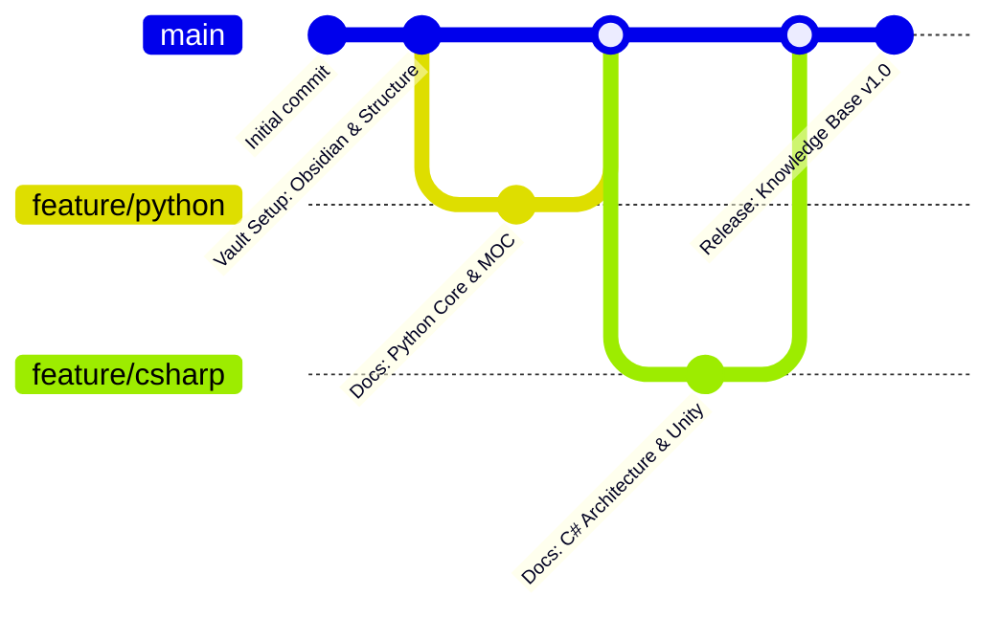

<div align="center">

# 🧠 Base de Conocimiento para Desarrolladores


<p>Un repositorio técnico estructurado y multilenguaje sobre fundamentos de ciencias de la computación, patrones de arquitectura de software y flujos de trabajo de ingeniería — con cada ejercicio planteado alrededor de la creación de videojuegos.</p>

</div>

**Versión original en inglés:** [README.md](README.md)


**Nota:**
Esta base de conocimiento funciona como un repositorio central de documentación, arquitecturas de referencia y notas de código escritas en **Obsidian** y renderizadas directamente en **GitHub**. Las notas en español son traducciones de las originales en inglés y se mantienen como un espejo: el inglés es la versión de referencia.


## 🗺️ Dominios de Conocimiento y MOCs

| Dominio / Lenguaje | Descripción | Estado | Mapa de Contenidos |
| :--- | :--- | :--- | :--- |
| 🐍 **Python** | Sintaxis básica, control de flujo, estructuras de datos, POO y ecosistemas | 🟢 Activo | [Ir al MOC](%F0%9F%90%8D%20Python/README-ES.md) |
| 🚀 **Git & GitHub** | Control de versiones, estrategias de ramificación, colaboración y flujos de PR | 🟢 Activo | [Ir al MOC](%F0%9F%9A%80%20Git%20&%20GitHub/README-ES.md) |
| 🟣 **CSharp** | Tipado fuerte, POO, ecosistema .NET y arquitectura del motor Unity | 🟢 Activo | [Ir al MOC](%F0%9F%9F%A3%20CSharp/README-ES.md) |
| 🧮 **Data Structures & Algorithms** | Estructuras de datos fundamentales, eficiencia de algoritmos y resolución de problemas | 🟢 Activo | [Ir al MOC](%F0%9F%A7%AE%20Data%20Structures%20&%20Algorithms/README-ES.md) |
| ⚙️ **Software Engineering** | Patrones de diseño, algoritmos y arquitectura de sistemas | 🟡 Planificado | *Próximamente* |
| 🎮 **Game Architecture** | Mecánicas interactivas, patrones de motor y física | 🟡 Planificado | *Próximamente* |


## 🌍 Idiomas

| Versión | Ruta de entrada | Estado |
| :--- | :--- | :--- |
| 🇬🇧 Inglés (original) | [README.md](README.md) | 🟢 Base de referencia |
| 🇪🇸 Español (traducción) | [README-ES.md](README-ES.md) | 🟢 Sincronizado |

Cada nota existe en ambos idiomas. Las notas en español incluyen una línea
`**Versión original en inglés:**` en la parte superior que enlaza a su nota original.


## 🛠️ Arquitectura del Repositorio

```text
Developer-Knowledge-Base/
├── 🐍 Python/
│   ├── README.md                <-- Python MOC & topic index
│   ├── z_attachments/           <-- Local diagrams & assets
│   └── 01-09_*.md               <-- Topic notes
├── 🚀 Git & GitHub/
│   ├── README.md                <-- Git & GitHub MOC & topic index
│   └── 01-04_*.md               <-- Topic notes
├── 🟣 CSharp/
│   ├── README.md                <-- C# MOC & topic index
│   └── 01-06_*.md               <-- Topic notes
├── 🧮 Data Structures & Algorithms/
│   ├── README.md                <-- DSA MOC & topic index
│   └── 01-03_*.md               <-- Topic notes
├── .gitignore
└── README.md                    <-- Main repository homepage
```

> El árbol anterior muestra la estructura de las notas originales en inglés.
> Cada módulo incluye además sus equivalentes en español: los README aparecen como
> `README-ES.md` y cada nota cuenta con una versión traducida junto a la original.


## ⚙️ Flujo de Trabajo de Ingeniería

- **Gestión de la vault:** escrita y enlazada en [Obsidian](https://obsidian.md).
- **Maquetación y renderizado:** diseñada y formateada con **Visual Studio Code / Trae** + **GitHub Copilot**.
- **Control de versiones:** creado, rastreado y alojado con **Git** y **GitHub**.
- **Traducción:** la versión en español se mantiene como espejo de la inglesa, con el código idéntico byte a byte y únicamente la prosa traducida.


