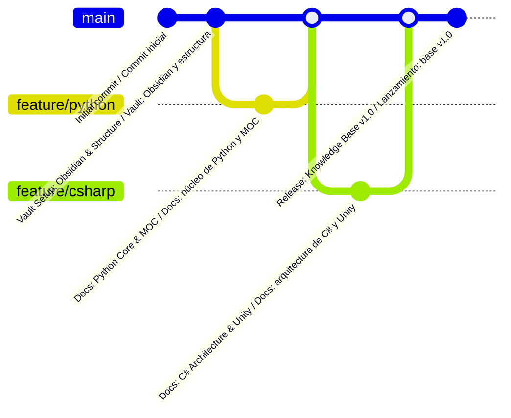

<div align="center">

# 🧠 Developer Knowledge Base · Base de Conocimiento para Desarrolladores


<p>A structured, multi-language technical repository for computer science foundations, software architecture patterns, and engineering workflows — with every exercise framed around building video games.</p>

<p>Un repositorio técnico estructurado y multilenguaje sobre fundamentos de ciencias de la computación, patrones de arquitectura de software y flujos de trabajo de ingeniería — con cada ejercicio planteado alrededor de la creación de videojuegos.</p>

</div>

**English:** [README.md](README.md) · **Español:** [README-ES.md](README-ES.md)


**Note:**
This knowledge base acts as a central repository for documentation, reference architectures, and code notes authored in **Obsidian** and rendered directly on **GitHub**.

**Nota:**
Esta base de conocimiento funciona como un repositorio central de documentación, arquitecturas de referencia y notas de código escritas en **Obsidian** y renderizadas directamente en **GitHub**. Las notas en español son traducciones de las originales en inglés y se mantienen como un espejo: el inglés es la versión de referencia.


## 🗺️ Knowledge Domains & MOCs · Dominios de Conocimiento y MOCs

Every domain is self-contained and opens with a **MOC** (Map of Content): an index note
that lists each topic with a one-line description, so you enter through the map instead
of scrolling a folder.

Cada dominio es autónomo y abre con un **MOC** (Mapa de Contenidos): una nota índice
que enumera cada tema con una descripción de una línea, para entrar por el mapa en lugar
de recorrer una carpeta.

| Domain / Language · Dominio / Lenguaje | Description · Descripción | Notes · Notas | Status · Estado | Map of Content · Mapa de Contenidos |
| :--- | :--- | :--- | :--- | :--- |
| 🐍 **Python** | Core syntax, control flow, data structures, OOP & ecosystems<br>Sintaxis básica, control de flujo, estructuras de datos, POO y ecosistemas | 11 EN · 11 ES | 🟢 Active / Activo | [EN MOC](%F0%9F%90%8D%20Python/README.md)<br>[ES MOC](%F0%9F%90%8D%20Python/README-ES.md) |
| 🚀 **Git & GitHub** | Version control, branching strategies, collaboration & PR workflows<br>Control de versiones, estrategias de ramificación, colaboración y flujos de PR | 4 EN · 4 ES | 🟢 Active / Activo | [EN MOC](%F0%9F%9A%80%20Git%20&%20GitHub/README.md)<br>[ES MOC](%F0%9F%9A%80%20Git%20&%20GitHub/README-ES.md) |
| 🟣 **CSharp** | Strongly typed, OOP, .NET ecosystem & Unity engine architecture<br>Tipado fuerte, POO, ecosistema .NET y arquitectura del motor Unity | 8 EN · 7 ES | 🟢 Active / Activo | [EN MOC](%F0%9F%9F%A3%20CSharp/README.md)<br>[ES MOC](%F0%9F%9F%A3%20CSharp/README-ES.md) |
| 🧮 **Data Structures & Algorithms** | Core data structures, algorithm efficiency & problem solving<br>Estructuras de datos fundamentales, eficiencia de algoritmos y resolución de problemas | 3 EN · 3 ES | 🟢 Active / Activo | [EN MOC](%F0%9F%A7%AE%20Data%20Structures%20&%20Algorithms/README.md)<br>[ES MOC](%F0%9F%A7%AE%20Data%20Structures%20&%20Algorithms/README-ES.md) |
| ⚙️ **Software Engineering / Ingeniería de Software** | Design patterns, algorithms & system architecture<br>Patrones de diseño, algoritmos y arquitectura de sistemas | — | 🟡 Planned / Planificado | *Coming soon*<br>*Próximamente* |
| 🎮 **Game Architecture / Arquitectura de Juegos** | Interactive mechanics, engine patterns & physics<br>Mecánicas interactivas, patrones de motor y física | — | 🟡 Planned / Planificado | *Coming soon*<br>*Próximamente* |

> The C# domain carries one extra English note: `00b - CSharp Cheatsheet.md` is an empty
> placeholder with no Spanish pair yet, which is why it reads 8 EN · 7 ES.
>
> El dominio de C# tiene una nota extra solo en inglés: `00b - CSharp Cheatsheet.md` es un
> marcador de posición vacío que aún no tiene su pareja en español, por eso figura 8 EN · 7 ES.

**Topic numbering.** Notes are prefixed so a domain reads in learning order — `01`, `02`,
`03`… Cheatsheets use a `00b` / `00c` prefix and sit *before* the numbered sequence,
because they are meant to be consulted while working rather than read front to back.

**Numeración de los temas.** Las notas llevan un prefijo para que el dominio se lea en orden
de aprendizaje — `01`, `02`, `03`… Las chuletas usan el prefijo `00b` / `00c` y se sitúan
*antes* de la secuencia numerada, porque están pensadas para consultarse mientras se trabaja
y no para leerse de principio a fin.

**How to read a note.** Each one is a self-contained lesson: a concept, a runnable
example, its printed output, and the traps worth knowing. Code blocks are executable as
written — the comments state the output you should actually get.

**Cómo leer una nota.** Cada una es una lección autónoma: un concepto, un ejemplo
ejecutable, su salida por consola y las trampas que conviene conocer. Los bloques de código
se ejecutan tal cual — los comentarios indican la salida que deberías obtener realmente.

**The Spanish mirror.** Every topic exists in both languages. English is the reference
version; the Spanish note carries a `**Versión original en inglés:**` line at the top
linking back to it. Inside Spanish code blocks, variables and string literals are
localized, while language keywords, API names and class names stay in English.

**El espejo en español.** Todos los temas existen en ambos idiomas. El inglés es la versión
de referencia; la nota en español incluye una línea `**Versión original en inglés:**` al
principio que enlaza a su original. Dentro de los bloques en español, las variables y las
cadenas están traducidas, mientras que las palabras clave del lenguaje, los nombres de API
y los nombres de clase permanecen en inglés.


## 🌍 Languages · Idiomas

| Version · Versión | Entry point · Ruta de entrada | Status · Estado |
| :--- | :--- | :--- |
| 🇬🇧 English (original) · Inglés (original) | [README.md](README.md) | 🟢 Reference base · Base de referencia |
| 🇪🇸 Spanish (translation) · Español (traducción) | [README-ES.md](README-ES.md) | 🟢 In sync · Sincronizado |

Every note exists in both languages. The Spanish note includes a
`**Versión original en inglés:**` line at the top linking back to its English original.
English is the reference version; the Spanish one is kept as a mirror of it.

Cada nota existe en ambos idiomas. Las notas en español incluyen una línea
`**Versión original en inglés:**` en la parte superior que enlaza a su nota original.
El inglés es la versión de referencia y el español se mantiene como su espejo.


## 🛠️ Repository Architecture · Arquitectura del Repositorio

Notes are stored as **filename pairs** on the same line: the English note first, its
Spanish translation after the `·` separator.

Las notas se guardan como **pares de nombres de archivo** en la misma línea: primero la
nota en inglés y, tras el separador `·`, su traducción al español.

```text
Developer-Knowledge-Base/
├── README.md                              <-- English homepage / Portada en inglés (reference / referencia)
├── README-ES.md                           <-- Spanish homepage / Portada en español (mirror / espejo)
├── LICENSE
├── .gitignore
│
├── 🐍 Python/                             <-- 11 topics / temas · EN + ES
│   ├── README.md          ·  README-ES.md
│   ├── 00b - Python Cheatsheet.md         ·  00b - Chuleta de Python.md
│   ├── 00c - Python Cheatsheet II.md      ·  00c - Chuleta de Python II.md
│   ├── 01 - Setup & Data Types.md         ·  01 - Configuración y Tipos de Datos.md
│   ├── 02 - Control Flow.md               ·  02 - Control de Flujo.md
│   ├── 03 - Loops.md                      ·  03 - Bucles.md
│   ├── 04 - Terminal Dungeon Crawl.md     ·  04 - Mazmorra por Terminal.md
│   ├── 05 - Lists.md                      ·  05 - Listas.md
│   ├── 06 - Built-in Functions & List Methods.md  ·  06 - Funciones Integradas y Métodos de Lista.md
│   ├── 07 - Functions.md                  ·  07 - Funciones.md
│   ├── 08 - Object-Oriented Programming.md  ·  08 - Programación Orientada a Objetos.md
│   ├── 09 - Modules.md                    ·  09 - Módulos.md
│   └── z_attachments/                     <-- local assets / recursos locales (empty / vacía, untracked)
│
├── 🚀 Git & GitHub/                       <-- 4 topics / temas · EN + ES
│   ├── README.md          ·  README-ES.md
│   ├── 01 - Introduction & Setup.md        ·  01 - Introducción y Configuración.md
│   ├── 02 - Core Workflow.md               ·  02 - Flujo de Trabajo Principal.md
│   ├── 03 - Collaboration & Branching.md   ·  03 - Colaboración y Ramas.md
│   └── 04 - Advanced Workflow & PRs.md     ·  04 - Flujo Avanzado y PRs.md
│
├── 🟣 CSharp/                             <-- 7 topics / temas · EN + ES (+ 1 EN-only / solo EN)
│   ├── README.md          ·  README-ES.md
│   ├── 00b - CSharp Cheatsheet.md         <-- empty placeholder / marcador vacío, no ES pair / sin pareja ES
│   ├── 01 - Press Start.md                ·  01 - Pulsa Start.md
│   ├── 02 - Typecast.md                   ·  02 - Conversión de Tipos.md
│   ├── 03 - Control Flow.md               ·  03 - Control de Flujo.md
│   ├── 04 - Loops.md                      ·  04 - Bucles.md
│   ├── 05 - Arrays.md                     ·  05 - Arreglos.md
│   ├── 06 - Methods.md                    ·  06 - Métodos.md
│   └── Mad Dungeon Master - Checkpoint Project.md  ·  Mad Dungeon Master - Proyecto de Hito.md
│
└── 🧮 Data Structures & Algorithms/       <-- 3 topics / temas · EN + ES
    ├── README.md          ·  README-ES.md
    ├── 01 - Introduction to DSA.md        ·  01 - Introducción a Estructuras de Datos y Algoritmos.md
    ├── 02 - Algorithms & Efficiency.md    ·  02 - Algoritmos y Eficiencia.md
    └── 03 - Lists & Linear Search.md      ·  03 - Listas y Búsqueda Lineal.md
```

> The tree above shows the real structure of the repository. Every module ships both a
> `README.md` (English) and a `README-ES.md` (Spanish), and every note exists in both languages.
>
> El árbol anterior muestra la estructura real del repositorio. Cada módulo incluye su
> `README.md` (inglés) y su `README-ES.md` (español), y cada nota existe en ambos idiomas.

**Conventions worth knowing / Convenciones que conviene conocer**

| Convention · Convención | Meaning · Significado |
| :--- | :--- |
| `README.md` / `README-ES.md` | The MOC of a domain. Start here.<br>El MOC de un dominio. Empieza por aquí. |
| `NN - Title.md` | A topic note. `NN` encodes the learning order.<br>Una nota de tema. `NN` indica el orden de aprendizaje. |
| `00b` / `00c` | Cheatsheets, consulted on demand.<br>Chuletas, para consultar bajo demanda. |
| `z_attachments/` | Local scratch folder for diagrams. Not versioned.<br>Carpeta local para diagramas. Sin versionar. |
| Pairing · Emparejamiento | Every `.md` has an English original; the Spanish translation sits next to it.<br>Cada `.md` tiene un original en inglés; la traducción va junto a él. |

**Not versioned on purpose / No se versiona a propósito** — listed in `.gitignore` so the
vault stays portable / figura en `.gitignore` para que la vault siga siendo portable:
`.obsidian/` (local vault state / estado local de la vault), `.DS_Store`, and the assistant
tooling folders / y las carpetas de herramientas del asistente `.copilot/`, `.opencode/`,
`copilot/`.


## ⚙️ Engineering Workflow · Flujo de Trabajo de Ingeniería

- **Vault Management:** Written and interlinked in [Obsidian](https://obsidian.md).
- **Gestión de la vault:** escrita y enlazada en [Obsidian](https://obsidian.md).
- **Layout & Rendering:** Designed and formatted using **Visual Studio Code / Trae** + **GitHub Copilot**.
- **Maquetación y renderizado:** diseñada y formateada con **Visual Studio Code / Trae** + **GitHub Copilot**.
- **Version Control:** Sourced, tracked, and hosted via **Git** & **GitHub**.
- **Control de versiones:** creado, rastreado y alojado con **Git** y **GitHub**.
- **Translation / Traducción:** the Spanish version is kept as a mirror of the English one. Variables, string literals and comments are translated; language keywords, API names and class names stay in English. Code blocks run with the same result as their originals.
- **Traducción:** la versión en español se mantiene como espejo de la inglesa. Las variables, las cadenas y los comentarios se traducen; las palabras clave, los nombres de API y los nombres de clase permanecen en inglés. Los bloques de código se ejecutan con el mismo resultado que sus originales.


