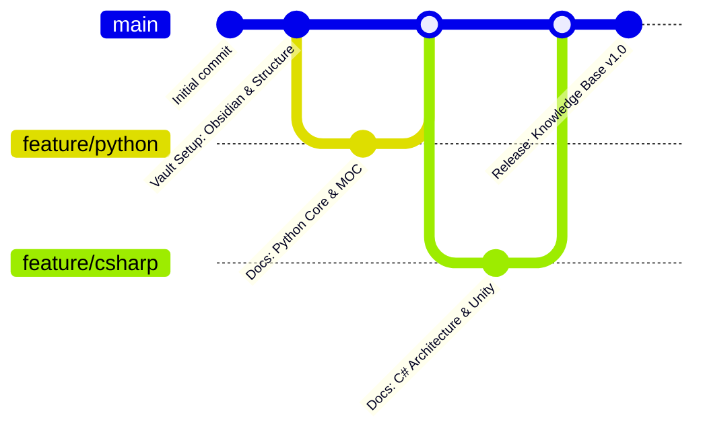

<div align="center">

# 🧠 Base de Conocimiento para Desarrolladores


<p>Un repositorio técnico estructurado y multilenguaje sobre fundamentos de ciencias de la computación, patrones de arquitectura de software y flujos de trabajo de ingeniería — con cada ejercicio planteado alrededor de la creación de videojuegos.</p>

</div>

**Versión original en inglés:** [README.md](README.md)


**Nota:**
Esta base de conocimiento funciona como un repositorio central de documentación, arquitecturas de referencia y notas de código escritas en **Obsidian** y renderizadas directamente en **GitHub**. Las notas en español son traducciones de las originales en inglés y se mantienen como un espejo: el inglés es la versión de referencia.


## 🗺️ Dominios de Conocimiento y MOCs

Cada dominio es autónomo y abre con un **MOC** (Mapa de Contenidos): una nota índice
que enumera cada tema con una descripción de una línea, para entrar por el mapa en lugar
de recorrer una carpeta.

| Dominio / Lenguaje | Descripción | Notas | Estado | Mapa de Contenidos |
| :--- | :--- | :--- | :--- | :--- |
| 🐍 **Python** | Sintaxis básica, control de flujo, estructuras de datos, POO y ecosistemas | 11 EN · 11 ES | 🟢 Activo | [Ir al MOC](%F0%9F%90%8D%20Python/README-ES.md) |
| 🚀 **Git & GitHub** | Control de versiones, estrategias de ramificación, colaboración y flujos de PR | 4 EN · 4 ES | 🟢 Activo | [Ir al MOC](%F0%9F%9A%80%20Git%20&%20GitHub/README-ES.md) |
| 🟣 **CSharp** | Tipado fuerte, POO, ecosistema .NET y arquitectura del motor Unity | 8 EN · 7 ES | 🟢 Activo | [Ir al MOC](%F0%9F%9F%A3%20CSharp/README-ES.md) |
| 🧮 **Data Structures & Algorithms** | Estructuras de datos fundamentales, eficiencia de algoritmos y resolución de problemas | 3 EN · 3 ES | 🟢 Activo | [Ir al MOC](%F0%9F%A7%AE%20Data%20Structures%20&%20Algorithms/README-ES.md) |
| ⚙️ **Software Engineering** | Patrones de diseño, algoritmos y arquitectura de sistemas | — | 🟡 Planificado | *Próximamente* |
| 🎮 **Game Architecture** | Mecánicas interactivas, patrones de motor y física | — | 🟡 Planificado | *Próximamente* |

> El dominio de C# tiene una nota extra solo en inglés: `00b - CSharp Cheatsheet.md` es un
> marcador de posición vacío que aún no tiene su pareja en español, por eso figura 8 EN · 7 ES.

**Numeración de los temas.** Las notas llevan un prefijo para que el dominio se lea en orden
de aprendizaje — `01`, `02`, `03`… Las chuletas usan el prefijo `00b` / `00c` y se sitúan
*antes* de la secuencia numerada, porque están pensadas para consultarse mientras se trabaja
y no para leerse de principio a fin.

**Cómo leer una nota.** Cada una es una lección autónoma: un concepto, un ejemplo
ejecutable, su salida por consola y las trampas que conviene conocer. Los bloques de código
se ejecutan tal cual — los comentarios indican la salida que deberías obtener realmente.

**El espejo en español.** Todos los temas existen en ambos idiomas. El inglés es la versión
de referencia; la nota en español incluye una línea `**Versión original en inglés:**` al
principio que enlaza a su original. Dentro de los bloques en español, las variables y las
cadenas están traducidas, mientras que las palabras clave del lenguaje, los nombres de API
y los nombres de clase permanecen en inglés.


## 🌍 Idiomas

| Versión | Ruta de entrada | Estado |
| :--- | :--- | :--- |
| 🇬🇧 Inglés (original) | [README.md](README.md) | 🟢 Base de referencia |
| 🇪🇸 Español (traducción) | [README-ES.md](README-ES.md) | 🟢 Sincronizado |

Cada nota existe en ambos idiomas. Las notas en español incluyen una línea
`**Versión original en inglés:**` en la parte superior que enlaza a su nota original.


## 🛠️ Arquitectura del Repositorio

Las notas se guardan como **pares de nombres de archivo** en la misma línea: primero la nota
en inglés y, tras el separador `·`, su traducción al español.

```text
Developer-Knowledge-Base/
├── README.md                              <-- portada en inglés (versión de referencia)
├── README-ES.md                           <-- portada en español (espejo traducido)
├── LICENSE
├── .gitignore
│
├── 🐍 Python/                             <-- 11 temas · EN + ES
│   ├── README.md          ·  README-ES.md
│   ├── 00b - Python Cheatsheet.md         ·  00b - Chuleta de Python.md
│   ├── 00c - Python Cheatsheet II.md      ·  00c - Chuleta de Python II.md
│   ├── 01 - Setup & Data Types.md         ·  01 - Configuración y Tipos de Datos.md
│   ├── 02 - Control Flow.md               ·  02 - Control de Flujo.md
│   ├── 03 - Loops.md                      ·  03 - Bucles.md
│   ├── 04 - Terminal Dungeon Crawl.md     ·  04 - Mazmorra por Terminal.md
│   ├── 05 - Lists.md                      ·  05 - Listas.md
│   ├── 06 - Built-in Functions & List Methods.md  ·  06 - Funciones Integradas y Métodos de Lista.md
│   ├── 07 - Functions.md                  ·  07 - Funciones.md
│   ├── 08 - Object-Oriented Programming.md  ·  08 - Programación Orientada a Objetos.md
│   ├── 09 - Modules.md                    ·  09 - Módulos.md
│   └── z_attachments/                     <-- carpeta local de recursos (vacía, sin versionar)
│
├── 🚀 Git & GitHub/                       <-- 4 temas · EN + ES
│   ├── README.md          ·  README-ES.md
│   ├── 01 - Introduction & Setup.md        ·  01 - Introducción y Configuración.md
│   ├── 02 - Core Workflow.md               ·  02 - Flujo de Trabajo Principal.md
│   ├── 03 - Collaboration & Branching.md   ·  03 - Colaboración y Ramas.md
│   └── 04 - Advanced Workflow & PRs.md     ·  04 - Flujo Avanzado y PRs.md
│
├── 🟣 CSharp/                             <-- 7 temas · EN + ES (+ 1 solo EN)
│   ├── README.md          ·  README-ES.md
│   ├── 00b - CSharp Cheatsheet.md         <-- marcador vacío, sin pareja ES
│   ├── 01 - Press Start.md                ·  01 - Pulsa Start.md
│   ├── 02 - Typecast.md                   ·  02 - Conversión de Tipos.md
│   ├── 03 - Control Flow.md               ·  03 - Control de Flujo.md
│   ├── 04 - Loops.md                      ·  04 - Bucles.md
│   ├── 05 - Arrays.md                     ·  05 - Arreglos.md
│   ├── 06 - Methods.md                    ·  06 - Métodos.md
│   └── Mad Dungeon Master - Checkpoint Project.md  ·  Mad Dungeon Master - Proyecto de Hito.md
│
└── 🧮 Data Structures & Algorithms/       <-- 3 temas · EN + ES
    ├── README.md          ·  README-ES.md
    ├── 01 - Introduction to DSA.md        ·  01 - Introducción a Estructuras de Datos y Algoritmos.md
    ├── 02 - Algorithms & Efficiency.md    ·  02 - Algoritmos y Eficiencia.md
    └── 03 - Lists & Linear Search.md      ·  03 - Listas y Búsqueda Lineal.md
```

> El árbol anterior muestra la estructura real del repositorio. Cada módulo incluye su
> `README.md` (inglés) y su `README-ES.md` (español), y cada nota existe en ambos idiomas.

**Convenciones que conviene conocer**

| Convención | Significado |
| :--- | :--- |
| `README.md` / `README-ES.md` | El MOC del dominio. Empieza por aquí. |
| `NN - Título.md` | Una nota de tema. `NN` indica el orden de aprendizaje. |
| `00b` / `00c` | Chuletas, para consultar bajo demanda. |
| `z_attachments/` | Carpeta local para diagramas. Sin versionar. |
| Emparejamiento | Cada `.md` tiene un original en inglés; la traducción va junto a él. |

**No se versiona a propósito** — figura en `.gitignore` para que la vault siga siendo
portable: `.obsidian/` (estado local de la vault), `.DS_Store` y las carpetas de
herramientas del asistente `.copilot/`, `.opencode/`, `copilot/`.


## ⚙️ Flujo de Trabajo de Ingeniería

- **Gestión de la vault:** escrita y enlazada en [Obsidian](https://obsidian.md).
- **Maquetación y renderizado:** diseñada y formateada con **Visual Studio Code / Trae** + **GitHub Copilot**.
- **Control de versiones:** creado, rastreado y alojado con **Git** y **GitHub**.
- **Traducción:** la versión en español se mantiene como espejo de la inglesa. Dentro de los bloques de código se traducen las variables, las cadenas y los comentarios; las palabras clave, los nombres de API y los nombres de clase permanecen en inglés. Los bloques se ejecutan con el mismo resultado que sus originales.


