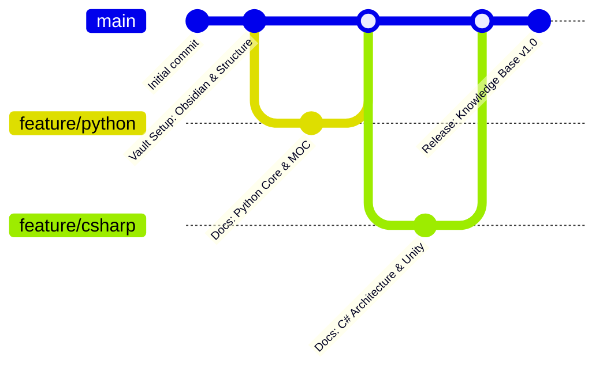

<div align="center">

# 🧠 Developer Knowledge Base


<p>A structured, multi-language technical repository for computer science foundations, software architecture patterns, and engineering workflows — with every exercise framed around building video games.</p>

</div>

**Español:** [README-ES.md](README-ES.md)


> **Note**
> This knowledge base acts as a central repository for documentation, reference architectures, and code notes authored in **Obsidian** and rendered directly on **GitHub**.

## 🗺️ Knowledge Domains & MOCs

Every domain is self-contained and opens with a **MOC** (Map of Content): an index note that lists each topic with a one-line description, so you enter through the map instead of scrolling a folder.

| Domain | Description | Notes | Status | Map of Content |
| :--- | :--- | :--- | :--- | :--- |
| 🐍 **Python** | Core syntax, control flow, data structures, OOP & ecosystems | 11 EN · 11 ES | 🟢 Active | [EN](%F0%9F%90%8D%20Python/README.md) · [ES](%F0%9F%90%8D%20Python/README-ES.md) |
| 🚀 **Git & GitHub** | Version control, branching strategies, collaboration & PR workflows | 4 EN · 4 ES | 🟢 Active | [EN](%F0%9F%9A%80%20Git%20&%20GitHub/README.md) · [ES](%F0%9F%9A%80%20Git%20&%20GitHub/README-ES.md) |
| 🟣 **CSharp** | Strongly typed, OOP, .NET ecosystem & Unity engine architecture | 8 EN · 8 ES | 🟢 Active | [EN](%F0%9F%9F%A3%20CSharp/README.md) · [ES](%F0%9F%9F%A3%20CSharp/README-ES.md) |
| 🧮 **Data Structures & Algorithms** | Core data structures, algorithm efficiency & problem solving | 5 EN · 5 ES | 🟢 Active | [EN](%F0%9F%A7%AE%20Data%20Structures%20&%20Algorithms/README.md) · [ES](%F0%9F%A7%AE%20Data%20Structures%20&%20Algorithms/README-ES.md) |
| 🖥️ **Command Line** | Terminal navigation, file management, permissions & shell workflow | 13 EN · 13 ES | 🟢 Active | [EN](%F0%9F%96%A5%EF%B8%8F%20Command%20Line/README.md) · [ES](%F0%9F%96%A5%EF%B8%8F%20Command%20Line/README-ES.md) |
| 🤖 **GenAI** | How LLMs work, prompt engineering, embeddings & AI failure modes | 6 EN · 6 ES | 🟢 Active | [EN](%F0%9F%A4%96%20GenAI/README.md) · [ES](%F0%9F%A4%96%20GenAI/README-ES.md) |
| 🌐 **HTML** | Web page structure, elements, attributes, styles, forms & semantic regions | 6 EN · 6 ES | 🟢 Active | [EN](%F0%9F%8C%90%20HTML/README.md) · [ES](%F0%9F%8C%90%20HTML/README-ES.md) |
| 🎨 **CSS** | Styling, layouts, responsiveness & design systems | — | 🟡 Planned | [EN](%F0%9F%8E%A8%20CSS/README.md) · [ES](%F0%9F%8E%A8%20CSS/README-ES.md) |
| ⚙️ **Software Engineering** | Design patterns, algorithms & system architecture | — | 🟡 Planned | *Coming soon* |
| 🎮 **Game Architecture** | Interactive mechanics, engine patterns & physics | — | 🟡 Planned | *Coming soon* |

**Topic numbering.** Notes are prefixed so a domain reads in learning order — `01`, `02`,
`03`… Cheatsheets use a `00b` / `00c` prefix and sit *before* the numbered sequence,
because they are meant to be consulted while working rather than read front to back.

**The one module that builds on another.** 🤖 **GenAI** is the AI layer of this vault: it
starts from the Python of 🐍 **Python** and builds a next-token predictor, a prompt library
and a semantic search engine in pure Python, so the AI tooling is understood from the
inside rather than borrowed from an API.

**How to read a note.** Each one is a self-contained lesson: a concept, a runnable
example, its printed output, and the traps worth knowing. Code blocks are executable as
written — the comments state the output you should actually get.

**The Spanish mirror.** Every topic exists in both languages. English is the reference
version; the Spanish note carries a `**Versión original en inglés:**` line at the top
linking back to it. Inside Spanish code blocks, variables and string literals are
localized, while language keywords, API names and class names stay in English.

## 🌍 Languages

| Version | Entry point | Status |
| :--- | :--- | :--- |
| 🇬🇧 English (original) | [README.md](README.md) | 🟢 Reference base |
| 🇪🇸 Spanish (translation) | [README-ES.md](README-ES.md) | 🟢 In sync |

Every note exists in both languages. The Spanish note includes a
`**Versión original en inglés:**` line at the top linking back to its English original.
English is the reference version; the Spanish one is kept as a mirror of it.

## 🛠️ Repository Architecture

Notes are stored as **filename pairs** on the same line: the English note first, its
Spanish translation after the `·` separator.

```text
Developer-Knowledge-Base/
├── README.md                              <-- English homepage (reference)
├── README-ES.md                           <-- Spanish homepage (mirror)
├── LICENSE
├── .gitignore
│
├── tools/                                 <-- vault verifiers (see below)
├── .github/workflows/                      <-- runs them on every push
│
├── 🐍 Python/                             <-- 11 topics · EN + ES
│   ├── README.md          ·  README-ES.md
│   ├── 00b - Python Cheatsheet.md         ·  00b - Chuleta de Python.md
│   ├── 00c - Python Cheatsheet II.md      ·  00c - Chuleta de Python II.md
│   ├── 01 - Setup & Data Types.md         ·  01 - Configuración y Tipos de Datos.md
│   ├── 02 - Control Flow.md               ·  02 - Control de Flujo.md
│   ├── 03 - Loops.md                      ·  03 - Bucles.md
│   ├── 04 - Terminal Dungeon Crawl.md     ·  04 - Mazmorra por Terminal.md
│   ├── 05 - Lists.md                      ·  05 - Listas.md
│   ├── 06 - Built-in Functions & List Methods.md  ·  06 - Funciones Integradas y Métodos de Lista.md
│   ├── 07 - Functions.md                  ·  07 - Funciones.md
│   ├── 08 - Object-Oriented Programming.md  ·  08 - Programación Orientada a Objetos.md
│   ├── 09 - Modules.md                    ·  09 - Módulos.md
│   └── z_attachments/                     <-- local assets (empty, untracked)
│
├── 🚀 Git & GitHub/                       <-- 4 topics · EN + ES
│   ├── README.md          ·  README-ES.md
│   ├── 01 - Introduction & Setup.md        ·  01 - Introducción y Configuración.md
│   ├── 02 - Core Workflow.md               ·  02 - Flujo de Trabajo Principal.md
│   ├── 03 - Collaboration & Branching.md   ·  03 - Colaboración y Ramas.md
│   └── 04 - Advanced Workflow & PRs.md     ·  04 - Flujo Avanzado y PRs.md
│
├── 🟣 CSharp/                             <-- 8 topics · EN + ES
│   ├── README.md          ·  README-ES.md
│   ├── 00b - CSharp Cheatsheet.md         ·  00b - Chuleta de CSharp.md
│   ├── 01 - Press Start.md                ·  01 - Pulsa Start.md
│   ├── 02 - Typecast.md                   ·  02 - Conversión de Tipos.md
│   ├── 03 - Control Flow.md               ·  03 - Control de Flujo.md
│   ├── 04 - Loops.md                      ·  04 - Bucles.md
│   ├── 05 - Arrays.md                     ·  05 - Arreglos.md
│   ├── 06 - Methods.md                    ·  06 - Métodos.md
│   └── Mad Dungeon Master - Checkpoint Project.md  ·  Mad Dungeon Master - Proyecto de Hito.md
│
├── 🧮 Data Structures & Algorithms/       <-- 5 topics · EN + ES
│   ├── README.md          ·  README-ES.md
│   ├── 01 - Introduction to DSA.md        ·  01 - Introducción a Estructuras de Datos y Algoritmos.md
│   ├── 02 - Algorithms & Efficiency.md    ·  02 - Algoritmos y Eficiencia.md
│   ├── 03 - Lists & Linear Search.md      ·  03 - Listas y Búsqueda Lineal.md
│   ├── 04 - Binary Search.md              ·  04 - Búsqueda Binaria.md
│   └── 05 - Selection Sort.md             ·  05 - Ordenamiento por Selección.md
│
├── 🖥️ Command Line/                       <-- 13 topics · EN + ES
│   ├── README.md          ·  README-ES.md
│   ├── 00b - Command Line Cheatsheet.md   ·  00b - Chuleta de Línea de Comandos.md
│   ├── 01 - In The Beginning.md           ·  01 - En los Orígenes.md
│   ├── 02 - Filesystem.md                 ·  02 - Sistema de Archivos.md
│   ├── 03 - Moving Day.md                 ·  03 - Día de Mudanza.md
│   ├── 04 - House Tour.md                 ·  04 - Visita a la Casa.md
│   ├── 05 - Clean Slate.md                ·  05 - Hoja en Blanco.md
│   ├── 06 - Scavenger Hunt.md             ·  06 - Búsqueda del Tesoro.md
│   ├── 07 - Recipes.md                    ·  07 - Recetas.md
│   ├── 08 - Cuisine Type.md               ·  08 - Tipo de Cocina.md
│   ├── 09 - Grilled Cheese.md             ·  09 - Queso a la Plancha.md
│   ├── 10 - Move Around.md                ·  10 - Mover y Renombrar.md
│   ├── 11 - Copy That.md                  ·  11 - Copia Eso.md
│   └── 12 - Music Playlists.md            ·  12 - Listas de Reproducción.md
│
├── 🌐 HTML/                           <-- 6 topics · EN + ES
│   ├── README.md          ·  README-ES.md
│   ├── 00b - HTML Cheatsheet.md          ·  00b - Chuleta de HTML.md
│   ├── 00c - HTML Cheatsheet II.md       ·  00c - Chuleta de HTML II.md
│   ├── 01 - HTML Basics.md               ·  01 - Fundamentos de HTML.md
│   ├── 02 - Structure & Attributes.md    ·  02 - Estructura y Atributos.md
│   ├── 03 - Forms.md                     ·  03 - Formularios.md
│   └── 04 - Semantic HTML.md             ·  04 - HTML Semántico.md
│
└── 🤖 GenAI/                              <-- 6 topics · EN + ES
    ├── README.md          ·  README-ES.md
    ├── 00b - GenAI Cheatsheet.md          ·  00b - Chuleta de GenAI.md
    ├── 00c - GenAI Cheatsheet II.md       ·  00c - Chuleta de GenAI II.md
    ├── 01 - How AI Thinks.md              ·  01 - Cómo Piensa la IA.md
    ├── 02 - Prompt Engineering.md         ·  02 - Ingeniería de Prompts.md
    ├── 03 - Embeddings & Semantic Search.md  ·  03 - Embeddings y Búsqueda Semántica.md
    ├── 04 - Limits & Risks.md             ·  04 - Límites y Riesgos.md
    └── z_attachments/                     <-- local assets (empty, untracked)
```

> The tree above shows the real structure of the repository. Every module ships both a
> `README.md` (English) and a `README-ES.md` (Spanish), and every note exists in both languages.

**Conventions worth knowing**

| Convention | Meaning |
| :--- | :--- |
| `README.md` / `README-ES.md` | The MOC of a domain. Start here. |
| `NN - Title.md` | A topic note. `NN` encodes the learning order. |
| `00b` / `00c` | Cheatsheets, consulted on demand. |
| `z_attachments/` | Local scratch folder for diagrams. Not versioned. |
| Pairing | Every `.md` has an English original; the Spanish translation sits next to it. |

**Not versioned on purpose** — listed in `.gitignore` so the vault stays portable:
`.obsidian/` (local vault state), `.DS_Store`, and the assistant tooling folders
`.copilot/`, `.opencode/`, `copilot/`.

## ✅ Automatic Verification

The vault drifts quietly: a note gets a new section, a code block stops matching
its documented output, the Spanish mirror falls a step behind. These four
verifiers catch that on every push, without anyone having to remember to look.

| Verifier | What it proves | Runs on |
| :--- | :--- | :--- |
| `.check_readme_index.py` | Every note is reachable from a README; no broken links; EN/ES totals match per module. | Linux |
| `tools/check_notes.py` | Fences close, tables keep their column count, wikilinks resolve, alerts use the five types GitHub renders. | Linux |
| `tools/check_parity.py` | Every note has a mirror in the other language, with the same commands in the same order. | Linux |
| `tools/check_transcripts.py` | Every documented bash block actually produces the output it claims, executed for real against a real file tree. | macOS |

```bash
python3 .check_readme_index.py     # index
python3 tools/check_notes.py       # structure
python3 tools/check_parity.py      # EN/ES mirror
python3 tools/check_transcripts.py # run the transcripts (macOS, zsh)
python3 tools/selftest.py          # prove the verifiers still catch faults
```

`tools/selftest.py` is the one worth knowing about. A verifier nobody has ever
seen fail proves nothing: it may be checking the wrong condition and still
report `OK` forever. The selftest breaks the notes on purpose in a throwaway
copy and fails if any verifier fails to notice.

**A red check does not block anything.** The workflow is not a required status
check, so a pull request merges regardless. That is deliberate: one person
writes this vault, and a gate that gets in the way of saving work eventually
gets switched off. To close that door later it is a single checkbox under
*Settings → Branches → Branch protection rules* — no change to the workflow,
since the verifiers already exit non-zero on failure.

Two jobs, because the costs differ: the three Linux verifiers take seconds and
cover the whole vault, while the transcript runner needs macOS (zsh and the BSD
tools) and only covers the modules whose transcripts have been audited. To add a
module to it, append its folder to `MODS` in `tools/check_transcripts.py` and
document the file tree its notes start from.

## ⚙️ Engineering Workflow

- **Vault Management:** Written and interlinked in [Obsidian](https://obsidian.md).
- **Layout & Rendering:** Designed and formatted using **Visual Studio Code / Trae** + **GitHub Copilot**.
- **Version Control:** Sourced, tracked, and hosted via **Git** & **GitHub**.
- **Translation:** the Spanish version is kept as a mirror of the English one. Variables, string literals and comments are translated; language keywords, API names and class names stay in English. Code blocks run with the same result as their originals.


