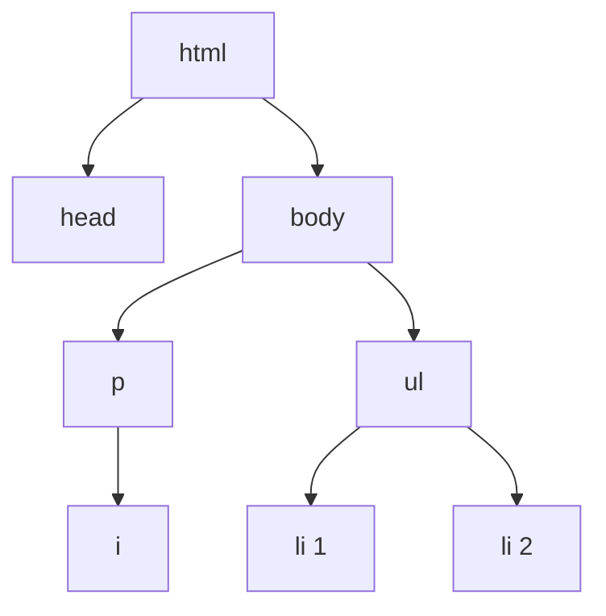

# 00c. Chuleta de HTML II

**Versión original en inglés:** [00c - HTML Cheatsheet II.md](00c%20-%20HTML%20Cheatsheet%20II.md)

**Curso:** HTML
**Tema:** Atributos, `class` frente a `id`, bases de CSS dentro de HTML, campos de formulario, textarea y etiquetas
**Tags:** `#html` `#web-development` `#chuleta` `#atributos` `#formularios` `#etiquetas` `#game-dev`

<p align="left">
  
  
  
  
  
  
</p>

<p align="center">
  
</p>

<hr style="border: none; height: 3px; background: linear-gradient(90deg, transparent, #E34F26, #2DD4BF, #E34F26, transparent); margin: 24px 0;" />

La segunda mitad de la hoja de referencia: todo lo que personaliza un elemento. Los atributos
lo etiquetan, `class` e `id` lo nombran, `<style>` lo pinta y `<input>` lo hace interactivo.
[[00b - Chuleta de HTML]] cubre los propios elementos.

> [!NOTE]
> Un atributo es la única forma de configurar un elemento. No hay ningún modo de marcar un
> elemento como encabezado salvo usar el elemento correcto, y los atributos solo llevan ajustes.
> Mantener separados esos dos trabajos es toda la idea de esta hoja.

---

## 🏷️ Atributos

Un atributo es un par `nombre="valor"` dentro de la etiqueta de apertura:

```html
<elemento nombre="valor">Contenido</elemento>
```

| Atributo | Se usa en | Significado |
| :--- | :--- | :--- |
| `src` | `` | Ruta del archivo / URL de la imagen |
| `alt` | `` | Texto alternativo (accesibilidad, mostrado si la imagen falla) |
| `width` | `` | Ancho de la imagen |
| `href` | `<a>` | A dónde lleva el enlace |
| `target="_blank"` | `<a>` | Abre el enlace en una nueva pestaña |
| `type` | `<ol>`, `<input>` | Estilo de numeración (`"a"`, `"i"`) o tipo de campo |
| `class` | cualquier elemento | Etiqueta compartida por muchos elementos (lista separada por espacios) |
| `id` | cualquier elemento | Etiqueta única (un solo elemento, sin espacios) |
| `style` | cualquier elemento | CSS en línea |
| `value` | `<input>` | Texto del botón de enviar, o el dato que envía un radio / checkbox |
| `minlength` / `maxlength` | `<input>` de texto, `<textarea>` | Número mínimo / máximo de caracteres |
| `required` | `<input>` | Debe rellenarse antes de enviar el formulario |
| `min` / `max` / `step` | `<input type="number">` | Rango y paso del número |
| `action` / `method` | `<form>` | Dónde y cómo se envían los datos del formulario |
| `name` | `<input>` | Los radios con el mismo `name` forman un grupo (una sola opción) |
| `rows` / `cols` | `<textarea>` | Filas visibles / columnas de caracteres (2 / 20 por defecto) |
| `placeholder` | `<textarea>` | Texto de ayuda mostrado mientras está vacío |
| `for` | `<label>` | Debe coincidir con el `id` del campo que etiqueta |

Varios atributos pueden ir en la misma etiqueta, separados por espacios:

```html

```

---

## 🆚 `class` frente a `id`

| | `class` | `id` |
| :--- | :--- | :--- |
| Cuántos por elemento | Muchos (`class="a b c"`) | Uno |
| Cuántos elementos lo comparten | Muchos | Uno (debe ser único) |
| Selector CSS | `.nombre` | `#nombre` |
| Destino de enlace | no | sí, con `href="#nombre"` |

Convención de nombres: minúsculas y palabras separadas por guiones (`tarjeta-habilidad`).

> [!TIP]
> Puede haber muchos jugadores en un **grupo** (`class`), pero cada jugador tiene un **ID**
> único. Esa frase basta para recordar la diferencia y sobrevive más que cualquier regla que
> leas después sobre especificidad.

---

## 🌳 Padres, hijos y hermanos

- **Padre:** contiene a otros elementos.
- **Hijo:** está directamente dentro de un padre.
- **Nieto:** está dentro de un hijo.
- **Hermanos:** comparten el mismo padre directo.

```text
<html>
└── <body>
    └── <ul>                       <-- padre de los <li>
        ├── <li>Ranger Prime</li>  <-- hermano de los demás <li>
        └── <li>Espectro de Ceniza</li>
```



En ese árbol, `<head>` y `<body>` son hijos de `<html>`, `<i>` es hijo de `<p>` y nieto de
`<body>`, y los dos `<li>` son hermanos porque comparten el mismo padre.

---

## 🎨 CSS dentro de HTML

### En línea, con el atributo `style`

```html
<span style="color:red; text-decoration:underline;">golpe crítico</span>
```

La propiedad y el valor se separan con `:`; varios estilos se separan con `;`.

### Con el elemento `<style>` en `<head>`

```html
<style>
  span { text-decoration: underline; }    /* por elemento */
  .slot { width: 50%; }                   /* por clase    */
  #slot-brasa { background-color: red; }   /* por id       */
  * { margin: 0; padding: 0; }             /* todos        */
</style>
```

| Selector | Coincide con |
| :--- | :--- |
| `span` | Todos los elementos `<span>` |
| `.slot` | Elementos con `class="slot"` |
| `#slot-brasa` | El elemento con `id="slot-brasa"` |
| `*` | Todos los elementos de la página |

### Propiedades imprescindibles al principio

| Propiedad | Ejemplo | Efecto |
| :--- | :--- | :--- |
| `color` | `color: blue;` | Color del texto |
| `background-color` | `background-color: pink;` | Color de fondo |
| `width` / `height` | `width: 50%; height: 100px;` | Tamaño |
| `text-align` | `text-align: center;` | Alineación del texto |
| `border` | `border: 3px solid blue;` | Borde |
| `margin` | `margin: auto;` | Espacio exterior |
| `padding` | `padding: 0;` | Espacio interior |
| `display` | `display: inline-block;` / `display: inline;` | Cómo se distribuye (`inline` pone los elementos de lista en fila) |
| `text-decoration` | `text-decoration: underline;` | Subrayado, tachado, etc. |

> [!WARNING]
> Los atributos `style` en línea solo tienen sentido para un valor puntual que nadie va a
> cambiar dos veces. En cuanto una regla aparece en más de un elemento, ponla en un bloque
> `<style>` — y, cuando avance el curso, en su propio archivo CSS.

---

## 📝 Campos de formulario

| Campo | Código | Comportamiento |
| :--- | :--- | :--- |
| Texto | `<input type="text">` | Caja de texto sencilla |
| Correo | `<input type="email">` | Comprueba que haya un `@` válido |
| Contraseña | `<input type="password">` | Oculta el texto con puntos |
| Número | `<input type="number" min="0" max="67" step="2">` | Permite números con flechas y límites |
| Casilla | `<input type="checkbox">` | Casilla: se pueden marcar **varias** opciones |
| Radio | `<input type="radio" name="grupo">` | Botón redondo: **una** opción por grupo `name` |
| Enviar | `<input type="submit" value="Enviar">` | Botón para enviar el formulario |

```html
<form>
  Nombre del jugador:<br>
  <input type="text" minlength="3" maxlength="20" required>
  <br><br>
  Correo electrónico:<br>
  <input type="email" required>
  <br><br>
  Contraseña:<br>
  <input type="password" minlength="8" maxlength="64" required>
  <br><br>
  <input type="submit" value="Crear cuenta">
</form>
```

| Atributo de `<form>` | Valor | Significado |
| :--- | :--- | :--- |
| `action` | `""` o una URL | A dónde van los datos al enviar |
| `method` | `"get"` / `"post"` | Cómo se envían los datos |

Todos los `<input>` deben estar dentro de **un único** `<form>`: el formulario es el sobre
que lleva todos los valores al servidor.

---

## 🎛️ Radio, checkbox, textarea y etiquetas

```html
<form>
  ¿Vienes a la incursión de esta noche?<br>
  <input type="radio" name="incursion" value="Sí"> Sí
  <input type="radio" name="incursion" value="No"> No
  <input type="radio" name="incursion" value="Quizá"> Quizá
  <br><br>

  ¿Qué clases llevas?<br>
  <input type="checkbox" name="rol" value="Explorador"> Explorador
  <input type="checkbox" name="rol" value="Mago"> Mago
  <input type="checkbox" name="rol" value="Tanque"> Tanque
  <br><br>

  <label for="build">Describe tu build:</label><br>
  <textarea id="build" name="build" rows="4" cols="42" placeholder="Agilidad 18, bastón de hielo…" maxlength="250"></textarea>
  <br><br>

  <label for="robot">
    <input type="checkbox" id="robot" name="robot"> No soy un robot
  </label>
  <br><br>

  <input type="submit" value="Enviar">
</form>
```

| | `"checkbox"` | `"radio"` |
| :--- | :--- | :--- |
| Opciones permitidas | Una o varias | Solo una por grupo |
| Ejemplo en Emberfall | Roles del grupo, opciones de accesibilidad | ¿Asistes? Sí / No / Quizá |

| Estilo de etiqueta | Código |
| :--- | :--- |
| Explícito | `<label for="name">Name:</label> <input type="text" id="name">` |
| Implícito | `<label>Name: <input type="text"></label>` |

> [!WARNING]
> Los radios **sin** `name` no forman un grupo: puedes marcar todos a la vez. Mismo `name`, una
> sola opción. Los checkbox no necesitan un `name` compartido para funcionar: lo comparten para
> que el servidor sepa qué opciones se eligieron.

---

## ✅ Buenas prácticas

- Indentar con **dos espacios**.
- Un solo `<h1>` y un solo `<body>` por archivo.
- Escribir siempre texto `alt` para las imágenes.
- Usar comentarios con moderación y eliminarlos cuando ya no sirven.
- Mantener cada `<input>` dentro de un solo `<form>`.
- Preferir CSS a `<b>`, `<i>`, `<u>` y `<s>` para el estilo (se ve en el curso de CSS).
- Enlazar cada `<label>` con su campo (`for` = `id`), o envolver el campo dentro de la etiqueta.
- Dar a los radios de una misma pregunta el mismo `name`.

---

## ⚠️ Trampas que conviene memorizar

| Trampa | Qué ocurre realmente |
| :--- | :--- |
| Dos elementos comparten un `id` | El salto `href="#id"` y el selector `#id` solo alcanzan el primero |
| Usar mayúsculas en `id` o `class` | El selector `.slot` no coincide con `class="Slot"` |
| `id="mi id"` con un espacio | El destino del enlace se rompe — `id` no admite espacios |
| `style="color:red"` sin comillas | Funciona en muchos navegadores, pero falla si el valor lleva espacios |
| Olvidar `:` o `;` en `style` | La declaración siguiente se descarta en silencio |
| Radios sin `name` compartido | Se pueden marcar todas las opciones a la vez |
| Usar checkbox para una sola elección | El jugador puede marcar tres clases para un grupo de tres |
| `<label for="build">` apuntando a un `id` inexistente | Al pulsar el texto no se enfoca nada |
| `<input>` fuera de `<form>` | Se muestra, pero pulsar Intro no envía nada |
| Pensar que `maxlength` valida | Solo limita la escritura; para bloquear el envío necesitas `minlength` |
| Dar estilo con `<b>` e `<i>` | Mal uso semántico que tendrás que deshacer en el curso de CSS |

---

## 🎮 La versión en una sola página

Todos los atributos de esta hoja, en el formulario de invitación del sitio de Emberfall:

```html
<form action="" method="post">
  <h2>Invitación a la incursión</h2>

  <label for="nombre-jugador">Nombre del jugador:</label>
  <input type="text" id="nombre-jugador" name="nombre-jugador" minlength="3" maxlength="16" required>
  <br><br>

  <p>Nivel del personaje:</p>
  <input type="number" id="nivel" name="nivel" min="1" max="99" step="1" required>
  <br><br>

  <p>¿Asistes?</p>
  <input type="radio" id="si" name="incursion" value="Sí">
  <label for="si">Sí</label>
  <input type="radio" id="no" name="incursion" value="No">
  <label for="no">No</label>
  <input type="radio" id="quiza" name="incursion" value="Quizá">
  <label for="quiza">Quizá</label>
  <br><br>

  <p>Clases del grupo:</p>
  <input type="checkbox" name="rol" value="Explorador"> Explorador
  <input type="checkbox" name="rol" value="Mago"> Mago
  <input type="checkbox" name="rol" value="Tanque"> Tanque
  <input type="checkbox" name="rol" value="Curandero"> Curandero
  <br><br>

  <label for="build">Notas del build:</label><br>
  <textarea id="build" name="build" rows="4" cols="42" placeholder="Bastón de hielo, build de evasión" maxlength="250"></textarea>
  <br><br>

  <input type="submit" value="Enviar invitación">
</form>
```

---

## 🔗 Ver también

- [[00b - Chuleta de HTML]] — elementos, etiquetas, diseño semántico y tipos de enlace
- [[02 - Estructura y Atributos]] — dónde se introducen `class`, `id` y `<style>`
- [[03 - Formularios]] — campos, tipos y validación, lección a lección

---