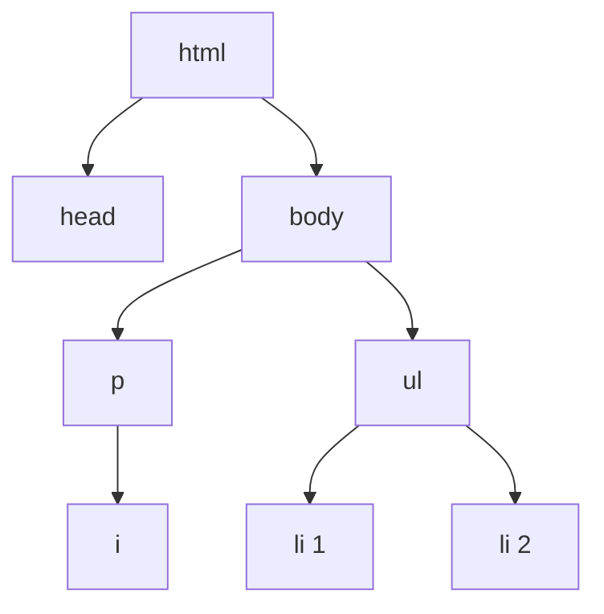

# 00c. HTML Cheatsheet II

**Spanish version:** [00c - Chuleta de HTML II.md](00c%20-%20Chuleta%20de%20HTML%20II.md)

**Course:** HTML
**Topic:** Attributes, `class` vs `id`, CSS basics inside HTML, and form inputs
**Tags:** `#html` `#web-development` `#cheatsheet` `#attributes` `#forms` `#game-dev`

<p align="left">
  
  
  
  
  
</p>

<hr style="border: none; height: 3px; background: linear-gradient(90deg, transparent, #E34F26, #2DD4BF, #E34F26, transparent); margin: 24px 0;" />

The second half of the reference sheet: everything that customizes an element. Attributes label it, `class` and `id` name it, `<style>` paints it, and `<input>` makes it interactive. [[00b - HTML Cheatsheet]] covers the elements themselves.

> [!NOTE]
> An attribute is the only way to configure an element. There is no `tag="something"` that
> sets styles and no way to mark an element as a heading: the element carries meaning, the
> attribute carries settings. Keeping those two jobs apart is the whole of this sheet.

---

## 🏷️ Attributes

An attribute is a `name="value"` pair inside the opening tag:

```html
<element name="value">Content</element>
```

| Attribute | Used on | Meaning |
| :--- | :--- | :--- |
| `src` | `` | File path / URL of the image |
| `alt` | `` | Alternative text (accessibility, shown if the image fails) |
| `width` | `` | Width of the image |
| `href` | `<a>` | Where the link goes |
| `target="_blank"` | `<a>` | Open the link in a new tab |
| `type` | `<ol>`, `<input>` | List label style (`"a"`, `"i"`) or input kind |
| `class` | any | Label shared by many elements (space-separated list) |
| `id` | any | Unique label (one per element, no spaces) |
| `style` | any | Inline CSS |
| `value` | `<input type="submit">` | Text of the button |
| `minlength` / `maxlength` | text-like `<input>` | Min / max number of characters |
| `required` | `<input>` | Must be filled in before submitting |
| `min` / `max` / `step` | `<input type="number">` | Range and step of a number |
| `action` / `method` | `<form>` | Where / how the form data is sent |

Multiple attributes in the same tag are separated by spaces:

```html

```

---

## 🆚 `class` vs `id`

| | `class` | `id` |
| :--- | :--- | :--- |
| How many per element | Many (`class="a b c"`) | One |
| How many elements share it | Many | One (must be unique) |
| CSS selector | `.name` | `#name` |
| Link target | no | yes, with `href="#name"` |

Naming: lowercase, words separated with dashes (`friend-card`).

> [!TIP]
> There can be multiple students in a **class**, but each student should have a unique
> **id**. That sentence is the whole difference, and it survives longer than any rule
> you will read about specificity.

---

## 🌳 Parents, Children & Siblings

- **Parent:** contains other elements.
- **Child:** directly inside a parent.
- **Grandchild:** inside a child.
- **Siblings:** share the same direct parent.

```text
<html>
└── <body>
    └── <ul>                 <-- parent of the <li>s
        ├── <li>Mario</li>   <-- sibling of the other <li>s
        └── <li>Luigi</li>
```



In the tree, `<head>` and `<body>` are children of `<html>`, `<i>` is a child of `<p>` and a
grandchild of `<body>`, and the two `<li>`s are siblings because they share the same parent.

---

## 🎨 CSS Inside HTML

### Inline, with the `style` attribute

```html
<span style="color:red; text-decoration:underline;">red</span>
```

Property and value are separated by `:`; several styles are separated by `;`.

### With a `<style>` element in `<head>`

```html
<style>
  span { text-decoration: underline; }   /* by element */
  .ranger-div { width: 50%; }            /* by class   */
  #red-ranger { background-color: red; }  /* by id      */
</style>
```

| Selector | Matches |
| :--- | :--- |
| `span` | Every `<span>` element |
| `.ranger-div` | Elements with `class="ranger-div"` |
| `#red-ranger` | The element with `id="red-ranger"` |

### The properties you need first

| Property | Example | Effect |
| :--- | :--- | :--- |
| `color` | `color: blue;` | Text color |
| `background-color` | `background-color: pink;` | Background color |
| `width` / `height` | `width: 50%; height: 100px;` | Size |
| `text-align` | `text-align: center;` | Text alignment |
| `border` | `border: 3px solid blue;` | Border |
| `margin` | `margin: auto;` | Outer spacing |
| `display` | `display: inline-block;` | How an element lays out |
| `text-decoration` | `text-decoration: underline;` | Underline and similar |

> [!WARNING]
> Inline `style` attributes are the right answer exactly once: for a one-off value nobody
> will want to change twice. The moment a rule appears on more than one element it belongs
> in a `<style>` block — and then to the CSS course, in its own file.

---

## 📝 Form Inputs

| Input | Code | Behavior |
| :--- | :--- | :--- |
| Text | `<input type="text">` | Plain textbox |
| Email | `<input type="email">` | Checks for a valid email (`@`) |
| Password | `<input type="password">` | Hides text as dots |
| Number | `<input type="number" min="0" max="67" step="2">` | Number with arrows and limits |
| Submit | `<input type="submit" value="Send">` | Submit button |

```html
<form>
  Username:<br>
  <input type="text" minlength="3" maxlength="20" required>
  <br><br>
  Email:<br>
  <input type="email" required>
  <br><br>
  Password:<br>
  <input type="password" minlength="8" maxlength="64" required>
  <br><br>
  <input type="submit">
</form>
```

| Form attribute | Value | Meaning |
| :--- | :--- | :--- |
| `action` | `""` or a URL | Where the data goes on submit |
| `method` | `"get"` / `"post"` | How the data is sent |

All `<input>` elements belong inside a **single** `<form>`: the form is the envelope that
carries every value to the server.

---

## ✅ Best Practices

- Indent with **two spaces**.
- One `<h1>` and one `<body>` per file.
- Always write `alt` text for images.
- Use comments sparingly and remove them when no longer needed.
- Keep every `<input>` inside a single `<form>`.
- Prefer CSS over `<b>`, `<i>`, `<u>` and `<s>` for styling (covered in the CSS course).

---

## ⚠️ Traps Worth Memorizing

| Trap | What actually happens |
| :--- | :--- |
| Two elements sharing an `id` | The `href="#id"` jump and the `#id` selector hit only the first one |
| `Id` or `City` with capitals | The value does not match your `.city` / `#city` selector |
| `id="my id"` with a space | The link target breaks — `id` values cannot contain spaces |
| `style="color:red"` without quotes | Works in most browsers, breaks the moment the value has a space |
| Forgetting `:` or `;` in `style` | The declaration after it is dropped silently |
| `<input>` outside a `<form>` | It renders, and pressing Enter submits nothing at all |
| `maxlength` as validation | It only limits typing; `minlength` is what blocks submission |
| Styling with `<b>` and `<i>` | Semantic misuse that the CSS course has to undo |

---

## 🔗 See Also

- [[00b - HTML Cheatsheet]] — elements, tags, comments and link types
- [[02 - Structure & Attributes]] — where `class`, `id` and `<style>` are introduced
- [[03 - Forms]] — inputs, types and validation, lesson by lesson

---