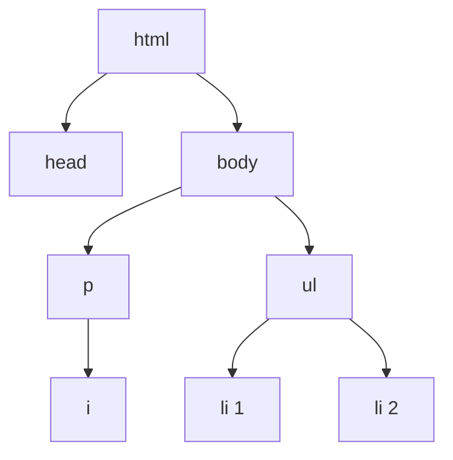

# 00c. HTML Cheatsheet II

**Spanish version:** [00c - Chuleta de HTML II.md](00c%20-%20Chuleta%20de%20HTML%20II.md)

**Course:** HTML
**Topic:** Attributes, `class` vs `id`, CSS basics inside HTML, form inputs, textarea and labels
**Tags:** `#html` `#web-development` `#cheatsheet` `#attributes` `#forms` `#labels` `#game-dev`

<p align="left">
  
  
  
  
  
  
</p>

<p align="center">
  
</p>

<hr style="border: none; height: 3px; background: linear-gradient(90deg, transparent, #E34F26, #2DD4BF, #E34F26, transparent); margin: 24px 0;" />

The second half of the reference sheet: everything that customizes an element. Attributes label
it, `class` and `id` name it, `<style>` paints it, and `<input>` makes it interactive.
[[00b - HTML Cheatsheet]] covers the elements themselves.

> [!NOTE]
> An attribute is the only way to configure an element. There is no `tag="something"` that sets
> styles and no way to mark an element as a heading: the element carries meaning, the attribute
> carries settings. Keeping those two jobs apart is the whole of this sheet.

---

## 🏷️ Attributes

An attribute is a `name="value"` pair inside the opening tag:

```html
<element name="value">Content</element>
```

| Attribute | Used on | Meaning |
| :--- | :--- | :--- |
| `src` | `` | File path / URL of the image |
| `alt` | `` | Alternative text (accessibility, shown if the image fails) |
| `width` | `` | Width of the image |
| `href` | `<a>` | Where the link goes |
| `target="_blank"` | `<a>` | Open the link in a new tab |
| `type` | `<ol>`, `<input>` | List label style (`"a"`, `"i"`) or input kind |
| `class` | any | Label shared by many elements (space-separated list) |
| `id` | any | Unique label (one per element, no spaces) |
| `style` | any | Inline CSS |
| `value` | `<input>` | Text of a submit button, or the data sent by a radio / checkbox |
| `minlength` / `maxlength` | text-like `<input>`, `<textarea>` | Min / max number of characters |
| `required` | `<input>` | Must be filled in before submitting |
| `min` / `max` / `step` | `<input type="number">` | Range and step of a number |
| `action` / `method` | `<form>` | Where / how form data is sent |
| `name` | `<input>` | Radio buttons with the same `name` form one group (one choice) |
| `rows` / `cols` | `<textarea>` | Visible rows / character columns (defaults 2 / 20) |
| `placeholder` | `<textarea>` | Hint text shown while empty |
| `for` | `<label>` | Must match the `id` of the input it labels |

Multiple attributes in the same tag are separated by spaces:

```html

```

---

## 🆚 `class` vs `id`

| | `class` | `id` |
| :--- | :--- | :--- |
| How many per element | Many (`class="a b c"`) | One |
| How many elements share it | Many | One (must be unique) |
| CSS selector | `.name` | `#name` |
| Link target | no | yes, with `href="#name"` |

Naming: lowercase, words separated with dashes (`ability-card`).

> [!TIP]
> There can be multiple players in a **party** (`class`), but each one has a unique **id**.
> That sentence is the whole difference, and it survives longer than any rule you will read
> about specificity.

---

## 🌳 Parents, Children & Siblings

- **Parent:** contains other elements.
- **Child:** directly inside a parent.
- **Grandchild:** inside a child.
- **Siblings:** share the same direct parent.

```text
<html>
└── <body>
    └── <ul>                      <-- parent of the <li>s
        ├── <li>Ranger Prime</li> <-- sibling of the other <li>s
        └── <li>Ash Wraith</li>
```



In the tree, `<head>` and `<body>` are children of `<html>`, `<i>` is a child of `<p>` and a
grandchild of `<body>`, and the two `<li>`s are siblings because they share the same parent.

---

## 🎨 CSS Inside HTML

### Inline, with the `style` attribute

```html
<span style="color:red; text-decoration:underline;">critical hit</span>
```

Property and value are separated by `:`; several styles are separated by `;`.

### With a `<style>` element in `<head>`

```html
<style>
  span { text-decoration: underline; }   /* by element */
  .slot { width: 50%; }                 /* by class   */
  #ember-slot { background-color: red; } /* by id     */
  * { margin: 0; padding: 0; }          /* every element */
</style>
```

| Selector | Matches |
| :--- | :--- |
| `span` | Every `<span>` element |
| `.slot` | Elements with `class="slot"` |
| `#ember-slot` | The element with `id="ember-slot"` |
| `*` | Every element on the page |

### The properties you need first

| Property | Example | Effect |
| :--- | :--- | :--- |
| `color` | `color: blue;` | Text color |
| `background-color` | `background-color: pink;` | Background color |
| `width` / `height` | `width: 50%; height: 100px;` | Size |
| `text-align` | `text-align: center;` | Text alignment |
| `border` | `border: 3px solid blue;` | Border |
| `margin` | `margin: auto;` | Outer spacing |
| `padding` | `padding: 0;` | Inner spacing |
| `display` | `display: inline-block;` / `display: inline;` | How an element lays out (`inline` puts list items in a row) |
| `text-decoration` | `text-decoration: underline;` | Underline and similar |

> [!WARNING]
> Inline `style` attributes are the right answer exactly once: for a one-off value nobody
> will want to change twice. The moment a rule appears on more than one element it belongs
> in a `<style>` block — and then to the CSS course, in its own file.

---

## 📝 Form Inputs

| Input | Code | Behavior |
| :--- | :--- | :--- |
| Text | `<input type="text">` | Plain textbox |
| Email | `<input type="email">` | Checks for a valid email (`@`) |
| Password | `<input type="password">` | Hides text as dots |
| Number | `<input type="number" min="0" max="67" step="2">` | Number with arrows and limits |
| Checkbox | `<input type="checkbox">` | Tick box: **many** choices allowed |
| Radio | `<input type="radio" name="group">` | Round button: **one** choice per `name` group |
| Submit | `<input type="submit" value="Send">` | Submit button |

```html
<form>
  Player name:<br>
  <input type="text" minlength="3" maxlength="20" required>
  <br><br>
  Email:<br>
  <input type="email" required>
  <br><br>
  Password:<br>
  <input type="password" minlength="8" maxlength="64" required>
  <br><br>
  <input type="submit" value="Create account">
</form>
```

| Form attribute | Value | Meaning |
| :--- | :--- | :--- |
| `action` | `""` or a URL | Where the data goes on submit |
| `method` | `"get"` / `"post"` | How the data is sent |

All `<input>` elements belong inside a **single** `<form>`: the form is the envelope that
carries every value to the server.

---

## 🎛️ Radio, Checkbox, Textarea & Labels

```html
<form>
  Joining the raid tonight?<br>
  <input type="radio" name="raid" value="Yes"> Yes
  <input type="radio" name="raid" value="No"> No
  <input type="radio" name="raid" value="Maybe"> Maybe
  <br><br>

  Which classes will you bring?<br>
  <input type="checkbox" name="role" value="Ranger"> Ranger
  <input type="checkbox" name="role" value="Mage"> Mage
  <input type="checkbox" name="role" value="Tank"> Tank
  <br><br>

  <label for="build">Describe your build:</label><br>
  <textarea id="build" name="build" rows="4" cols="42" placeholder="Agility 18, frost staff…" maxlength="250"></textarea>
  <br><br>

  <label for="robot">
    <input type="checkbox" id="robot" name="robot"> I'm not a robot
  </label>
  <br><br>

  <input type="submit" value="Send">
</form>
```

| | `"checkbox"` | `"radio"` |
| :--- | :--- | :--- |
| Choices allowed | One or more | Only one per group |
| Emberfall example | Roles brought to the raid, accessibility options | Attending? Yes / No / Maybe |

| Label style | Code |
| :--- | :--- |
| Explicit | `<label for="name">Name:</label> <input type="text" id="name">` |
| Implicit | `<label>Name: <input type="text"></label>` |

> [!WARNING]
> Radios with **no** `name` are not a group: you can tick all of them at once. Same `name`,
> one choice. Checkboxes never need a shared `name` to work — they share it so the server can
> tell which options were picked.

---

## ✅ Best Practices

- Indent with **two spaces**.
- One `<h1>` and one `<body>` per file.
- Always write `alt` text for images.
- Use comments sparingly and remove them when no longer needed.
- Keep every `<input>` inside a single `<form>`.
- Prefer CSS over `<b>`, `<i>`, `<u>` and `<s>` for styling (covered in the CSS course).
- Link every `<label>` to its input (`for` = `id`), or wrap the input inside the label.
- Give radio buttons of the same question the same `name`.

---

## ⚠️ Traps Worth Memorizing

| Trap | What actually happens |
| :--- | :--- |
| Two elements sharing an `id` | The `href="#id"` jump and the `#id` selector hit only the first one |
| `Id` or `Slot` with capitals | The value does not match your `.slot` / `#slot` selector |
| `id="ember slot"` with a space | The link target breaks — `id` values cannot contain spaces |
| `style="color:red"` without quotes | Works in most browsers, breaks the moment the value has a space |
| Forgetting `:` or `;` in `style` | The declaration after it is dropped silently |
| Radios without a shared `name` | Every option can be selected at the same time |
| Checkbox used for a single choice | The player can tick three classes for a three-slot party |
| `<label for="build">` pointing at a missing `id` | Clicking the text focuses nothing |
| `<input>` outside a `<form>` | It renders, and pressing Enter submits nothing at all |
| `maxlength` as validation | It only limits typing; `minlength` is what blocks submission |
| Styling with `<b>` and `<i>` | Semantic misuse that the CSS course has to undo |

---

## 🎮 The One-Page Version

Every attribute on this sheet, in the party-invite form of the Emberfall site:

```html
<form action="" method="post">
  <h2>Raid invite</h2>

  <label for="player-name">Player name:</label>
  <input type="text" id="player-name" name="player-name" minlength="3" maxlength="16" required>
  <br><br>

  <p>Level of the character:</p>
  <input type="number" id="level" name="level" min="1" max="99" step="1" required>
  <br><br>

  <p>Attending?</p>
  <input type="radio" id="yes" name="raid" value="Yes">
  <label for="yes">Yes</label>
  <input type="radio" id="no" name="raid" value="No">
  <label for="no">No</label>
  <input type="radio" id="maybe" name="raid" value="Maybe">
  <label for="maybe">Maybe</label>
  <br><br>

  <p>Classes in the party:</p>
  <input type="checkbox" name="role" value="Ranger"> Ranger
  <input type="checkbox" name="role" value="Mage"> Mage
  <input type="checkbox" name="role" value="Tank"> Tank
  <input type="checkbox" name="role" value="Healer"> Healer
  <br><br>

  <label for="build">Build notes:</label><br>
  <textarea id="build" name="build" rows="4" cols="42" placeholder="Frost staff, dodge build" maxlength="250"></textarea>
  <br><br>

  <input type="submit" value="Send invite">
</form>
```

---

## 🔗 See Also

- [[00b - HTML Cheatsheet]] — elements, tags, semantic layout and link types
- [[02 - Structure & Attributes]] — where `class`, `id` and `<style>` are introduced
- [[03 - Forms]] — inputs, types and validation, lesson by lesson

---