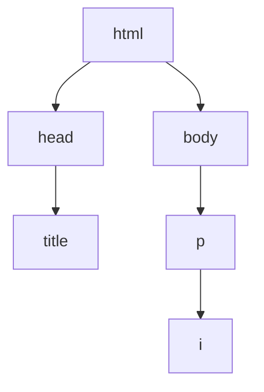

# 02. Estructura y Atributos

**Versión original en inglés:** [02 - Structure & Attributes.md](02%20-%20Structure%20&%20Attributes.md)

**Curso:** HTML
**Tema:** Estructura de HTML, padres e hijos, comentarios, atributos, clases e IDs, `<div>`, estilos en línea y el elemento `<style>`
**Tags:** `#html` `#web-development` `#estructura` `#atributos` `#game-dev`

<p align="left">
  
  
  
  
  
  
</p>

<p align="center">
  
</p>

<hr style="border: none; height: 3px; background: linear-gradient(90deg, transparent, #E34F26, #2DD4BF, #E34F26, transparent); margin: 24px 0;" />

El capítulo 01 nos enseñó a escribir páginas que funcionaban. Este capítulo las hace
**mantenibles**: un esqueleto real de documento, comentarios que explican la intención, etiquetas
`class` e `id` para que otros elementos puedan dirigirse a ellas y nuestros primeros pasos con
CSS. Terminamos con la "Cuadrícula de Equipamiento", que es el momento en el que varios `<div>`
pasan a formar un diseño.

> [!NOTE]
> **Por qué este capítulo es más importante de lo que parece**
> Todo lo que vemos aquí existe para que una **hoja de estilos** pueda encontrar nuestros
> elementos más adelante. `class` e `id` no son decoración: son asas a las que CSS, JavaScript
> y las herramientas de accesibilidad pueden agarrarse. Un elemento sin etiqueta es un elemento
> al que nadie puede llegar.

---

## 08. Plano

### Estructura de HTML

Ya sabemos crear una página web básica. Ahora vamos a estructurarla correctamente. Estos elementos son imprescindibles en cualquier archivo `.html`:

- `<!DOCTYPE html>` es la **declaración del tipo de documento**. Aparece al principio del archivo y le indica al navegador que estamos usando **HTML5**. **No tiene etiqueta de cierre**.
- `<html>` es el elemento que contiene todo el código de la página. **Sí tiene etiqueta de cierre**.

```html
<!DOCTYPE html>
<html>
  Aquí va el código
</html>
```

Dentro de `<html>` deben haber dos elementos principales:

| Elemento | Contiene |
| :--- | :--- |
| `<head>` | Información para el navegador, **no visible** en la página |
| `<body>` | Todo el contenido **visible** en la página |

```html
<!DOCTYPE html>
<html>
  <head>
    Información del documento
  </head>
  <body>
    Contenido visible
  </body>
</html>
```

### El elemento `<title>`

El elemento `<title>` va dentro de `<head>` y define el texto que aparece en la **pestaña del navegador**.

```html
<!DOCTYPE html>
<html>
  <head>
    <title>Devlog de Emberfall | Notas desde la forja</title>
  </head>
  <body>
    Aquí va el contenido
  </body>
</html>
```

Todo el contenido principal va dentro de `<body>`.

> [!WARNING]
> Un archivo sin `<title>` muestra la ruta del archivo en la pestaña — `file:///Users/tu-nombre/index.html` — lo cual es el punto de partida de la mitad de los errores de "¿mi web está terminada?". Un `<title>` por archivo, y debe nombrar la página, no la carpeta.

### Misión: Plano del Proyecto

Crea `blueprint.html` con la declaración `<!DOCTYPE html>`, el elemento `<html>`, dentro un `<head>` con un título y un `<body>` con un párrafo. Así tienes el esqueleto para todas tus páginas HTML.

```html
<!DOCTYPE html>
<html>
  <head>
    <title>Emberfall — Parche 1.4</title>
  </head>
  <body>
    <p>Este es el esqueleto del que parte cada página de Emberfall.</p>
  </body>
</html>
```

---

## 09. Árbol del Grupo

### Padres e hijos

Los elementos de un archivo HTML forman un **árbol de escena**. Muchos elementos pueden ser **padres** y contener uno o varios elementos **hijos**.

```html
<!DOCTYPE html>
<html>
  <head>
    <title>Grupo de Emberfall</title>
  </head>
  <body>
    <p>Un grupo de <i>cuatro</i> aventureros.</p>
  </body>
</html>
```

Relaciones en este ejemplo:

- `<head>` y `<body>` son **hijos** de `<html>`.
- `<title>` es hijo de `<head>`.
- `<i>` es hijo de `<p>` y **nieto** de `<body>`.



### Hermanos

Dos o más elementos son **hermanos** si comparten el mismo padre directo.

```html
<body>
  <ul>
    <li>🍄 Exploradora Prime</li>
    <li>🐢 Tanque Wanda</li>
  </ul>
</body>
```

Los dos elementos `<li>` son hermanos, porque ambos son hijos del mismo padre: `<ul>`.

### Misión: Árbol del Grupo

"Un héroe se define por el grupo en el que cae." Crea `party_tree.html` para tu propio grupo — o uno famoso: el elenco de Star Wars, los granjeros de Stardew Valley, el grupo original de Emberfall — usando listas anidadas con `<ul>` y `<li>`. Usa siempre la estructura completa con `<!DOCTYPE html>`, `<html>`, `<head>` y `<body>`.

Pregúntate: ¿qué elementos son padres? ¿Qué son hijos? ¿Qué son hermanos?

```html
<!-- Árbol del grupo 🌳 -->

<!DOCTYPE html>
<html>
  <head>
    <title>Árbol del Grupo</title>
  </head>
  <body>
    <h1>El grupo de Emberfall</h1>
    <p>🏠 Base: Sala de la Forja, Planta 1</p>
    <ul>
      <li>
        Exploradora Prime
        <ul>
          <li>Habilidad: Andanada</li>
          <li>Habilidad: Poner Trampas</li>
        </ul>
      </li>
      <li>
        Tanque Wanda
        <ul>
          <li>Habilidad: Muro de Escudo</li>
          <li>Habilidad: Provocar</li>
        </ul>
      </li>
      <li>Mago Sol (invitado)</li>
    </ul>
  </body>
</html>
```

> [!TIP]
> Una lista anidada dentro de un `<li>` es el árbol de grupo clásico — y también el árbol de
> habilidades, el árbol tecnológico y el árbol de carpetas. El patrón es recursivo: un
> contenedor con elementos que son a su vez contenedores con más elementos. La misma forma
> describe un grafo de escena de un juego.

---

## 10. Anuncio del Mercado de Mods

### Comentarios

Los **comentarios** sirven para dejar notas sobre la lógica o intención del código. Benefician tanto a quien lo escribió como a quien lo lea después.

```html
<!-- Soy un comentario. -->
<p>¡Yo no lo soy!</p>
```

Todo lo que está entre `<!--` y `-->` es **ignorado** por el navegador. Esto también nos permite "comentar" código para ocultarlo temporalmente:

```html
<!-- Vamos a comentar esto también. -->
<!-- <p>¡Nooo!</p> -->
```

### Comentarios de una línea o varias

Los comentarios pueden ocupar varias líneas:

```html
<!--
  Esto también es un comentario.
-->
```

También pueden estar dentro de un elemento:

```html
<p>Este texto sí se ve. <!-- Pero este no. --></p>
```

> [!NOTE]
> No abuses de los comentarios. Úsalos con moderación y bórralos cuando ya no sean necesarios.

> [!TIP]
> Un comentario que explica **qué** hace una línea suele ser ruido. Un comentario que explica
> **por qué** lo hace es oro puro: `<!-- cerrar el diálogo al éxito, no al cancelar -->` sobrevive
> a cualquier refactor; `<!-- incrementa i -->` no.

### Misión: Ficha del Mercado de Mods

El mercado de mods de Emberfall necesita limpiar la ficha de una skin. Pega este ejemplo en
`marketplace.html`, ejecútalo y sigue los comentarios para corregirlo:

```html
<!DOCTYPE html>
<html>
  <head>
    <!-- ¡Hola, soy Jun! ¿Puedes añadir "En venta" al título de abajo? -->
    <title>Espada wobble. Necesita arreglo</title>
  </head>
  <body>
    <!-- Añade comentarios para explicar cada línea -->
    <h2>Espada wobble. Necesita arreglo</h2>
    
    <p>Skin de espada hecha por la comunidad. Necesita arreglo. Gratis a buen hogar.</p>

    <!-- Descomenta el código de abajo y añade algo al punto de la lista -->
    <!-- <ul>
      <li>Aquí debería ir algo</li>
    </ul> -->
  </body>
</html>
```

Versión corregida:

```html
<!-- Ficha del mercado de mods 🪵 -->

<!DOCTYPE html>
<html>
  <head>
    <title>En venta: Espada wobble. Necesita arreglo</title>
  </head>
  <body>
    <!-- Encabezado de nivel 2: el nombre del mod. -->
    <h2>Espada wobble. Necesita arreglo</h2>

    <!-- Imagen de la vista previa del mod. -->
    

    <!-- Descripción del mod. -->
    <p>Skin de espada hecha por la comunidad. Necesita arreglo. Gratis a buen hogar.</p>

    <ul>
      <li>No contactes conmigo con ofertas no solicitadas</li>
    </ul>
  </body>
</html>
```

---

## 11. Entrada del Códex

### Atributos

Los **atributos** son ajustes extra para personalizar un elemento. Suelen ser pares `nombre="valor"`, separados por un signo igual:

```html
<elemento nombre="valor">Contenido</elemento>
```

- `nombre` indica qué atributo estamos configurando.
- `"valor"` va entre comillas dobles.

Por defecto, `<ol>` numera sus elementos con 1, 2, 3... El atributo `type` cambia ese formato:

```html
<ol type="a">   <!-- a. b. c. -->
  <li>Hoja de Brasa 🔥</li>
  <li>Bastón de Hielo ❄️</li>
  <li>Escudo de Hierro 🛡️</li>
</ol>
```

| Valor de `type` | Etiquetas |
| :--- | :--- |
| *(por defecto)* | 1. 2. 3. |
| `"a"` | a. b. c. |
| `"i"` | i. ii. iii. |

### Atributos de la etiqueta ``

```html


```

- `src` indica la ruta de la imagen.
- `width="250"` establece el ancho de la imagen.
- `alt` mejora la **accesibilidad**: si la imagen no carga, se muestra ese texto, y los lectores de pantalla lo leen para describir la imagen.

### Atributos de la etiqueta `<a>`

```html
<a href="https://emberfall.example/">Emberfall</a>
<a href="https://emberfall.example/" target="_blank">Emberfall</a>
```

- `href` es la URL a la que lleva el enlace.
- `target="_blank"` hace que el enlace se abra en una **nueva pestaña** del navegador.

> [!IMPORTANT]
> El orden de los atributos no importa — `src` antes de `alt` es igual que `alt` antes de `src`.
> Lo que sí importa son las **comillas**: sin ellas el navegador adivina y, si el valor tiene
> espacios, el atributo se rompe.

### Misión: Entrada del Códex

Escribe un artículo tipo "códex" sobre uno de tus héroes en `codex.html`. Debe incluir:

- Un encabezado `<h2>` que diga "Biografía".
- Una imagen de esa persona con su `alt` correspondiente.
- Un párrafo con al menos dos frases.
- Un enlace a una fuente externa que se abra en una nueva pestaña.

**Bonus:** ¿Cómo podemos ajustar el tamaño de la imagen con atributos? ¿Cómo podemos convertir la imagen en un enlace?

```html
<!DOCTYPE html>
<html>
  <head>
    <title>Entrada del Códex</title>
  </head>
  <body>
    <h2>Biografía</h2>
    
    <p>Ada Lovelace fue una matemática y escritora inglesa, conocida sobre todo por su trabajo sobre la máquina mecánica de propósito general de Charles Babbage, la Máquina Analítica. Se la considera una de las primeras programadoras de ordenadores de la historia.</p>
    <a href="https://es.wikipedia.org/wiki/Ada_Lovelace" target="_blank">Más información en Wikipedia</a>
  </body>
</html>
```

---

## 12. Maqueta en Groso

### Clases e IDs

Los dos atributos más usados son `class` e `id`. Cualquier elemento puede usarlos. Ambos sirven para etiquetar elementos, pero con diferencias importantes.

Un elemento puede tener **varios valores en `class`**, separados por espacios:

```html
<p class="stat-line stat-line--odd">Vida: 84 / 100</p>
```

Cada elemento solo puede tener **un solo `id`**, sin espacios, y ese `id` debe ser **único** en toda la página:

```html
<p id="vida-jugador">Vida: 84 / 100</p>
```

El `id` también sirve para **enlazar a una parte concreta de la misma página**. Para eso, usamos un enlace `<a>` con `href="#nombre-del-id"`:

```html
<a href="#salas-profundas">Ir a las Salas Profundas</a>

<h2 class="zona" id="salas-profundas">Salas Profundas 🕯️</h2>
```

Mientras que `id` es único por elemento, `class` puede reutilizarse en muchos elementos:

```html
<h2 class="zona" id="salas-profundas">Salas Profundas 🕯️</h2>
<h2 class="zona" id="boveda-de-brasa">Bóveda de Brasa 🔥</h2>
<h2 class="zona" id="cisterna-congelada">Cisterna Congelada ❄️</h2>
```

Los valores de `class` e `id` deben escribirse siempre en **minúsculas**. Si tienen varias palabras, sepáralas con **guiones** (`-`).

> [!TIP]
> Truco para recordarlo: puede haber muchos jugadores en un **grupo** (`class`), pero cada
> jugador necesita un **ID** (`id`) único.

### El elemento `<div>`

`<div>` (abreviatura de "division") es un contenedor genérico sin significado propio. Se usa mucho junto con `class` e `id` para organizar secciones:

```html
<div class="panel-hud" id="estadisticas">
  <h2>Estadísticas</h2>
  <p>Exploradora de nivel 7, puntos de habilidad sin gastar.</p>
</div>

<div class="panel-hud" id="inventario">
  <h2>Inventario:</h2>
  <ul>
    <li>Hoja de Brasa</li>
    <li>Bastón de Hielo</li>
    <li>Escudo de Hierro</li>
  </ul>
</div>
```

> [!WARNING]
> `<div>` no transmite significado. Úsalo cuando no existe otro elemento semántico más
> adecuado (`section`, `article`, `nav`, `ul`...). Un montón de `<div>` apilados es lo que
> se conoce como "div soup" (sopa de divs).

### Misión: Maqueta en Grueso

Una maqueta en grueso es la maquetación provisional que usas antes de que exista el contenido
definitivo. Crea `wireframe.html`:

- Un encabezado `<h1>` con el texto "Sin título".
- Dos enlaces `<a>`: uno con `href="#panel-1"` y texto "Panel 1", y otro con `href="#panel-2"` y texto "Panel 2".
- Debajo, dos elementos `<div>` con `class="panel-hud"`. Cada `<div>` debe contener:
  - Un `<h2>` con `class="titulo-panel"` e `id="panel-x"`.
  - Dos párrafos `<p>` con texto de relleno.

```html
<!DOCTYPE html>
<html>
  <head>
    <title>Maqueta</title>
  </head>
  <body>
    <h1>Sin título</h1>

    <a href="#panel-1">Panel 1</a>
    <a href="#panel-2">Panel 2</a>

    <div class="panel-hud">
      <h2 class="titulo-panel" id="panel-1">Panel 1</h2>
      <p>Las notas del parche de Salas Profundas irán aquí cuando el texto esté definido.</p>
      <p>Las tarjetas de botín, la fecha de lanzamiento y el banner de la temporada se renderizan en este panel.</p>
    </div>

    <div class="panel-hud">
      <h2 class="titulo-panel" id="panel-2">Panel 2</h2>
      <p>Las notas del parche de Salas Profundas irán aquí cuando el texto esté definido.</p>
      <p>Las tarjetas de botín, la fecha de lanzamiento y el banner de la temporada se renderizan en este panel.</p>
    </div>
  </body>
</html>
```

---

## 13. Grupo de los Elementos

### El atributo `style`

Hasta ahora nuestras páginas eran muy simples visualmente. Podemos añadir el atributo `style` a cualquier elemento HTML para darle un poco de estilo, como cambiar el color del texto:

```html
<p>
  El Guardián es <span style="color:red;">hostil</span>.<br />
  Sol es <span style="color:blue;">amistoso</span>.
</p>
```

Un estilo está formado por una **propiedad** (como `color`) y un **valor** (como `red`), separados por dos puntos `:`. Si queremos aplicar varios estilos, los separamos con punto y coma `;`.

```html
<p>
  El Guardián es <span style="color:red; text-decoration:underline;">hostil</span>.<br />
  Sol es <span style="color:blue; text-decoration:underline;">amistoso</span>.
</p>
```

- `color` cambia el color del texto.
- `text-decoration` añade efectos al texto (`underline`, `line-through`...), parecido a `<u>` o `<s>`.

Esto en realidad es **CSS**, y lo veremos con más profundidad en el siguiente curso.

### El elemento `<style>`

Usar `style` en un elemento está bien para casos puntuales. Pero si queremos aplicar los mismos estilos a muchos elementos, lo mejor es usar el elemento `<style>` dentro de `<head>`:

```html
<!DOCTYPE html>
<html>
  <head>
    <style>
      /* Aquí van los estilos */
    </style>
  </head>
  <body>
    <!-- Aquí va el contenido -->
  </body>
</html>
```

Dentro de `<style>` seleccionamos los elementos con selectores y aplicamos estilos entre llaves `{ ... }`:

```html
<style>
  elemento {
    propiedad: valor;
  }
</style>
```

Tipos de selectores:

| Selector | Selecciona |
| :--- | :--- |
| `span` | Todos los elementos `<span>` |
| `.mi-clase` | Elementos con `class="mi-clase"` (punto delante) |
| `#mi-id` | El elemento con `id="mi-id"` (almohadilla delante) |

```html
<!DOCTYPE html>
<html>
  <head>
    <style>
      span {
        text-decoration: underline;
      }

      #palabra-hostil {
        color: red;
      }

      #palabra-amistosa {
        color: blue;
      }
    </style>
  </head>
  <body>
    <p>
      El Guardián es <span id="palabra-hostil">hostil</span>.<br />
      Sol es <span id="palabra-amistosa">amistoso</span>.
    </p>
  </body>
</html>
```

> [!NOTE]
> El selector en `<style>` es exactamente el mismo valor que el atributo, con un carácter
> delante: `.slot-grupo` apunta a `class="slot-grupo"`, `#slot-brasa` apunta a
> `id="slot-brasa"`. Ese emparejamiento es el mecanismo entero.

### Misión: Formación del Grupo

Cinco miembros del grupo, cada uno con una identidad de color. Crea `party.html`. Coloca esto en `<body>`:

```html
<div class="slot-grupo" id="slot-brasa"></div>
<div class="slot-grupo" id="slot-hielo"></div>
<div class="slot-grupo" id="slot-piedra"></div>
<div class="slot-grupo" id="slot-viento"></div>
<div class="slot-grupo" id="slot-crepusculo"></div>
```

Añade un elemento `<style>` en `<head>` y aplica:

- Un `width` del `50%` y un `height` de `100px` para todos los `<div>` con la clase `slot-grupo`.
- Un `background-color` distinto para cada `<div>` según su `id` (rojo, azul, negro, amarillo y rosa).

```html
<!DOCTYPE html>
<html>
  <head>
    <title>Grupo de los Elementos</title>
    <style>
      .slot-grupo {
        width: 50%;
        height: 100px;
      }
      #slot-brasa {
        background-color: red;
      }
      #slot-hielo {
        background-color: blue;
      }
      #slot-piedra {
        background-color: black;
      }
      #slot-viento {
        background-color: yellow;
      }
      #slot-crepusculo {
        background-color: pink;
      }
    </style>
  </head>
  <body>
    <div class="slot-grupo" id="slot-brasa"></div>
    <div class="slot-grupo" id="slot-hielo"></div>
    <div class="slot-grupo" id="slot-piedra"></div>
    <div class="slot-grupo" id="slot-viento"></div>
    <div class="slot-grupo" id="slot-crepusculo"></div>
  </body>
</html>
```

> [!TIP]
> Observa lo importante: el HTML **no tiene colores**. Cinco `<div>` vacíos idénticos, y toda
> la decisión visual vive en un solo bloque `<style>`. Ahí está la lección: estructura por un
> lado, presentación por otro.

---

## 14. Cuadrícula de Equipamiento

### Punto de Control: Recapitulación

- Toda página HTML necesita `<!DOCTYPE html>`, `<html>`, `<head>` y `<body>`.
- `<head>` contiene información del documento, como `<title>`.
- Los comentarios `<!-- -->` sirven para documentar u ocultar código.
- Los atributos (`class`, `id`, `src`, `href`...) personalizan los elementos.
- Podemos dar estilo con el atributo `style` o con el elemento `<style>` (CSS viene después).

### Proyecto: Cuadrícula de Equipamiento

Una cuadrícula de ocho huecos de equipamiento es la pantalla que miras antes de cada incursión. Crea `loadout.html`.

Pega este bloque `<style>` en `<head>`:

```html
<style>
  body {
    width: 85%;
    margin: auto;
  }

  h1 {
    text-align: left;
  }

  img {
    border: 3px solid blue;
  }

  #contenedor-equipamiento {
    text-align: center;
  }

  .tarjeta-hueco {
    display: inline-block;
    margin: 1px;
    text-align: center;
  }

  .nombre-hueco {
    color: blue;
  }
</style>
```

Ahora añade el HTML:

1. Un `<div>` con `id="contenedor-equipamiento"`.
2. Dentro, un `<h1>` con el texto "¡Mi equipamiento de incursión!", seguido de dos `<div>` con `class="fila-equipamiento"`.
3. Dentro de cada `fila-equipamiento`, cuatro `<div>` con `class="tarjeta-hueco"`.
4. Dentro de cada `tarjeta-hueco`: un `<h2>` con `class="nombre-hueco"` y el nombre del objeto, más un `` con `src` y `alt`.

Si no quieres usar nombres reales, usa nombres bromas: "Falda infinita", "Lag de 200 ms", "Espada de depuración"...

```html
<!DOCTYPE html>
<html>
  <head>
    <title>Cuadrícula de Equipamiento</title>
    <style>
      /* ...estilos... */
    </style>
  </head>
  <body>
    <div id="contenedor-equipamiento">
      <h1>¡Mi equipamiento de incursión!</h1>

      <div class="fila-equipamiento">
        <div class="tarjeta-hueco">
          <h2 class="nombre-hueco">Hoja de Brasa</h2>
          
        </div>
        <div class="tarjeta-hueco">
          <h2 class="nombre-hueco">Bastón de Hielo</h2>
          
        </div>
        <div class="tarjeta-hueco">
          <h2 class="nombre-hueco">Escudo de Hierro</h2>
          
        </div>
        <div class="tarjeta-hueco">
          <h2 class="nombre-hueco">Farol</h2>
          
        </div>
      </div>

      <div class="fila-equipamiento">
        <div class="tarjeta-hueco">
          <h2 class="nombre-hueco">Cuerda</h2>
          
        </div>
        <div class="tarjeta-hueco">
          <h2 class="nombre-hueco">Poción de vida</h2>
          
        </div>
        <div class="tarjeta-hueco">
          <h2 class="nombre-hueco">Espada de depuración</h2>
          
        </div>
        <div class="tarjeta-hueco">
          <h2 class="nombre-hueco">Llave de repuesto</h2>
          
        </div>
      </div>
    </div>
  </body>
</html>
```

> [!TIP]
> **Versión para videojuegos**
> `tarjeta-hueco` es un componente reutilizable: una caja con imagen + nombre + estilo que se
> repite ocho veces. Cámbialo por miembros del equipo, con su retrato y nivel, y tendrás
> una pantalla de grupo perfecta. `display: inline-block` es el truco para colocar tarjetas
> en fila, igual que un grid muy básico.

---

## XP Obtenida: Conclusiones clave

- 🧬 Toda página: `<!DOCTYPE html>` → `<html>` → `<head>` + `<body>`.
- 🗂️ Los elementos forman un **árbol de escena**: padres, hijos y hermanos.
- 💬 Los comentarios `<!-- -->` documentan u ocultan código.
- 🏷️ Los atributos son pares `nombre="valor"`: `src`, `alt`, `href`, `target`, `type`, `class`, `id`, `style`.
- 🆔 Un solo `id` por elemento (único), muchos elementos pueden compartir una `class`.
- 🔗 `href="#id"` sirve para saltar a una parte de la misma página.
- 📦 `<div>` es un contenedor genérico.
- 🎨 Podemos dar estilo con `style` o con `<style>` (CSS viene después).

---

## Botín: Casos de uso reales

- 🗺️ Páginas con varias secciones y navegación interna
- 📚 Artículos tipo Wikipedia
- 🧑‍🤝‍🧑 Perfiles con tarjetas (cards)
- 🎨 Primeros experimentos con colores y diseño
- 🎮 Cuadrículas de equipamiento, pantallas de grupo y árboles de habilidades

---

## Misiones Secundarias: Ejercicios prácticos

1. Añade una tercera sección a `wireframe.html` con su propio enlace en la parte superior.
2. Crea una página en la que todos los `<p>` tengan el mismo estilo desde un bloque `<style>`.
3. Convierte una imagen en enlace: envuelve un `` dentro de un `<a>`.
4. Añade comentarios a un archivo antiguo explicando qué hace cada sección.
5. **Desafío final:** rehace el ejercicio del Grupo de los Elementos como una pantalla de equipo: usa una clase `.slot-equipo` y cuatro IDs (`#miembro-1` a `#miembro-4`), con una regla común para que todos tengan el mismo tamaño.

---

## Ver también

- [[00c - Chuleta de HTML II]] — referencia de atributos y selectores para este capítulo
- [[01 - Fundamentos de HTML]] — los elementos que usamos aquí, explicados desde cero
- [[03 - Formularios]] — cómo recoger datos de entrada
- [[04 - HTML Semántico]] — sustituir la sopa de `<div>` por elementos con significado

---