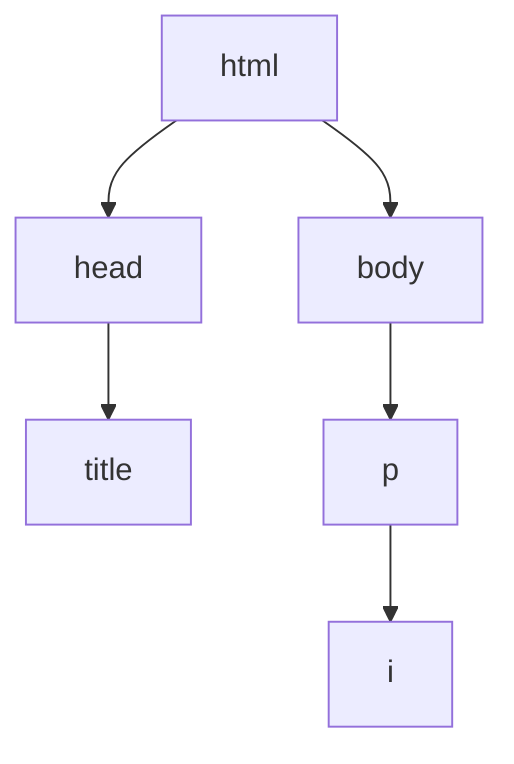

# 02. Estructura y Atributos

**Versión original en inglés:** [02 - Structure & Attributes.md](02%20-%20Structure%20&%20Attributes.md)

**Curso:** HTML
**Tema:** Estructura de HTML, padres e hijos, comentarios, atributos, clases e IDs, `<div>`, estilos en línea y el elemento `<style>`
**Tags:** `#html` `#web-development` `#structure` `#attributes` `#game-dev`

<p align="left">
  
  
  
  
  
</p>

<hr style="border: none; height: 3px; background: linear-gradient(90deg, transparent, #E34F26, #2DD4BF, #E34F26, transparent); margin: 24px 0;" />

El capítulo 01 nos enseñó a escribir páginas que funcionaban. Este capítulo las hace **mantenibles**: un esqueleto real de documento, comentarios que explican la intención, etiquetas `class` e `id` para que otros elementos puedan dirigirse a ellas y nuestros primeros pasos con CSS. Terminamos con el "MySpace Plantilla de Grupo", que es el momento en el que varios `<div>` pasan a formar un diseño.

> [!NOTE]
> **Por qué este capítulo es más importante de lo que parece**
> Todo lo que vemos aquí existe para que una **hoja de estilos** pueda encontrar nuestros elementos más adelante. `class` e `id` no son decoración: son asas a las que CSS, JavaScript y las herramientas de accesibilidad pueden agarrarse. Un elemento sin etiqueta es un elemento al que nadie puede llegar.

---

## 08. Plano

### Estructura de HTML

Ya sabemos crear una página web básica. Ahora vamos a estructurarla correctamente. Estos elementos son imprescindibles en cualquier archivo `.html`:

- `<!DOCTYPE html>` es la **declaración del tipo de documento**. Aparece al principio del archivo y le indica al navegador que estamos usando **HTML5**. **No tiene etiqueta de cierre**.
- `<html>` es el elemento que contiene todo el código de la página. **Sí tiene etiqueta de cierre**.

```html
<!DOCTYPE html>
<html>
  Aquí va el código
</html>
```

Dentro de `<html>` deben haber dos elementos principales:

| Elemento | Contiene |
| :--- | :--- |
| `<head>` | Información para el navegador, **no visible** en la página |
| `<body>` | Todo el contenido **visible** en la página |

```html
<!DOCTYPE html>
<html>
  <head>
    Información del documento
  </head>
  <body>
    Contenido visible
  </body>
</html>
```

### El elemento `<title>`

El elemento `<title>` va dentro de `<head>` y define el texto que aparece en la **pestaña del navegador**.

```html
<!DOCTYPE html>
<html>
  <head>
    <title>GameForge | Empieza tu aventura de programación</title>
  </head>
  <body>
    Aquí va el contenido
  </body>
</html>
```

Todo el contenido principal va dentro de `<body>`.

> [!WARNING]
> Un archivo sin `<title>` muestra la ruta del archivo en la pestaña — `file:///Users/tu-nombre/index.html` — lo cual es muy poco profesional. Pon siempre un `<title>` que describa la página.

### Misión: Plano del Mapa

Crea `blueprint.html` con la declaración `<!DOCTYPE html>`, el elemento `<html>`, dentro un `<head>` con un título y un `<body>` con un párrafo. Así tienes el esqueleto para todas tus páginas HTML.

```html
<!DOCTYPE html>
<html>
  <head>
    <title>Mi página base</title>
  </head>
  <body>
    <p>Este es el esqueleto básico de una página HTML.</p>
  </body>
</html>
```

---

## 09. Árbol Genealógico

### Padres e hijos

Los elementos de un archivo HTML forman un **árbol**. Muchos elementos pueden ser **padres** y contener uno o varios elementos **hijos**.

```html
<!DOCTYPE html>
<html>
  <head>
    <title>Mi sitio web</title>
  </head>
  <body>
    <p>Hola, <i>¿qué tal?</i></p>
  </body>
</html>
```

Relaciones en este ejemplo:

- `<head>` y `<body>` son **hijos** de `<html>`.
- `<title>` es hijo de `<head>`.
- `<i>` es hijo de `<p>` y **nieto** de `<body>`.



### Hermanos

Dos o más elementos son **hermanos** si comparten el mismo padre directo.

```html
<body>
  <ul>
    <li>🍄 Mario</li>
    <li>🐢 Luigi</li>
  </ul>
</body>
```

Los dos elementos `<li>` son hermanos, porque ambos son hijos del mismo padre: `<ul>`.

### Misión: Árbol del Clan

Crea `family_tree.html` sobre tu familia (o una famosa: los Simpson, los Stark, los Kardashian...) usando listas anidadas con `<ul>` y `<li>`. Usa siempre la estructura completa con `<!DOCTYPE html>`, `<html>`, `<head>` y `<body>`.

Pregúntate: ¿qué elementos son padres? ¿Qué son hijos? ¿Qué son hermanos?

```html
<!-- Árbol genealógico 🌳 -->

<!DOCTYPE html>
<html>
  <head>
    <title>Árbol Genealógico</title>
  </head>
  <body>
    <h1>Los Simpson</h1>
    <p>🏡 Ciudad: Springfield, IL</p>
    <ul>
      <li>
        Homer y Marge Simpson
        <ul>
          <li>Bart Simpson</li>
          <li>Lisa Simpson</li>
          <li>Maggie Simpson</li>
        </ul>
      </li>
      <li>Patty Bouvier (Gemela)</li>
      <li>Selma Bouvier (Gemela)</li>
    </ul>
  </body>
</html>
```

> [!TIP]
> Una lista anidada es una estructura recursiva: un elemento que contiene otros elementos que,
> a su vez, pueden contener más. Es la misma forma que usan los árboles de archivos, los mapas
> de juego o las habilidades en un árbol de talentos.

---

## 10. Anuncio de Craigslist

### Comentarios

Los **comentarios** sirven para dejar notas sobre la lógica o intención del código. Benefician tanto a quien lo escribió como a quien lo lea después.

```html
<!-- Soy un comentario. -->
<p>¡Yo no lo soy!</p>
```

Todo lo que está entre `<!--` y `-->` es **ignorado** por el navegador. Esto también nos permite "comentar" código para ocultarlo temporalmente:

```html
<!-- Vamos a comentar esto también. -->
<!-- <p>¡Nooo!</p> -->
```

### Comentarios de una línea o varias

Los comentarios pueden ocupar varias líneas:

```html
<!--
  Esto también es un comentario.
-->
```

También pueden estar dentro de un elemento:

```html
<p>Este texto sí se ve. <!-- Pero este no. --></p>
```

> [!NOTE]
> No abuses de los comentarios. Úsalos con moderación y bórralos cuando ya no sean necesarios.

> [!TIP]
> Un comentario que explica **qué** hace una línea suele ser ruido. Un comentario que explica
> **por qué** lo hace es oro puro: `<!-- cerrar el diálogo al éxito, no al cancelar -->` sobrevive
> a cualquier refactor; `<!-- incrementa i -->` no.

### Misión: Tablero del Gremio

Necesitamos limpiar este código. Pega este ejemplo en `craigslist_ad.html`, ejecútalo y sigue los comentarios para corregirlo:

```html
<!DOCTYPE html>
<html>
  <head>
    <!-- ¡Hola, soy Craig! ¿Puedes añadir "En venta" al título de abajo? -->
    <title>Didgeridoo. Necesita arreglo</title>
  </head>
  <body>
    <!-- Añade comentarios para explicar cada línea -->
    <h2>Didgeridoo. Necesita arreglo</h2>
    
    <p>Didgeridoo aborigen australiano. Necesita arreglo. Gratis a buen hogar.</p>

    <!-- Descomenta el código de abajo y añade algo al punto de la lista -->
    <!-- <ul>
      <li>Aquí debería ir algo</li>
    </ul> -->
  </body>
</html>
```

Versión corregida:

```html
<!-- Anuncio de Craigslist 🪵 -->

<!DOCTYPE html>
<html>
  <head>
    <title>En venta: Didgeridoo. Necesita arreglo</title>
  </head>
  <body>
    <!-- Encabezado de nivel 2 -->
    <h2>Didgeridoo. Necesita arreglo</h2>

    <!-- Imagen de un didgeridoo, un instrumento musical -->
    

    <!-- Descripción del anuncio -->
    <p>Didgeridoo aborigen australiano. Necesita arreglo. Gratis a buen hogar.</p>

    <ul>
      <li>No contactes conmigo con ofertas no solicitadas</li>
    </ul>
  </body>
</html>
```

---

## 11. Artículo de Wikipedia

### Atributos

Los **atributos** son ajustes extra para personalizar un elemento. Suelen ser pares `nombre="valor"`, separados por un signo igual:

```html
<elemento nombre="valor">Contenido</elemento>
```

- `nombre` indica qué atributo estamos configurando.
- `"valor"` va entre comillas dobles.

Por defecto, `<ol>` numera sus elementos con 1, 2, 3... El atributo `type` cambia ese formato:

```html
<ol type="a">   <!-- a. b. c. -->
  <li>Poder ⚡</li>
  <li>Coraje 🔥</li>
  <li>Sabiduría 🦉</li>
</ol>
```

| Valor de `type` | Etiquetas |
| :--- | :--- |
| *(por defecto)* | 1. 2. 3. |
| `"a"` | a. b. c. |
| `"i"` | i. ii. iii. |

### Atributos de la etiqueta ``

```html


```

- `src` indica la ruta de la imagen.
- `width="250"` establece el ancho de la imagen.
- `alt` mejora la **accesibilidad**: si la imagen no carga, se muestra ese texto, y los lectores de pantalla lo leen para describir la imagen.

### Atributos de la etiqueta `<a>`

```html
<a href="https://gameforge.example/">GameForge</a>
<a href="https://gameforge.example/" target="_blank">GameForge</a>
```

- `href` es la URL a la que lleva el enlace.
- `target="_blank"` hace que el enlace se abra en una **nueva pestaña** del navegador.

> [!IMPORTANT]
> El orden de los atributos no importa — `src` antes de `alt` es igual que `alt` antes de `src`.
> Lo que sí importa son las **comillas**: sin ellas el navegador adivina y, si el valor tiene
> espacios, el atributo se rompe.

### Misión: Entrada del Bestiario

Escribe un artículo tipo "Wikipedia" sobre uno de tus héroes en `wiki_article.html`. Debe incluir:

- Un encabezado `<h2>` que diga "Biografía".
- Una imagen de esa persona con su `alt` correspondiente.
- Un párrafo con al menos dos frases.
- Un enlace a una fuente externa que se abra en una nueva pestaña.

**Bonus:** ¿Cómo podemos ajustar el tamaño de la imagen con atributos? ¿Cómo podemos convertir la imagen en un enlace?

```html
<!DOCTYPE html>
<html>
  <head>
    <title>Artículo de Wikipedia</title>
  </head>
  <body>
    <h2>Biografía</h2>
    
    <p>Ada Lovelace fue una matemática y escritora inglesa, conocida sobre todo por su trabajo sobre la máquina mecánica de propósito general de Charles Babbage, la Máquina Analítica. Se la considera una de las primeras programadoras de ordenadores de la historia.</p>
    <a href="https://es.wikipedia.org/wiki/Ada_Lovelace" target="_blank">Más información en Wikipedia</a>
  </body>
</html>
```

---

## 12. Lorem Ipsum

### Clases e IDs

Los dos atributos más usados son `class` e `id`. Cualquier elemento puede usarlos. Ambos sirven para etiquetar elementos, pero con diferencias importantes.

Un elemento puede tener **varios valores en `class`**, separados por espacios:

```html
<p class="valor-uno valor-dos valor-tres">¡Hola, Mundo!</p>
```

Cada elemento solo puede tener **un solo `id`**, sin espacios, y ese `id` debe ser **único** en toda la página:

```html
<p id="valor">¡Hola, Mundo!</p>
```

El `id` también sirve para **enlazar a una parte concreta de la misma página**. Para eso, usamos un enlace `<a>` con `href="#nombre-del-id"`:

```html
<a href="#medellin">Ir a Medellín</a>

<h2 class="ciudad" id="medellin">Medellín 🇨🇴</h2>
```

Mientras que `id` es único por elemento, `class` puede reutilizarse en muchos elementos:

```html
<h2 class="ciudad" id="medellin">Medellín 🇨🇴</h2>
<h2 class="ciudad" id="lisboa">Lisboa 🇵🇹</h2>
<h2 class="ciudad" id="bali">Bali 🇮🇩</h2>
```

Los valores de `class` e `id` deben escribirse siempre en **minúsculas**. Si tienen varias palabras, sepáralas con **guiones** (`-`).

> [!TIP]
> Truco para recordarlo: puede haber muchos alumnos en una **clase** (`class`), pero cada
> alumno tiene un **ID** (`id`) único.

### El elemento `<div>`

`<div>` (abreviatura de "division") es un contenedor genérico sin significado propio. Se usa mucho junto con `class` e `id` para organizar secciones:

```html
<div class="seccion" id="sobre-mi">
  <h2>Sobre mí</h2>
  <p>¡Ness quiere ser desarrollador web!</p>
</div>

<div class="seccion" id="redes-sociales">
  <h2>Redes sociales:</h2>
  <ul>
    <li>GitHub</li>
    <li>Twitter</li>
    <li>LinkedIn</li>
  </ul>
</div>
```

> [!WARNING]
> `<div>` no transmite significado. Úsalo cuando no existe otro elemento semántico más
> adecuado (`section`, `article`, `nav`, `ul`...). Un montón de `<div>` apilados es lo que
> se conoce como "div soup" (sopa de divs).

### Misión: Pergamino de Lore

**Lorem Ipsum** es texto de relleno que usamos para ver cómo quedará el diseño antes de tener el texto definitivo. Crea `lorem_ipsum.html`:

- Un encabezado `<h1>` con el texto "Sin título".
- Dos enlaces `<a>`: uno con `href="#encabezado-1"` y texto "Encabezado 1", y otro con `href="#encabezado-2"` y texto "Encabezado 2".
- Debajo, dos elementos `<div>` con `class="seccion"`. Cada `<div>` debe contener:
  - Un `<h2>` con `class="encabezado"` e `id="encabezado-x"`.
  - Dos párrafos `<p>` con texto Lorem Ipsum.

```html
<!DOCTYPE html>
<html>
  <head>
    <title>Lorem Ipsum</title>
  </head>
  <body>
    <h1>Sin título</h1>

    <a href="#encabezado-1">Encabezado 1</a>
    <a href="#encabezado-2">Encabezado 2</a>

    <div class="seccion">
      <h2 class="encabezado" id="encabezado-1">Encabezado 1</h2>
      <p>Lorem ipsum dolor sit amet, consectetur adipiscing elit, sed do eiusmod tempor incididunt ut labore et dolore magna aliqua. Ut enim ad minim veniam, quis nostrud exercitation ullamco laboris nisi ut aliquip ex ea commodo consequat.</p>
      <p>Lorem ipsum dolor sit amet, consectetur adipiscing elit, sed do eiusmod tempor incididunt ut labore et dolore magna aliqua. Ut enim ad minim veniam, quis nostrud exercitation ullamco laboris nisi ut aliquip ex ea commodo consequat.</p>
    </div>

    <div class="seccion">
      <h2 class="encabezado" id="encabezado-2">Encabezado 2</h2>
      <p>Lorem ipsum dolor sit amet, consectetur adipiscing elit, sed do eiusmod tempor incididunt ut labore et dolore magna aliqua. Ut enim ad minim veniam, quis nostrud exercitation ullamco laboris nisi ut aliquip ex ea commodo consequat.</p>
      <p>Lorem ipsum dolor sit amet, consectetur adipiscing elit, sed do eiusmod tempor incididunt ut labore et dolore magna aliqua. Ut enim ad minim veniam, quis nostrud exercitation ullamco laboris nisi ut aliquip ex ea commodo consequat.</p>
    </div>
  </body>
</html>
```

---

## 13. Escuadrón de Héroes

### El atributo `style`

Hasta ahora nuestras páginas eran muy simples visualmente. Podemos añadir el atributo `style` a cualquier elemento HTML para darle un poco de estilo, como cambiar el color del texto:

```html
<p>
  Las rosas son <span style="color:red;">rojas</span>.<br />
  Los violetas son <span style="color:blue;">azules</span>.
</p>
```

Un estilo está formado por una **propiedad** (como `color`) y un **valor** (como `red`), separados por dos puntos `:`. Si queremos aplicar varios estilos, los separamos con punto y coma `;`.

```html
<p>
  Las rosas son <span style="color:red; text-decoration:underline;">rojas</span>.<br />
  Los violetas son <span style="color:blue; text-decoration:underline;">azules</span>.
</p>
```

- `color` cambia el color del texto.
- `text-decoration` añade efectos al texto (`underline`, `line-through`...), parecido a `<u>` o `<s>`.

Esto en realidad es **CSS**, y lo veremos con más profundidad en el siguiente curso.

### El elemento `<style>`

Usar `style` en un elemento está bien para casos puntuales. Pero si queremos aplicar los mismos estilos a muchos elementos, lo mejor es usar el elemento `<style>` dentro de `<head>`:

```html
<!DOCTYPE html>
<html>
  <head>
    <style>
      /* Aquí van los estilos */
    </style>
  </head>
  <body>
    <!-- Aquí va el contenido -->
  </body>
</html>
```

Dentro de `<style>` seleccionamos los elementos con selectores y aplicamos estilos entre llaves `{ ... }`:

```html
<style>
  elemento {
    propiedad: valor;
  }
</style>
```

Tipos de selectores:

| Selector | Selecciona |
| :--- | :--- |
| `span` | Todos los elementos `<span>` |
| `.mi-clase` | Elementos con `class="mi-clase"` (punto delante) |
| `#mi-id` | El elemento con `id="mi-id"` (almohadilla delante) |

```html
<!DOCTYPE html>
<html>
  <head>
    <style>
      span {
        text-decoration: underline;
      }

      #palabra-roja {
        color: red;
      }

      #palabra-azul {
        color: blue;
      }
    </style>
  </head>
  <body>
    <p>
      Las rosas son <span id="palabra-roja">rojas</span>.<br />
      Los violetas son <span id="palabra-azul">azules</span>.
    </p>
  </body>
</html>
```

> [!NOTE]
> El selector en `<style>` es exactamente el mismo valor que el atributo, con un carácter
> delante: `.ranger-div` apunta a `class="ranger-div"`, `#red-ranger` apunta a
> `id="red-ranger"`. Ese emparejamiento es el mecanismo entero.

### Misión: Formación del Equipo

En 1993 se estrenó "Mighty Morphin' Escuadrón de Héroes". Los cinco Escuadrón de Héroes originales tenían cada uno un color: rojo, azul, negro, amarillo y rosa. Crea `power_rangers.html`. Coloca esto en `<body>`:

```html
<div class="ranger-div" id="red-ranger"></div>
<div class="ranger-div" id="blue-ranger"></div>
<div class="ranger-div" id="black-ranger"></div>
<div class="ranger-div" id="yellow-ranger"></div>
<div class="ranger-div" id="pink-ranger"></div>
```

Añade un elemento `<style>` en `<head>` y aplica:

- Un `width` del `50%` y un `height` de `100px` para todos los `<div>` con la clase `ranger-div`.
- Un `background-color` distinto para cada `<div>` según su `id` (rojo, azul, negro, amarillo y rosa).

```html
<!DOCTYPE html>
<html>
  <head>
    <title>Escuadrón de Héroes</title>
    <style>
      .ranger-div {
        width: 50%;
        height: 100px;
      }
      #red-ranger {
        background-color: red;
      }
      #blue-ranger {
        background-color: blue;
      }
      #black-ranger {
        background-color: black;
      }
      #yellow-ranger {
        background-color: yellow;
      }
      #pink-ranger {
        background-color: pink;
      }
    </style>
  </head>
  <body>
    <div class="ranger-div" id="red-ranger"></div>
    <div class="ranger-div" id="blue-ranger"></div>
    <div class="ranger-div" id="black-ranger"></div>
    <div class="ranger-div" id="yellow-ranger"></div>
    <div class="ranger-div" id="pink-ranger"></div>
  </body>
</html>
```

> [!TIP]
> Observa lo importante: el HTML **no tiene colores**. Cinco `<div>` vacíos idénticos, y toda
> la decisión visual vive en un solo bloque `<style>`. Ahí está la lección: estructura por un
> lado, presentación por otro.

---

## 14. MySpace Plantilla de Grupo

### Punto de Control: Recapitulación

- Toda página HTML necesita `<!DOCTYPE html>`, `<html>`, `<head>` y `<body>`.
- `<head>` contiene información del documento, como `<title>`.
- Los comentarios `<!-- -->` sirven para documentar u ocultar código.
- Los atributos (`class`, `id`, `src`, `href`...) personalizan los elementos.
- Podemos dar estilo con el atributo `style` o con el elemento `<style>` (CSS viene después).

### Proyecto: MySpace Plantilla de Grupo

El **Plantilla de Grupo** era una función muy famosa de MySpace: permitía elegir a 8 amigos para mostrarlos en tu perfil. Crea `top_8.html`.

Pega este bloque `<style>` en `<head>`:

```html
<style>
  body {
    width: 85%;
    margin: auto;
  }

  h1 {
    text-align: left;
  }

  img {
    border: 3px solid blue;
  }

  #top-8-wrapper {
    text-align: center;
  }

  .friend-card {
    display: inline-block;
    margin: 1px;
    text-align: center;
  }

  .friend-name {
    color: blue;
  }
</style>
```

Ahora añade el HTML:

1. Un `<div>` con `id="top-8-wrapper"`.
2. Dentro, un `<h1>` con el texto "Mis 8 mejores amigos", seguido de dos `<div>` con `class="top-8-row"`.
3. Dentro de cada `top-8-row`, cuatro `<div>` con `class="friend-card"`.
4. Dentro de cada `friend-card`: un `<h2>` con `class="friend-name"` y el nombre del amigo, más un `` con `src` y `alt`.

Si no quieres usar nombres reales, usa apodos divertidos.

```html
<!DOCTYPE html>
<html>
  <head>
    <title>MySpace Plantilla de Grupo</title>
    <style>
      /* ...estilos... */
    </style>
  </head>
  <body>
    <div id="top-8-wrapper">
      <h1>¡Mis 8 mejores amigos!</h1>

      <div class="top-8-row">
        <div class="friend-card">
          <h2 class="friend-name">Tom</h2>
          
        </div>
        <div class="friend-card">
          <h2 class="friend-name">Sara</h2>
          
        </div>
        <div class="friend-card">
          <h2 class="friend-name">Álex</h2>
          
        </div>
        <div class="friend-card">
          <h2 class="friend-name">Taylor</h2>
          
        </div>
      </div>

      <div class="top-8-row">
        <div class="friend-card">
          <h2 class="friend-name">Jordi</h2>
          
        </div>
        <div class="friend-card">
          <h2 class="friend-name">Marta</h2>
          
        </div>
        <div class="friend-card">
          <h2 class="friend-name">Casey</h2>
          
        </div>
        <div class="friend-card">
          <h2 class="friend-name">Riley</h2>
          
        </div>
      </div>
    </div>
  </body>
</html>
```

> [!TIP]
> **Versión para videojuegos**
> `friend-card` es un componente reutilizable: una caja con imagen + nombre + estilo que se
> repite ocho veces. Cámbialo por miembros del equipo, con su retrato y nivel, y tendrás
> una pantalla de grupo perfecta. `display: inline-block` es el truco para colocar tarjetas
> en fila, igual que un grid muy básico.

---

## XP Obtenida: Conclusiones clave

- 🧬 Toda página: `<!DOCTYPE html>` → `<html>` → `<head>` + `<body>`.
- 🗂️ Los elementos forman un **árbol**: padres, hijos y hermanos.
- 💬 Los comentarios `<!-- -->` documentan u ocultan código.
- 🏷️ Los atributos son pares `nombre="valor"`: `src`, `alt`, `href`, `target`, `type`, `class`, `id`, `style`.
- 🆔 Un solo `id` por elemento (único), muchos elementos pueden compartir una `class`.
- 🔗 `href="#id"` sirve para saltar a una parte de la misma página.
- 📦 `<div>` es un contenedor genérico.
- 🎨 Podemos dar estilo con `style` o con `<style>` (CSS viene después).

---

## Botín: Casos de uso reales

- 🗺️ Páginas con varias secciones y navegación interna
- 📚 Artículos tipo Wikipedia
- 🧑‍🤝‍🧑 Perfiles con tarjetas (cards)
- 🎨 Primeros experimentos con colores y diseño
- 🎮 Hojas de personaje, pantallas de equipo y árboles de habilidades

---

## Misiones Secundarias: Ejercicios prácticos

1. Añade una tercera sección a `lorem_ipsum.html` con su propio enlace en la parte superior.
2. Crea una página en la que todos los `<p>` tengan el mismo estilo desde un bloque `<style>`.
3. Convierte una imagen en enlace: envuelve un `` dentro de un `<a>`.
4. Añade comentarios a un archivo antiguo explicando qué hace cada sección.
5. **Desafío final:** rehace el ejercicio de Escuadrón de Héroes como una pantalla de equipo: usa una clase `.slot-equipo` y cuatro IDs (`#miembro-1` a `#miembro-4`), con una regla común para que todos tengan el mismo tamaño.

---

## Ver también

- [[00c - Chuleta de HTML II]] — referencia de atributos y selectores para este capítulo
- [[01 - Fundamentos de HTML]] — los elementos que usamos aquí, explicados desde cero
- [[03 - Formularios]] — cómo recoger datos de entrada

---