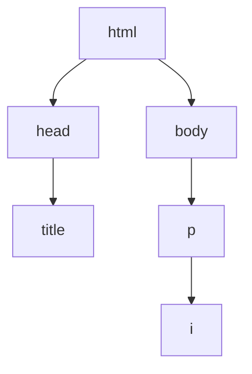

# 02. Structure & Attributes

**Spanish version:** [02 - Estructura y Atributos.md](02%20-%20Estructura%20y%20Atributos.md)

**Course:** HTML
**Topic:** HTML Structure, Parents & Children, Comments, Attributes, Classes & IDs, `<div>`, Inline Styles & the `<style>` Element
**Tags:** `#html` `#web-development` `#structure` `#attributes` `#game-dev`

<p align="left">
  
  
  
  
  
  
</p>

<p align="center">
  
</p>

<hr style="border: none; height: 3px; background: linear-gradient(90deg, transparent, #E34F26, #2DD4BF, #E34F26, transparent); margin: 24px 0;" />

Chapter 01 wrote pages that worked. This chapter makes them **maintainable**: a real document
skeleton, comments that explain intent, `class` and `id` labels that other code can target, and
the first taste of CSS. It ends with the Loadout Grid, which is the moment a stack of `<div>`s
turns into a layout.

> [!NOTE]
> **Why this chapter matters more than it looks**
> Everything here exists so that a *stylesheet* can find your elements later. `class` and `id`
> are not decoration — they are the handles that CSS, JavaScript and accessibility tools grab
> to work on your page. An element without a label is an element nothing can reach.

---

## 08. Blueprint

### HTML Structure

Now that we know how to spin up a web page, let's explore how to structure our HTML files better. Here are the must-haves in a `.html` file.

- `<!DOCTYPE html>` is the **document type declaration**. It appears at the top of the file and tells the browser the file is written in **HTML5**. It has **no closing tag**.
- `<html>` is the element that contains all the code processed on the page. It **does** have a closing tag.

```html
<!DOCTYPE html>
<html>
  Code goes here
</html>
```

Inside `<html>` there should be two elements:

| Element | Contains |
| :--- | :--- |
| `<head>` | All the info for your browser that is **not visible** on the page |
| `<body>` | All the content you will end up **seeing** on the page |

```html
<!DOCTYPE html>
<html>
  <head>
    Some code goes here
  </head>
  <body>
    A lot more goes here
  </body>
</html>
```

### The `<title>` Element

The `<title>` element goes in the `<head>` and assigns text to the **browser tab**.

```html
<!DOCTYPE html>
<html>
  <head>
    <title>Emberfall Devlog | Notes from the forge</title>
  </head>
  <body>
    Code goes here
  </body>
</html>
```

All the "main" code goes in the `<body>` element.

> [!WARNING]
> A file with no `<title>` shows the file path on the tab — `file:///Users/you/index.html` —
> which is how half the "is my site finished?" bugs start. One `<title>` per file, and it
> names the page, not the folder.

### Quest: Project Blueprint

Create `blueprint.html` with a `<!DOCTYPE html>` declaration and an `<html>` element containing a `<head>` with a page title and a `<body>` with a paragraph. You now have the blueprint for all future HTML files.

```html
<!DOCTYPE html>
<html>
  <head>
    <title>Emberfall — Patch 1.4</title>
  </head>
  <body>
    <p>This is the blueprint every Emberfall page starts from.</p>
  </body>
</html>
```

---

## 09. Party Tree

### Parents & Children

The elements in an HTML file are arranged like a **scene tree**. Most elements can be **parents** with one or more **child** elements.

```html
<!DOCTYPE html>
<html>
  <head>
    <title>Emberfall Party</title>
  </head>
  <body>
    <p>Party of <i>four</i> adventurers.</p>
  </body>
</html>
```

Relationships in this example:

- `<head>` and `<body>` are **children** of `<html>`.
- `<title>` is the child of `<head>`.
- `<i>` is the child of `<p>` and the **grandchild** of `<body>`.



### Siblings

Elements are **siblings** if they share a direct parent element.

```html
<body>
  <ul>
    <li>🍄 Ranger Prime</li>
    <li>🐢 Tank Wanda</li>
  </ul>
</body>
```

The two `<li>` elements are siblings because both are children of the same parent, the `<ul>` element.

### Quest: Party Tree

"A hero is defined by the party they fall with." Create `party_tree.html` for your own party — or a famous one: the Star Wars crew, the Stardew valley farmers, the Emberfall original party — using list elements such as `<ul>` and `<li>`. Set up the page properly with `<!DOCTYPE html>`, `<html>`, etc.

Then ask yourself: which elements are parents? Which are children? Which are siblings?

```html
<!-- Party Tree 🌳 -->

<!DOCTYPE html>
<html>
  <head>
    <title>Party Tree</title>
  </head>
  <body>
    <h1>The Emberfall Crew</h1>
    <p>🏠 Base: Forge Hall, Floor 1</p>
    <ul>
      <li>
        Ranger Prime
        <ul>
          <li>Skill: Volley</li>
          <li>Skill: Trap Setting</li>
        </ul>
      </li>
      <li>
        Tank Wanda
        <ul>
          <li>Skill: Shield Wall</li>
          <li>Skill: Taunt</li>
        </ul>
      </li>
      <li>Mage Sol (guest)</li>
    </ul>
  </body>
</html>
```

> [!TIP]
> A nested `<ul>` inside an `<li>` is the classic party tree — and it is also the classic
> skill tree, tech tree and folder tree. The pattern is recursive: a container holding items
> that are themselves containers holding items. The same shape describes a game scene graph.

---

## 10. Marketplace Listing

### Comments

Comments are useful for taking notes about the **logic and intentions** behind different parts of a page. They should benefit whoever wrote the code and anyone reviewing it later.

```html
<!-- I am a comment. -->
<p>And I'm not a comment!</p>
```

Everything surrounded by `<!--` and `-->` is **ignored** and not rendered by the browser. That also lets us "comment out" code:

```html
<!-- Let's make you a comment, too. -->
<!-- <p>Nooo!</p> -->
```

### Inline vs. Multi-line

Comments can span multiple lines:

```html
<!--
  This is also a comment.
-->
```

They can also be used within an element:

```html
<p>This text is visible. <!-- But this is not. --></p>
```

> [!NOTE]
> Don't be excessive with comments. Use them sparingly and remove them when no longer needed.

> [!TIP]
> A comment that explains **what** the line does is noise — the line already says it. A
> comment that explains **why** is gold. `<!-- close the dialog on success, not on cancel -->`
> survives a refactor; `<!-- increments i -->` does not.

### Quest: Mod Marketplace Listing

The Emberfall mod marketplace needs its skin listing cleaned up. Paste this starter code into `marketplace.html`, run it, then edit the HTML following the comments:

```html
<!DOCTYPE html>
<html>
  <head>
    <!-- Hi, it's Jun! Can you add "For Sale" in the title below? -->
    <title>Wobbly Sword. Needs work</title>
  </head>
  <body>
    <!-- Add some comments below to document what each line means! -->
    <h2>Wobbly Sword. Needs work</h2>
    
    <p>Community-made sword skin. Needs work. Free to good home</p>

    <!-- Add the bullet point in the picture and then uncomment the code below! -->
    <!-- <ul>
      <li>Something should go here</li>
    </ul> -->
  </body>
</html>
```

Finished version:

```html
<!-- Mod Marketplace Listing 🪵 -->

<!DOCTYPE html>
<html>
  <head>
    <title>For Sale: Wobbly Sword. Needs work</title>
  </head>
  <body>
    <!-- This is a level 2 heading: the name of the mod. -->
    <h2>Wobbly Sword. Needs work</h2>

    <!-- This is an image of the mod preview. -->
    

    <!-- This paragraph describes the mod above. -->
    <p>Community-made sword skin. Needs work. Free to good home</p>

    <ul>
      <li>do NOT contact me with unsolicited offers</li>
    </ul>
  </body>
</html>
```

---

## 11. Codex Entry

### Attributes

**Attributes** are additional settings we use to customize an element. They are usually **name/value pairs**, separated by an equals sign:

```html
<element name="value">Content</element>
```

- `name` indicates the attribute we are setting.
- `"value"` is surrounded by double quotes.

By default, `<ol>` uses numbers to label its `<li>` elements. The `type` attribute changes that:

```html
<ol type="a">   <!-- a. b. c. -->
  <li>Ember Blade 🔥</li>
  <li>Frost Staff ❄️</li>
  <li>Iron Buckler 🛡️</li>
</ol>
```

| `type` value | Labels |
| :--- | :--- |
| *(default)* | 1. 2. 3. |
| `"a"` | a. b. c. |
| `"i"` | i. ii. iii. |

### Attributes in the Image Tag

```html


```

- `src` specifies the file path of the image.
- `width="250"` sets the width of the image.
- `alt` makes images more **accessible**: if the image can't appear, the `alt` text is displayed instead, and assistive devices read it aloud to describe the image.

### Attributes in the Anchor Tag

```html
<a href="https://emberfall.example/">Emberfall</a>
<a href="https://emberfall.example/" target="_blank">Emberfall</a>
```

- `href` is the URL visited when the hyperlinked text is clicked.
- `target="_blank"` makes the link open in a **new browser tab**.

> [!IMPORTANT]
> Order does not matter between attributes — `src` before `alt` and `alt` before `src` are
> the same element. What does matter is the **quotes**: without them the browser guesses, and
> a value with a space silently breaks the tag into two attributes.

### Quest: Codex Entry

Write a "codex" article about one of your heroes in `codex.html`. Include:

- One heading that says "Biography".
- An image of that person that includes alternative text.
- One paragraph with at least 2 sentences.
- One link in the text (opens on a new tab).

**Bonus:** How can we adjust the size of the image using attributes? How can we make the image a hyperlink?

```html
<!DOCTYPE html>
<html>
  <head>
    <title>Codex Entry</title>
  </head>
  <body>
    <h2>Biography</h2>
    
    <p>Ada Lovelace was an English mathematician and writer, chiefly known for her work on Charles Babbage's mechanical general-purpose computer, the Analytical Engine. She is widely regarded as one of the first computer programmers in history.</p>
    <a href="https://en.wikipedia.org/wiki/Ada_Lovelace" target="_blank">Learn more on Wikipedia</a>
  </body>
</html>
```

---

## 12. Layout Wireframe

### Classes and IDs

The two attributes we'll come across most are `class` and `id`. Any element can use them. Both label elements, but they have important differences.

An element can have **multiple `class` values** in a space-separated list:

```html
<p class="stat-line stat-line--odd">Health: 84 / 100</p>
```

Each element can only have **one `id`** value, with no spaces, and every `id` should be **unique** in the entire page:

```html
<p id="player-health">Health: 84 / 100</p>
```

`id` can also be used to **link to another part of the same page**. Match it with an `<a>` element's `href` through a `#` hashtag followed by the identifier:

```html
<a href="#deep-halls">Link to the Deep Halls</a>

<h2 class="zone" id="deep-halls">Deep Halls 🕯️</h2>
```

Where only one `id` can be assigned to a single element, a `class` can be assigned to many:

```html
<h2 class="zone" id="deep-halls">Deep Halls 🕯️</h2>
<h2 class="zone" id="ember-vault">Ember Vault 🔥</h2>
<h2 class="zone" id="frozen-cistern">Frozen Cistern ❄️</h2>
```

The values of `class` and `id` must always be **lowercase**. If the name has multiple words, separate them with **dashes** (`-`).

> [!TIP]
> A good way to remember: there can be multiple players in a **party** (`class`), but each one
> needs a unique **id**. 💡

### Division Element

`<div>` (short for "division") is a generic container with no particular meaning, used to create sections. It goes hand in hand with `class` and `id`:

```html
<div class="hud-panel" id="player-stats">
  <h2>Stats</h2>
  <p>Level 7 ranger, unspent skill points.</p>
</div>

<div class="hud-panel" id="inventory">
  <h2>Inventory:</h2>
  <ul>
    <li>Ember Blade</li>
    <li>Frost Staff</li>
    <li>Iron Buckler</li>
  </ul>
</div>
```

> [!WARNING]
> `<div>` has no meaning of its own, which is exactly why it is so easy to overuse. Reach for
> `<section>`, `<article>`, `<nav>` or `<ul>` when one of those says what you mean — a stack
> of `<div>`s with `class` names is a page no one can navigate.

### Quest: Wireframe

A wireframe is placeholder layout you use before the final content exists. Create `wireframe.html`:

- An `<h1>` heading that says "Untitled".
- Two `<a>` anchors: `href="#panel-1"` with text "Panel 1" and `href="#panel-2"` with text "Panel 2".
- Underneath, two `<div>` elements with a `class` of `"hud-panel"`. Each `<div>` contains:
  - 1 `<h2>` with `class="panel-title"` and `id="panel-x"`.
  - 2 `<p>` elements with placeholder text.

```html
<!DOCTYPE html>
<html>
  <head>
    <title>Wireframe</title>
  </head>
  <body>
    <h1>Untitled</h1>

    <a href="#panel-1">Panel 1</a>
    <a href="#panel-2">Panel 2</a>

    <div class="hud-panel">
      <h2 class="panel-title" id="panel-1">Panel 1</h2>
      <p>Patch notes for the Deep Halls expansion land here once the text is final.</p>
      <p>Reward cards, the launch date and the season banner render inside this panel.</p>
    </div>

    <div class="hud-panel">
      <h2 class="panel-title" id="panel-2">Panel 2</h2>
      <p>Patch notes for the Deep Halls expansion land here once the text is final.</p>
      <p>Reward cards, the launch date and the season banner render inside this panel.</p>
    </div>
  </body>
</html>
```

---

## 13. Elemental Party

### The `style` Attribute

So far, the appearance of our pages has been pretty skeletal. We can apply a `style` attribute to any HTML element to stylize certain aspects of it, such as the text color:

```html
<p>
  The Warden is <span style="color:red;">hostile</span>.<br />
  Sol is <span style="color:blue;">friendly</span>.
</p>
```

A style is made of a **property** (like `color`) and a **value** (like `red`), separated by a **colon** `:`. Multiple styles can be applied to a single element, separated by a **semicolon** `;`.

```html
<p>
  The Warden is <span style="color:red; text-decoration:underline;">hostile</span>.<br />
  Sol is <span style="color:blue; text-decoration:underline;">friendly</span>.
</p>
```

- The `color` property sets the color of an element's text.
- The `text-decoration` property adds text formatting (such as `underline`), similar to what `<b>`, `<i>`, `<u>` and `<s>` do.

This is actually a language called **CSS**, which comes in the next course.

### The `<style>` Element

Using the `style` attribute for a few elements is one thing. But what if we want to style a bunch of different elements, or the same styles on every instance of an element? The `<style>` element goes in the `<head>` and styles the elements in the `<body>`:

```html
<!DOCTYPE html>
<html>
  <head>
    <style>
      ... Styles for elements go here
    </style>
  </head>
  <body>
    ... Elements go here
  </body>
</html>
```

Elements are **selected** inside `<style>` and styled within curly braces `{/}`:

```html
<style>
  element {
    property: value;
  }
</style>
```

Selectors:

| Selector | Matches |
| :--- | :--- |
| `span` | Every `<span>` element |
| `.my-class` | Elements with `class="my-class"` (period) |
| `#my-id` | The element with `id="my-id"` (hashtag) |

```html
<!DOCTYPE html>
<html>
  <head>
    <style>
      span {
        text-decoration: underline;
      }

      #hostile-word {
        color: red;
      }

      #friendly-word {
        color: blue;
      }
    </style>
  </head>
  <body>
    <p>
      The Warden is <span id="hostile-word">hostile</span>.<br />
      Sol is <span id="friendly-word">friendly</span>.<br />
    </p>
  </body>
</html>
```

> [!NOTE]
> The selector in `<style>` is the **same value** as the attribute in the body, with a
> character in front: `.party-slot` targets `class="party-slot"`, `#ember-slot` targets
> `id="ember-slot"`. That correspondence is the entire mechanism.

### Quest: Elemental Party

Five party members, each with a color identity. Create `party.html`. Put this in the `<body>`:

```html
<div class="party-slot" id="ember-slot"></div>
<div class="party-slot" id="frost-slot"></div>
<div class="party-slot" id="stone-slot"></div>
<div class="party-slot" id="gale-slot"></div>
<div class="party-slot" id="dusk-slot"></div>
```

Insert a `<style>` element in the `<head>` and apply:

- A `width` of `50%` and `height` of `100px` for `<div>` elements with the `party-slot` class.
- A different `background-color` for each `<div>` based on its `id`.

```html
<!DOCTYPE html>
<html>
  <head>
    <title>Elemental Party</title>
    <style>
      .party-slot {
        width: 50%;
        height: 100px;
      }
      #ember-slot {
        background-color: red;
      }
      #frost-slot {
        background-color: blue;
      }
      #stone-slot {
        background-color: black;
      }
      #gale-slot {
        background-color: yellow;
      }
      #dusk-slot {
        background-color: pink;
      }
    </style>
  </head>
  <body>
    <div class="party-slot" id="ember-slot"></div>
    <div class="party-slot" id="frost-slot"></div>
    <div class="party-slot" id="stone-slot"></div>
    <div class="party-slot" id="gale-slot"></div>
    <div class="party-slot" id="dusk-slot"></div>
  </body>
</html>
```

> [!TIP]
> Notice what happened: the HTML carries **no colors**. Five identical empty `<div>`s, and
> every visual decision lives in one `<style>` block that can be rewritten in one place.
> That separation — structure here, presentation there — is the actual lesson.

---

## 14. Loadout Grid

### Checkpoint: Chapter Recap

- Every HTML file should have a `<!DOCTYPE html>` declaration and an `<html>` element.
- The `<head>` element contains important info for the page, such as the `<title>`.
- Comments `<!-- -->` are great for documentation or excluding unwanted code.
- Attributes like `class`/`id` or `src` enhance the way elements are organized, presented and work on the page.
- We can add styles with either the `<style>` element or the `style` attribute.

### Project: Loadout Grid

An eight-slot loadout is the screen you stare at before every raid. Create `loadout.html`.

Paste this `<style>` element into the `<head>`:

```html
<style>
  body {
    width: 85%;
    margin: auto;
  }

  h1 {
    text-align: left;
  }

  img {
    border: 3px solid blue;
  }

  #loadout-wrapper {
    text-align: center;
  }

  .slot-card {
    display: inline-block;
    margin: 1px;
    text-align: center;
  }

  .slot-name {
    color: blue;
  }
</style>
```

Then add the HTML:

1. A `<div>` with an `id` of `"loadout-wrapper"`.
2. Inside, an `<h1>` that says "My Raid Loadout!", followed by two `<div>` elements with a class of `"loadout-row"`.
3. Inside each `loadout-row`, four `<div>` elements with a class of `"slot-card"`.
4. Inside each `slot-card`: an `<h2>` with a `"slot-name"` class and the item name, plus an `` with `src` and `alt`.

If you don't want to use real item names, use funny placeholders ("Pants of Holding", "Lag spikes", "Debug sword"...).

```html
<!DOCTYPE html>
<html>
  <head>
    <title>Loadout Grid</title>
    <style>
      /* ...styles above... */
    </style>
  </head>
  <body>
    <div id="loadout-wrapper">
      <h1>My Raid Loadout!</h1>

      <div class="loadout-row">
        <div class="slot-card">
          <h2 class="slot-name">Ember Blade</h2>
          
        </div>
        <div class="slot-card">
          <h2 class="slot-name">Frost Staff</h2>
          
        </div>
        <div class="slot-card">
          <h2 class="slot-name">Iron Buckler</h2>
          
        </div>
        <div class="slot-card">
          <h2 class="slot-name">Lantern</h2>
          
        </div>
      </div>

      <div class="loadout-row">
        <div class="slot-card">
          <h2 class="slot-name">Rope</h2>
          
        </div>
        <div class="slot-card">
          <h2 class="slot-name">Health Potion</h2>
          
        </div>
        <div class="slot-card">
          <h2 class="slot-name">Debug Sword</h2>
          
        </div>
        <div class="slot-card">
          <h2 class="slot-name">Spare Key</h2>
          
        </div>
      </div>
    </div>
  </body>
</html>
```

> [!TIP]
> **Game dev version**
> `slot-card` is a component: a repeated box of image + name + styling that appears eight
> times. Swap the items for party members, the `<h2>` for a level, the `` for the
> portrait and you have an inventory screen. `display: inline-block` is the whole trick
> behind "cards in a row", and it is the same idea as a grid in any UI framework.

---

## XP Earned: Key Takeaways

- 🧬 Every page: `<!DOCTYPE html>` → `<html>` → `<head>` + `<body>`.
- 🗂️ Elements form a **scene tree**: parents, children, siblings.
- 💬 Comments `<!-- -->` document code and hide code.
- 🏷️ Attributes are `name="value"` pairs: `src`, `alt`, `href`, `target`, `type`, `class`, `id`, `style`.
- 🆔 One `id` per element (unique), many elements can share a `class`.
- 🔗 `href="#id"` links to a part of the same page.
- 📦 `<div>` is the generic container.
- 🎨 Style with the `style` attribute or a `<style>` element (CSS is next).

---

## Loot Table: Real-World Use Cases

- 🗺️ Multi-section landing pages with in-page navigation
- 📚 Wiki-style article pages
- 🧑‍🤝‍🧑 Profile pages with card layouts
- 🎨 First experiments with colors and layout
- 🎮 Loadout grids, party screens and skill trees built from repeated card components

---

## 🎮 Side Quests: Practice Exercises

1. Add a third section to `wireframe.html` with its own link at the top.
2. Create a page where every `<p>` is styled by one `<style>` rule.
3. Make an `` into a link by wrapping it in an `<a>`.
4. Add comments to an old file explaining what every section does.
5. **Boss fight:** rebuild the Elemental Party exercise as a party screen — one `.party-slot` class, four `#member-1` … `#member-4` ids, and a shared rule that gives every slot the same size.

---

## 🔗 See Also

- [[00c - HTML Cheatsheet II]] — the attribute and selector reference for this chapter
- [[01 - HTML Basics]] — the elements used here, introduced from scratch
- [[03 - Forms]] — collecting the input these pages display
- [[04 - Semantic HTML]] — replacing `<div>` soup with elements that carry meaning

---