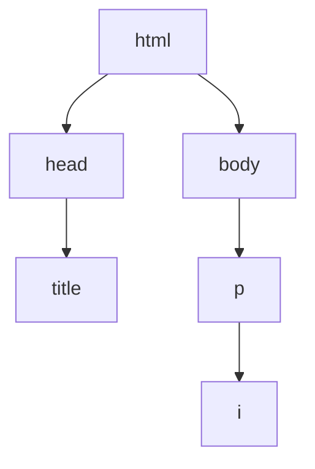

# 02. Structure & Attributes

**Spanish version:** [02 - Estructura y Atributos.md](02%20-%20Estructura%20y%20Atributos.md)

**Course:** HTML
**Topic:** HTML Structure, Parents & Children, Comments, Attributes, Classes & IDs, `<div>`, Inline Styles & the `<style>` Element
**Tags:** `#html` `#web-development` `#structure` `#attributes` `#game-dev`

<p align="left">
  
  
  
  
  
</p>

<hr style="border: none; height: 3px; background: linear-gradient(90deg, transparent, #E34F26, #2DD4BF, #E34F26, transparent); margin: 24px 0;" />

Chapter 01 wrote pages that worked. This chapter makes them **maintainable**: a real document
skeleton, comments that explain intent, `class` and `id` labels that other code can target, and
the first taste of CSS. It ends with the Party Roster, which is the moment a stack of `<div>`s
turns into a layout.

> [!NOTE]
> **Why this chapter matters more than it looks**
> Everything here exists so that a *stylesheet* can find your elements later. `class` and `id`
> are not decoration — they are the handles that CSS, JavaScript and accessibility tools grab
> to work on your page. An element without a label is an element nothing can reach.

---

## 08. Blueprint

### HTML Structure

Now that we know how to spin up a web page, let's explore how to structure our HTML files better. Here are the must-haves in a `.html` file.

- `<!DOCTYPE html>` is the **document type declaration**. It appears at the top of the file and tells the browser the file is written in **HTML5**. It has **no closing tag**.
- `<html>` is the element that contains all the code processed on the page. It **does** have a closing tag.

```html
<!DOCTYPE html>
<html>
  Code goes here
</html>
```

Inside `<html>` there should be two elements:

| Element | Contains |
| :--- | :--- |
| `<head>` | All the info for your browser that is **not visible** on the page |
| `<body>` | All the content you will end up **seeing** on the page |

```html
<!DOCTYPE html>
<html>
  <head>
    Some code goes here
  </head>
  <body>
    A lot more goes here
  </body>
</html>
```

### The `<title>` Element

The `<title>` element goes in the `<head>` and assigns text to the **browser tab**.

```html
<!DOCTYPE html>
<html>
  <head>
    <title>GameForge | Start your coding adventure</title>
  </head>
  <body>
    Code goes here
  </body>
</html>
```

All the "main" code goes in the `<body>` element.

> [!WARNING]
> A file with no `<title>` shows the file path on the tab — `file:///Users/you/index.html` —
> which is how half the "is my site finished?" bugs start. One `<title>` per file, and it
> names the page, not the folder.

### Quest: Map Blueprint

Create `blueprint.html` with a `<!DOCTYPE html>` declaration and an `<html>` element containing a `<head>` with a page title and a `<body>` with a paragraph. You now have the blueprint for all future HTML files.

```html
<!DOCTYPE html>
<html>
  <head>
    <title>My Blueprint Page</title>
  </head>
  <body>
    <p>This is the basic blueprint structure for an HTML page.</p>
  </body>
</html>
```

---

## 09. Family Tree

### Parents & Children

The elements in an HTML file are arranged like a **clan tree**. Most elements can be **parents** with one or more **child** elements.

```html
<!DOCTYPE html>
<html>
  <head>
    <title>My Website</title>
  </head>
  <body>
    <p>Well, <i>howdy</i> there!</p>
  </body>
</html>
```

Relationships in this example:

- `<head>` and `<body>` are **children** of `<html>`.
- `<title>` is the child of `<head>`.
- `<i>` is the child of `<p>` and the **grandchild** of `<body>`.



### Siblings

Elements are **siblings** if they share a direct parent element.

```html
<body>
  <ul>
    <li>🍄 Mario</li>
    <li>🐢 Luigi</li>
  </ul>
</body>
```

The two `<li>` elements are siblings because both are children of the same parent, the `<ul>` element.

### Quest: Clan Tree

"The apple doesn't fall far from the tree." Create `family_tree.html` for your family (or a famous one: the British Royal Family, the Kardashians, the Starks or the Simpsons) using list elements such as `<ul>` and `<li>`. Set up the page properly with `<!DOCTYPE html>`, `<html>`, etc.

Then ask yourself: which elements are parents? Which are children? Which are siblings?

```html
<!-- Family Tree 🌳 -->

<!DOCTYPE html>
<html>
  <head>
    <title>Family Tree</title>
  </head>
  <body>
    <h1>The Simpsons</h1>
    <p>🏡 Hometown: Springfield, IL</p>
    <ul>
      <li>
        Homer & Marge Simpson
        <ul>
          <li>Bart Simpson</li>
          <li>Lisa Simpson</li>
          <li>Maggie Simpson</li>
        </ul>
      </li>
      <li>Patty Bouvier (Twin)</li>
      <li>Selma Bouvier (Twin)</li>
    </ul>
  </body>
</html>
```

> [!TIP]
> A nested `<ul>` inside an `<li>` is the classic clan tree — and it is also the classic
> party tree, tech tree and folder tree. The pattern is recursive: a container holding items
> that are themselves containers holding items. The same shape describes a game scene graph.

---

## 10. Craigslist Ad

### Comments

Comments are useful for taking notes about the **logic and intentions** behind different parts of a page. They should benefit whoever wrote the code and anyone reviewing it later.

```html
<!-- I am a comment. -->
<p>And I'm not a comment!</p>
```

Everything surrounded by `<!--` and `-->` is **ignored** and not rendered by the browser. That also lets us "comment out" code:

```html
<!-- Let's make you a comment, too. -->
<!-- <p>Nooo!</p> -->
```

### Inline vs. Multi-line

Comments can span multiple lines:

```html
<!--
  This is also a comment.
-->
```

They can also be used within an element:

```html
<p>This text is visible. <!-- But this is not. --></p>
```

> [!NOTE]
> Don't be excessive with comments. Use them sparingly and remove them when no longer needed.

> [!TIP]
> A comment that explains **what** the line does is noise — the line already says it. A
> comment that explains **why** is gold. `<!-- close the dialog on success, not on cancel -->`
> survives a refactor; `<!-- increments i -->` does not.

### Quest: Guild Notice Board

Craig needs help cleaning up the codebase. Paste this starter code into `craigslist_ad.html`, run it, then edit the HTML following the comments:

```html
<!DOCTYPE html>
<html>
  <head>
    <!-- Hi, it's Craig! Can you add "For Sale" in the title below? -->
    <title>Didgeridoo. Needs work</title>
  </head>
  <body>
    <!-- Add some comments below to document what each line means! -->
    <h2>Didgeridoo. Needs work</h2>
    
    <p>Australian Aboriginal Didgeridoo. Needs work. Free to good home</p>

    <!-- Add the bullet point in the picture and then uncomment the code below! -->
    <!-- <ul>
      <li>Something should go here</li>
    </ul> -->
  </body>
</html>
```

Finished version:

```html
<!-- Craigslist Ad 🪵 -->

<!DOCTYPE html>
<html>
  <head>
    <title>For Sale: Didgeridoo. Needs work</title>
  </head>
  <body>
    <!-- This is a level 2 heading. -->
    <h2>Didgeridoo. Needs work</h2>

    <!-- This is an image of a didgeridoo, a musical instrument. -->
    

    <!-- This paragraph describes the image above. -->
    <p>Australian Aboriginal Didgeridoo. Needs work. Free to good home</p>

    <ul>
      <li>do NOT contact me with unsolicited services or offers</li>
    </ul>
  </body>
</html>
```

---

## 11. Wiki Article

### Attributes

**Attributes** are additional settings we use to customize an element. They are usually **name/value pairs**, separated by an equals sign:

```html
<element name="value">Content</element>
```

- `name` indicates the attribute we are setting.
- `"value"` is surrounded by double quotes.

By default, `<ol>` uses numbers to label its `<li>` elements. The `type` attribute changes that:

```html
<ol type="a">   <!-- a. b. c. -->
  <li>Power ⚡</li>
  <li>Courage 🔥</li>
  <li>Wisdom 🦉</li>
</ol>
```

| `type` value | Labels |
| :--- | :--- |
| *(default)* | 1. 2. 3. |
| `"a"` | a. b. c. |
| `"i"` | i. ii. iii. |

### Attributes in the Image Tag

```html


```

- `src` specifies the file path of the image.
- `width="250"` sets the width of the image.
- `alt` makes images more **accessible**: if the image can't appear, the `alt` text is displayed instead, and assistive devices read it aloud to describe the image.

### Attributes in the Anchor Tag

```html
<a href="https://gameforge.example/">GameForge</a>
<a href="https://gameforge.example/" target="_blank">GameForge</a>
```

- `href` is the URL visited when the hyperlinked text is clicked.
- `target="_blank"` makes the link open in a **new browser tab**.

> [!IMPORTANT]
> Order does not matter between attributes — `src` before `alt` and `alt` before `src` are
> the same element. What does matter is the **quotes**: without them the browser guesses, and
> a value with a space silently breaks the tag into two attributes.

### Quest: Bestiary Entry

Write a "Wikipedia" article about one of your heroes in `wiki_article.html`. Include:

- One heading that says "Biography".
- An image of that person that includes alternative text.
- One paragraph with at least 2 sentences.
- One link in the text (opens on a new tab).

**Bonus:** How can we adjust the size of the image using attributes? How can we make the image a hyperlink?

```html
<!DOCTYPE html>
<html>
  <head>
    <title>Wiki Article</title>
  </head>
  <body>
    <h2>Biography</h2>
    
    <p>Ada Lovelace was an English mathematician and writer, chiefly known for her work on Charles Babbage's mechanical general-purpose computer, the Analytical Engine. She is widely regarded as one of the first computer programmers in history.</p>
    <a href="https://en.wikipedia.org/wiki/Ada_Lovelace" target="_blank">Learn more on Wikipedia</a>
  </body>
</html>
```

---

## 12. Lorem Ipsum

### Classes and IDs

The two attributes we'll come across most are `class` and `id`. Any element can use them. Both label elements, but they have important differences.

An element can have **multiple `class` values** in a space-separated list:

```html
<p class="first-value second-value third-value">Hello, World</p>
```

Each element can only have **one `id`** value, with no spaces, and every `id` should be **unique** in the entire page:

```html
<p id="value">Hello, World</p>
```

`id` can also be used to **link to another part of the same page**. Match it with an `<a>` element's `href` through a `#` hashtag followed by the identifier:

```html
<a href="#medellin">Link to Medellín</a>

<h2 class="city" id="medellin">Medellín 🇨🇴</h2>
```

Where only one `id` can be assigned to a single element, a `class` can be assigned to many:

```html
<h2 class="city" id="medellin">Medellín 🇨🇴</h2>
<h2 class="city" id="lisbon">Lisbon 🇵🇹</h2>
<h2 class="city" id="bali">Bali 🇮🇩</h2>
```

The values of `class` and `id` must always be **lowercase**. If the name has multiple words, separate them with **dashes** (`-`).

> [!TIP]
> A good way to remember: there can be multiple students in a **class**, but each student should have a unique **id**. 💡

### Division Element

`<div>` (short for "division") is a generic container with no particular meaning, used to create sections. It goes hand in hand with `class` and `id`:

```html
<div class="page-section" id="about-me">
  <h2>About Me</h2>
  <p>Ness is an aspiring web developer!</p>
</div>

<div class="page-section" id="social-media">
  <h2>Social:</h2>
  <ul>
    <li>GitHub</li>
    <li>Twitter</li>
    <li>LinkedIn</li>
  </ul>
</div>
```

> [!WARNING]
> `<div>` has no meaning of its own, which is exactly why it is so easy to overuse. Reach for
> `<section>`, `<article>`, `<nav>` or `<ul>` when one of those says what you mean — a stack
> of `<div>`s with `class` names is a page no one can navigate.

### Quest: Lore Scroll

**Lorem Ipsum** is placeholder content commonly used to visualize how a page's text should look in the final copy. Create `lorem_ipsum.html`:

- An `<h1>` heading that says "Untitled".
- Two `<a>` anchors: `href="#heading-1"` with text "Heading 1" and `href="#heading-2"` with text "Heading 2".
- Underneath, two `<div>` elements with a `class` of `"section"`. Each `<div>` contains:
  - 1 `<h2>` with `class="heading"` and `id="heading-x"`.
  - 2 `<p>` elements with Lorem ipsum text.

```html
<!DOCTYPE html>
<html>
  <head>
    <title>Lorem Ipsum</title>
  </head>
  <body>
    <h1>Untitled</h1>

    <a href="#heading-1">Heading 1</a>
    <a href="#heading-2">Heading 2</a>

    <div class="section">
      <h2 class="heading" id="heading-1">Heading 1</h2>
      <p>Lorem ipsum dolor sit amet, consectetur adipiscing elit, sed do eiusmod tempor incididunt ut labore et dolore magna aliqua. Ut enim ad minim veniam, quis nostrud exercitation ullamco laboris nisi ut aliquip ex ea commodo consequat.</p>
      <p>Lorem ipsum dolor sit amet, consectetur adipiscing elit, sed do eiusmod tempor incididunt ut labore et dolore magna aliqua. Ut enim ad minim veniam, quis nostrud exercitation ullamco laboris nisi ut aliquip ex ea commodo consequat.</p>
    </div>

    <div class="section">
      <h2 class="heading" id="heading-2">Heading 2</h2>
      <p>Lorem ipsum dolor sit amet, consectetur adipiscing elit, sed do eiusmod tempor incididunt ut labore et dolore magna aliqua. Ut enim ad minim veniam, quis nostrud exercitation ullamco laboris nisi ut aliquip ex ea commodo consequat.</p>
      <p>Lorem ipsum dolor sit amet, consectetur adipiscing elit, sed do eiusmod tempor incididunt ut labore et dolore magna aliqua. Ut enim ad minim veniam, quis nostrud exercitation ullamco laboris nisi ut aliquip ex ea commodo consequat.</p>
    </div>
  </body>
</html>
```

---

## 13. Hero Squad

### The `style` Attribute

So far, the appearance of our pages has been pretty skeletal. We can apply a `style` attribute to any HTML element to stylize certain aspects of it, such as the text color:

```html
<p>
  Roses are <span style="color:red;">red</span>.<br />
  Violets are <span style="color:blue;">blue</span>.
</p>
```

A style is made of a **property** (like `color`) and a **value** (like `red`), separated by a **colon** `:`. Multiple styles can be applied to a single element, separated by a **semicolon** `;`.

```html
<p>
  Roses are <span style="color:red; text-decoration:underline;">red</span>.<br />
  Violets are <span style="color:blue; text-decoration:underline;">blue</span>.
</p>
```

- The `color` property sets the color of an element's text.
- The `text-decoration` property adds text formatting (such as `underline`), similar to what `<b>`, `<i>`, `<u>` and `<s>` do.

This is actually a language called **CSS**, which comes in the next course.

### The `<style>` Element

Using the `style` attribute for a few elements is one thing. But what if we want to style a bunch of different elements, or the same styles on every instance of an element? The `<style>` element goes in the `<head>` and styles the elements in the `<body>`:

```html
<!DOCTYPE html>
<html>
  <head>
    <style>
      ... Styles for elements go here
    </style>
  </head>
  <body>
    ... Elements go here
  </body>
</html>
```

Elements are **selected** inside `<style>` and styled within curly braces `{/}`:

```html
<style>
  element {
    property: value;
  }
</style>
```

Selectors:

| Selector | Matches |
| :--- | :--- |
| `span` | Every `<span>` element |
| `.my-class` | Elements with `class="my-class"` (period) |
| `#my-id` | The element with `id="my-id"` (hashtag) |

```html
<!DOCTYPE html>
<html>
  <head>
    <style>
      span {
        text-decoration: underline;
      }

      #red-word {
        color: red;
      }

      #blue-word {
        color: blue;
      }
    </style>
  </head>
  <body>
    <p>
      Roses are <span id="red-word">red</span>.<br />
      Violets are <span id="blue-word">blue</span>.<br />
    </p>
  </body>
</html>
```

> [!NOTE]
> The selector in `<style>` is the **same value** as the attribute in the body, with a
> character in front: `.ranger-div` targets `class="ranger-div"`, `#red-ranger` targets
> `id="red-ranger"`. That correspondence is the entire mechanism.

### Quest: Party Loadout

In 1993, "Mighty Morphin' Hero Squad" premiered on TV. The five original rangers were each represented by a color: red, blue, black, yellow and pink. Create `power_rangers.html`. Put this in the `<body>`:

```html
<div class="ranger-div" id="red-ranger"></div>
<div class="ranger-div" id="blue-ranger"></div>
<div class="ranger-div" id="black-ranger"></div>
<div class="ranger-div" id="yellow-ranger"></div>
<div class="ranger-div" id="pink-ranger"></div>
```

Insert a `<style>` element in the `<head>` and apply:

- A `width` of `50%` and `height` of `100px` for `<div>` elements with the `ranger-div` class.
- A different `background-color` for each `<div>` based on its `id`.

```html
<!DOCTYPE html>
<html>
  <head>
    <title>Hero Squad</title>
    <style>
      .ranger-div {
        width: 50%;
        height: 100px;
      }
      #red-ranger {
        background-color: red;
      }
      #blue-ranger {
        background-color: blue;
      }
      #black-ranger {
        background-color: black;
      }
      #yellow-ranger {
        background-color: yellow;
      }
      #pink-ranger {
        background-color: pink;
      }
    </style>
  </head>
  <body>
    <div class="ranger-div" id="red-ranger"></div>
    <div class="ranger-div" id="blue-ranger"></div>
    <div class="ranger-div" id="black-ranger"></div>
    <div class="ranger-div" id="yellow-ranger"></div>
    <div class="ranger-div" id="pink-ranger"></div>
  </body>
</html>
```

> [!TIP]
> Notice what happened: the HTML carries **no colors**. Five identical empty `<div>`s, and
> every visual decision lives in one `<style>` block that can be rewritten in one place.
> That separation — structure here, presentation there — is the actual lesson.

---

## 14. Party Roster

### Checkpoint: Chapter Recap

- Every HTML file should have a `<!DOCTYPE html>` declaration and an `<html>` element.
- The `<head>` element contains important info for the page, such as the `<title>`.
- Comments `<!-- -->` are great for documentation or excluding unwanted code.
- Attributes like `class`/`id` or `src` enhance the way elements are organized, presented and work on the page.
- We can add styles with either the `<style>` element or the `style` attribute.

### Project: Party Roster

The **Top 8** was an iconic feature of MySpace: it let users pick eight friends to display on their profile page. Create `top_8.html`.

Paste this `<style>` element into the `<head>` (provided by the course):

```html
<style>
  body {
    width: 85%;
    margin: auto;
  }

  h1 {
    text-align: left;
  }

  img {
    border: 3px solid blue;
  }

  #top-8-wrapper {
    text-align: center;
  }

  .friend-card {
    display: inline-block;
    margin: 1px;
    text-align: center;
  }

  .friend-name {
    color: blue;
  }
</style>
```

Then add the HTML:

1. A `<div>` with an `id` of `"top-8-wrapper"`.
2. Inside, an `<h1>` that says "My Top Friends!", followed by two `<div>` elements with a class of `"top-8-row"`.
3. Inside each `top-8-row`, four `<div>` elements with a class of `"friend-card"`.
4. Inside each `friend-card`: an `<h2>` with a `"friend-name"` class and the friend's name, plus an `` with `src` and `alt`.

If you don't want to use real names, use funny usernames or superlatives ("class clown", "life of the party", "best hair"...).

```html
<!DOCTYPE html>
<html>
  <head>
    <title>Party Roster</title>
    <style>
      /* ...styles above... */
    </style>
  </head>
  <body>
    <div id="top-8-wrapper">
      <h1>My Top Friends!</h1>

      <div class="top-8-row">
        <div class="friend-card">
          <h2 class="friend-name">Tom</h2>
          
        </div>
        <div class="friend-card">
          <h2 class="friend-name">Sarah</h2>
          
        </div>
        <div class="friend-card">
          <h2 class="friend-name">Alex</h2>
          
        </div>
        <div class="friend-card">
          <h2 class="friend-name">Taylor</h2>
          
        </div>
      </div>

      <div class="top-8-row">
        <div class="friend-card">
          <h2 class="friend-name">Jordan</h2>
          
        </div>
        <div class="friend-card">
          <h2 class="friend-name">Morgan</h2>
          
        </div>
        <div class="friend-card">
          <h2 class="friend-name">Casey</h2>
          
        </div>
        <div class="friend-card">
          <h2 class="friend-name">Riley</h2>
          
        </div>
      </div>
    </div>
  </body>
</html>
```

> [!TIP]
> **Game dev version**
> `friend-card` is a component: a repeated box of image + name + styling that appears eight
> times. Swap the names for party members, the `<h2>` for a level, the `` for the
> portrait and you have an inventory screen. `display: inline-block` is the whole trick
> behind "cards in a row", and it is the same idea as a grid in any UI framework.

---

## XP Earned: Key Takeaways

- 🧬 Every page: `<!DOCTYPE html>` → `<html>` → `<head>` + `<body>`.
- 🗂️ Elements form a **clan tree**: parents, children, siblings.
- 💬 Comments `<!-- -->` document code and hide code.
- 🏷️ Attributes are `name="value"` pairs: `src`, `alt`, `href`, `target`, `type`, `class`, `id`, `style`.
- 🆔 One `id` per element (unique), many elements can share a `class`.
- 🔗 `href="#id"` links to a part of the same page.
- 📦 `<div>` is the generic container.
- 🎨 Style with the `style` attribute or a `<style>` element (CSS is next).

---

## Loot Table: Real-World Use Cases

- 🗺️ Multi-section landing pages with in-page navigation
- 📚 Wiki-style article pages
- 🧑‍🤝‍🧑 Profile pages with card layouts
- 🎨 First experiments with colors and layout
- 🎮 Character sheets, party screens and skill trees built from repeated card components

---

## 🎮 Side Quests: Practice Exercises

1. Add a third section to `lorem_ipsum.html` with its own link at the top.
2. Create a page where every `<p>` is styled by one `<style>` rule.
3. Make an `` into a link by wrapping it in an `<a>`.
4. Add comments to an old file explaining what every section does.
5. **Boss fight:** rebuild the Hero Squad exercise as a party screen — one `.party-slot` class, four `#member-1` … `#member-4` ids, and a shared rule that gives every slot the same size.

---

## 🔗 See Also

- [[00c - HTML Cheatsheet II]] — the attribute and selector reference for this chapter
- [[01 - HTML Basics]] — the elements used here, introduced from scratch
- [[03 - Forms]] — collecting the input these pages display

---