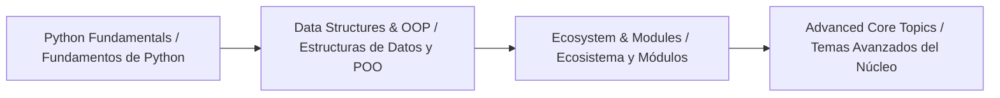

# 🐍 Python: The Art of Algorithmic Craft · El Arte de la Artesanía Algorítmica (MOC)

_A dynamic knowledge map for transforming Python syntax into functional game projects, architectures, and systems._

_Un mapa de conocimiento dinámico para transformar la sintaxis de Python en proyectos de videojuegos funcionales, arquitecturas y sistemas._

**English:** [README.md](./README.md) · **Español:** [README-ES.md](./README-ES.md)

---

**Note:**
This page is the central map for the Python notes in this Obsidian vault. Every exercise and code sample is framed around video game development (combat, loot, quests, party play, and engine tooling).

**Nota:**
Esta página es el mapa central de las notas de Python de este vault de Obsidian. Cada ejercicio y ejemplo de código está enmarcado en torno al desarrollo de videojuegos (combate, botín, misiones, juego en grupo y herramientas de motores).

**Tip:**
Start with the **Core Language Foundations**, then follow the map toward data structures, architecture, and real-world applications.

**Consejo:**
Empieza por los **Fundamentos del Lenguaje** y luego sigue el mapa hacia las estructuras de datos, la arquitectura y las aplicaciones del mundo real.

---

## 🗺️ Map of Content · Mapa de Contenidos

### 📑 Reference & Cheatsheets · Referencia y Chuletas

* **Cheatsheets / Chuletas:**
  * **[00b - Python Cheatsheet](./00b%20-%20Python%20Cheatsheet.md)** — Syntax, primitives, control flow, loops, and core fundamentals.
    **[00b - Chuleta de Python](./00b%20-%20Chuleta%20de%20Python.md)** — Sintaxis, primitivas, control de flujo, bucles y fundamentos esenciales.
  * **[00c - Python Cheatsheet II](./00c%20-%20Python%20Cheatsheet%20II.md)** — Lists, list methods, functions, scope, classes, and modules.
    **[00c - Chuleta de Python II](./00c%20-%20Chuleta%20de%20Python%20II.md)** — Listas, métodos de lista, funciones, ámbito, clases y módulos.

### 🧠 1. Core Language Foundations · Fundamentos del Lenguaje

* **Variables & Data Types:** **[01 - Setup & Data Types](./01%20-%20Setup%20&%20Data%20Types.md)** — Fundamentals, print output, and initial canvas (`str`, `int`, `float`, `bool`).
   **Variables y Tipos de Datos:** **[01 - Configuración y Tipos de Datos](./01%20-%20Configuraci%C3%B3n%20y%20Tipos%20de%20Datos.md)** — Fundamentos, salida por consola y el lienzo inicial (`str`, `int`, `float`, `bool`).
* **Control Flow Systems:** **[02 - Control Flow](./02%20-%20Control%20Flow.md)** — Decision-making with `if` / `elif` / `else` and boolean operators (`and`, `or`, `not`).
   **Sistemas de Control de Flujo:** **[02 - Control de Flujo](./02%20-%20Control%20de%20Flujo.md)** — Toma de decisiones con `if` / `elif` / `else` y operadores booleanos (`and`, `or`, `not`).
* **Iterative Logic (Loops):** **[03 - Loops](./03%20-%20Loops.md)** — Automated iteration with `for` and `while`, control via `break`, `continue`, and `pass`.
   **Lógica Iterativa (Bucles):** **[03 - Bucles](./03%20-%20Bucles.md)** — Iteración automatizada con `for` y `while`, control mediante `break`, `continue` y `pass`.
* **Projects:** **[04 - Terminal Dungeon Crawl](./04%20-%20Terminal%20Dungeon%20Crawl.md)** — Interactive CLI dungeon-crawl project.
   **Proyectos:** **[04 - Mazmorra por Terminal](./04%20-%20Mazmorra%20por%20Terminal.md)** — Proyecto interactivo de mazmorra por CLI.

### 📦 2. Data Structures (Organization & Storage) · Estructuras de Datos (Organización y Almacenamiento)

* **Lists (`list`) & Tuples (`tuple`) / Listas (`list`) y Tuplas (`tuple`):**
  * **[05 - Lists](./05%20-%20Lists.md)** — Intro, indexing, slicing, iterating, and core operations.
    **[05 - Listas](./05%20-%20Listas.md)** — Introducción, indexación, rebanado, iteración y operaciones esenciales.
  * **[06 - Built-in Functions & List Methods](./06%20-%20Built-in%20Functions%20&%20List%20Methods.md)** — List methods, bucket list project, and 2D matrices.
    **[06 - Funciones Integradas y Métodos de Lista](./06%20-%20Funciones%20Integradas%20y%20M%C3%A9todos%20de%20Lista.md)** — Métodos de lista, proyecto de lista de pendientes y matrices 2D.
* **Dictionaries (`dict`) & Sets (`set`) / Diccionarios (`dict`) y Conjuntos (`set`):** Key-value mapping and unique set operations. / Mapeo clave-valor y operaciones propias de los conjuntos.
* **Comprehensions / Comprensiones:** Expressive and efficient single-line creation of lists and dictionaries. / Creación expresiva y eficiente de listas y diccionarios en una sola línea.

### ⚙️ 3. Modular Architecture (Functions & Modules) · Arquitectura Modular (Funciones y Módulos)

* **Functions / Funciones:**
  * **[07 - Functions](./07%20-%20Functions.md)** — The D.R.Y. principle, defining/calling functions, parameters, and arguments.
    **[07 - Funciones](./07%20-%20Funciones.md)** — El principio D.R.Y., definición y llamada de funciones, parámetros y argumentos.
* **Object-Oriented Programming / Programación Orientada a Objetos:**
  * **[08 - Object-Oriented Programming](./08%20-%20Object-Oriented%20Programming.md)** — Classes, instances, constructors, methods, and OOP principles.
    **[08 - Programación Orientada a Objetos](./08%20-%20Programaci%C3%B3n%20Orientada%20a%20Objetos.md)** — Clases, instancias, constructores, métodos y principios de la POO.
* **Modules & Packages / Módulos y Paquetes:**
  * **[09 - Modules](./09%20-%20Modules.md)** — Standard library (`math`, `random`, `datetime`), custom modules, `pip3`, PyPI (`wikipedia`), and The Zen of Python.
    **[09 - Módulos](./09%20-%20M%C3%B3dulos.md)** — Biblioteca estándar (`math`, `random`, `datetime`), módulos personalizados, `pip3`, PyPI (`wikipedia`) y El Zen de Python.

