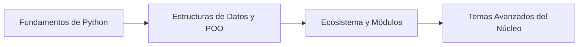

# 🐍 Python: El Arte de la Artesanía Algorítmica (MOC)

_Un mapa de conocimiento dinámico para transformar la sintaxis de Python en proyectos de videojuegos funcionales, arquitecturas y sistemas._

**English:** [README.md](./README.md)

---

**Nota:**
Esta página es el mapa central de las notas de Python de este vault de Obsidian. Cada ejercicio y ejemplo de código está enmarcado en torno al desarrollo de videojuegos (combate, botín, misiones, juego en grupo y herramientas de motores).

**Consejo:**
Empieza por los **Fundamentos del Lenguaje** y luego sigue el mapa hacia las estructuras de datos, la arquitectura y las aplicaciones del mundo real.

---

## 🗺️ Mapa de Contenidos

### 📑 Referencia y Chuletas

* **Chuletas:**
  * [00b - Chuleta de Python](./00b%20-%20Chuleta%20de%20Python.md) — Sintaxis, primitivas, control de flujo, bucles y fundamentos esenciales.
  * [00c - Chuleta de Python II](./00c%20-%20Chuleta%20de%20Python%20II.md) — Listas, métodos de lista, funciones, ámbito, clases y módulos.

### 🧠 1. Fundamentos del Lenguaje

* **Variables y Tipos de Datos:** [01 - Configuración y Tipos de Datos](./01%20-%20Configuraci%C3%B3n%20y%20Tipos%20de%20Datos.md) — Fundamentos, salida por consola y el lienzo inicial (`str`, `int`, `float`, `bool`).
* **Sistemas de Control de Flujo:** [02 - Control de Flujo](./02%20-%20Control%20de%20Flujo.md) — Toma de decisiones con `if` / `elif` / `else` y operadores booleanos (`and`, `or`, `not`).
* **Lógica Iterativa (Bucles):** [03 - Bucles](./03%20-%20Bucles.md) — Iteración automatizada con `for` y `while`, control mediante `break`, `continue` y `pass`.
* **Proyectos:** [04 - Mazmorra por Terminal](./04%20-%20Mazmorra%20por%20Terminal.md) — Proyecto interactivo de mazmorra por CLI.

### 📦 2. Estructuras de Datos (Organización y Almacenamiento)

* **Listas (`list`) y Tuplas (`tuple`):**
  * [05 - Listas](./05%20-%20Listas.md) — Introducción, indexación, rebanado, iteración y operaciones esenciales.
  * [06 - Funciones Integradas y Métodos de Lista](./06%20-%20Funciones%20Integradas%20y%20M%C3%A9todos%20de%20Lista.md) — Métodos de lista, proyecto de lista de pendientes y matrices 2D.
* **Diccionarios (`dict`) y Conjuntos (`set`):** Mapeo clave-valor y operaciones propias de los conjuntos.
* **Comprensiones:** Creación expresiva y eficiente de listas y diccionarios en una sola línea.

### ⚙️ 3. Arquitectura Modular (Funciones y Módulos)

* **Funciones:**
  * [07 - Funciones](./07%20-%20Funciones.md) — El principio D.R.Y., definición y llamada de funciones, parámetros y argumentos.
* **Programación Orientada a Objetos:**
  * [08 - Programación Orientada a Objetos](./08%20-%20Programaci%C3%B3n%20Orientada%20a%20Objetos.md) — Clases, instancias, constructores, métodos y principios de la POO.
* **Módulos y Paquetes:**
  * [09 - Módulos](./09%20-%20M%C3%B3dulos.md) — Biblioteca estándar (`math`, `random`, `datetime`), módulos personalizados, `pip3`, PyPI (`wikipedia`) y El Zen de Python.

