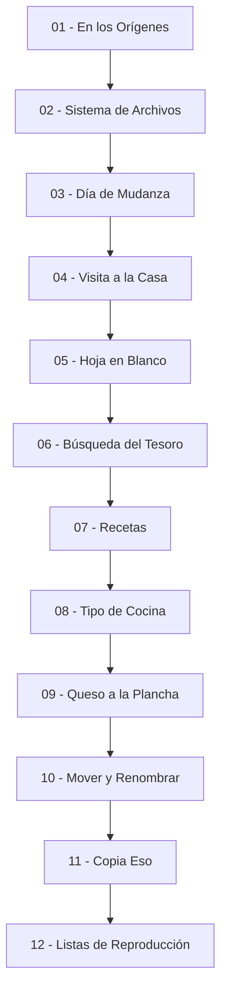

# 🖥️ Línea de Comandos: Sistema de Archivos, Navegación y Automatización (MOC)

**English:** [README.md](./README.md)

<p align="left">
  
  
  
  
  
</p>

**Nota:**
Este módulo es el Mapa de Contenidos (MOC) de las notas de Línea de Comandos de este vault de Obsidian. Todos los ejemplos se ejecutan sobre un proyecto continuo —un dungeon crawler 2D llamado **Sunken Keep**— de modo que las rutas, los nombres de archivo y las salidas se mantienen consistentes de la primera lección a la última. El módulo se divide en dos capítulos: **navegación** (saber dónde están las cosas) y **gestión de archivos** (cambiarlas).

**Consejo:**
Empieza por **01** si el terminal te resulta nuevo. Si ya te manegas con soltura, salta a **07** para la mitad de gestión de archivos — ahí es donde los comandos empiezan a hacer trabajo real.

---

## 🗺️ Mapa de Contenidos

### 📑 Referencia y Chuletas

* **Chuletas:**
  * [00b - Chuleta de Línea de Comandos](./00b%20-%20Chuleta%20de%20L%C3%ADnea%20de%20Comandos.md) — Referencia completa de una página: navegación, creación, redirección, mover, copiar, eliminar, atajos y las trampas que vale la pena memorizar.

---

### 🧭 1. Navegación (Capítulo 1)

* **Primeros pasos:** [01 - En los Orígenes](./01%20-%20En%20los%20Or%C3%ADgenes.md) — Qué es el shell, por qué la CLI sobrevive a la GUI, `echo`, `say`, el prompt y el historial de comandos.
* **El árbol:** [02 - Sistema de Archivos](./02%20-%20Sistema%20de%20Archivos.md) — Archivos, directorios y enlaces; lectura del árbol del proyecto; `pwd`; rutas absolutas frente a relativas; comillas y espacios.
* **Moverse y listar:** [03 - Día de Mudanza](./03%20-%20D%C3%ADa%20de%20Mudanza.md) — `cd` hacia dentro, hacia arriba, a casa y de vuelta; `ls` con `-l` y `-a`; listar varias rutas a la vez.
* **Lectura y rutas relativas:** [04 - Visita a la Casa](./04%20-%20Visita%20a%20la%20Casa.md) — Subir con `..`, combinar `.` y `..`, leer archivos con `cat` y por qué las rutas necesitan comillas.
* **Mantenerlo legible:** [05 - Hoja en Blanco](./05%20-%20Hoja%20en%20Blanco.md) — `clear`, historial con `↑`/`↓` y `Ctrl + R`, y autocompletado con Tab incluida la lista de candidatas con doble `Tab`.
* **Repaso del Capítulo 1:** [06 - Búsqueda del Tesoro](./06%20-%20B%C3%BAsqueda%20del%20Tesoro.md) — Reto de navegación de doce pistas por todo el proyecto, con recorrido completo y comentado.

---

### 📁 2. Gestión de Archivos (Capítulo 2)

* **Crear directorios:** [07 - Recetas](./07%20-%20Recetas.md) — `mkdir`, el error del padre ausente y por qué `mkdir -p` es la opción correcta en scripts.
* **Crear archivos:** [08 - Tipo de Cocina](./08%20-%20Tipo%20de%20Cocina.md) — `touch`, cómo las extensiones son una convención de nombres, y el marcador `.gitkeep`.
* **Escribir y añadir:** [09 - Queso a la Plancha](./09%20-%20Queso%20a%20la%20Plancha.md) — Redirección con `>` y `>>`, combinación de archivos con `cat` y la trampa de sobrescritura consigo mismo.
* **Mover y borrar:** [10 - Mover y Renombrar](./10%20-%20Mover%20y%20Renombrar.md) — Mover frente a renombrar con `mv`, `rm`, `rmdir`, `rm -r` y los hábitos que hacen sobrevivible un borrado.
* **Copiar:** [11 - Copia Eso](./11%20-%20Copia%20Eso.md) — `cp`, reglas de destino, `cp -r` y respaldar antes de borrar.
* **Repaso del Capítulo 2:** [12 - Listas de Reproducción](./12%20-%20Listas%20de%20Reproducci%C3%B3n.md) — Construir un espacio de nivel de principio a fin, `ls -R` y limpieza de sesión.

---

## 🌳 El Proyecto Usado en Todo el Módulo

Todos los comandos de este módulo se ejecutan dentro de un mismo proyecto. Este es el árbol que navegarás desde la lección 02 en adelante:

```text
SunkenKeep/
├── README.md
├── assets/
│   ├── audio/
│   │   ├── door-open.ogg
│   │   └── hit.wav
│   ├── sprites/
│   │   ├── hero.png
│   │   └── lantern.png
│   └── maps/
│       └── level-01.tmx
├── src/
│   ├── main.gd
│   └── player.gd
└── saves/
    ├── slot-1.dat
    └── slot-2.dat
```

---


