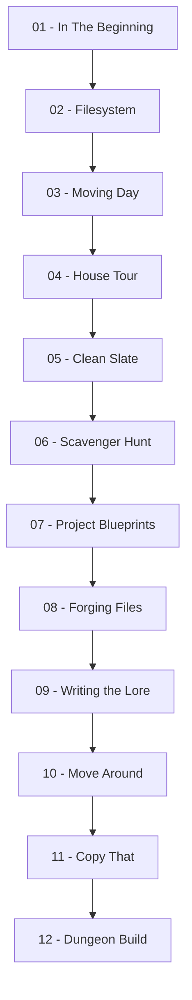

# 🖥️ Command Line: Filesystem, Navigation & Automation (MOC)

**Español:** [README-ES.md](./README-ES.md)

<p align="left">
  
  
  
  
  
</p>

**Note:**
This module is the Map of Content (MOC) for the Command Line notes in this Obsidian vault. Every example runs against one continuous project — a 2D dungeon crawler called **Sunken Keep** — so paths, filenames, and outputs stay consistent from the first lesson to the last. The module is split into two chapters: **navigation** (knowing where things are) and **file management** (changing them).

**Tip:**
Start with **01** if the terminal is new to you. If you already navigate comfortably, jump to **07** for the file-management half — that is where the commands start doing real work.

---

## 🗺️ Map of Content

### 📑 Reference & Cheatsheets

* **Cheatsheets:**
  * [00b - Command Line Cheatsheet](./00b%20-%20Command%20Line%20Cheatsheet.md) — Complete one-page reference: navigation, creation, redirection, moving, copying, removal, shortcuts, and the traps worth memorizing.

---

### 🧭 1. Navigation (Chapter 1)

* **First Steps:** [01 - In The Beginning](./01%20-%20In%20The%20Beginning.md) — What the shell is, why the CLI outlives the GUI, `echo`, `say`, the prompt, and command history.
* **The Tree:** [02 - Filesystem](./02%20-%20Filesystem.md) — Files, directories, and links; reading the project tree; `pwd`; absolute vs. relative paths; quoting paths with spaces.
* **Moving & Listing:** [03 - Moving Day](./03%20-%20Moving%20Day.md) — `cd` into, up, home, and back; `ls` with `-l` and `-a`; listing several paths at once.
* **Reading & Relative Paths:** [04 - House Tour](./04%20-%20House%20Tour.md) — Climbing with `..`, combining `.` and `..`, reading files with `cat`, and why paths need quotes.
* **Keeping It Readable:** [05 - Clean Slate](./05%20-%20Clean%20Slate.md) — `clear`, history with `↑`/`↓` and `Ctrl + R`, and `Tab` completion including the double-`Tab` candidate list.
* **Chapter 1 Review:** [06 - Scavenger Hunt](./06%20-%20Scavenger%20Hunt.md) — Twelve-clue navigation challenge over the whole project, with a full annotated walkthrough.

---

### 📁 2. File Management (Chapter 2)

* **Creating Directories:** [07 - Project Blueprints](./07%20-%20Recipes.md) — `mkdir`, the missing-parent error, and why `mkdir -p` is the right choice in scripts.
* **Creating Files:** [08 - Forging Files](./08%20-%20Cuisine%20Type.md) — `touch`, how extensions are a naming convention, and the `.gitkeep` placeholder.
* **Writing & Appending:** [09 - Writing the Lore](./09%20-%20Writing%20the%20Lore.md) — Redirection with `>` and `>>`, combining files with `cat`, and the self-overwrite trap.
* **Moving & Deleting:** [10 - Move Around](./10%20-%20Move%20Around.md) — `mv` move vs. rename, `rm`, `rmdir`, `rm -r`, and the habits that make deletion survivable.
* **Copying:** [11 - Copy That](./11%20-%20Copy%20That.md) — `cp`, destination rules, `cp -r`, and backing up before you delete.
* **Chapter 2 Review:** [12 - Dungeon Build](./12%20-%20Music%20Playlists.md) — Building a level workspace end to end, `ls -R`, and session cleanup.

---

## 🌳 The Project Used Throughout

Every command in this module runs inside one project. This is the tree you will be navigating from lesson 02 onward:

```text
SunkenKeep/
├── README.md
├── assets/
│   ├── audio/
│   │   ├── door-open.ogg
│   │   └── hit.wav
│   ├── sprites/
│   │   ├── hero.png
│   │   └── lantern.png
│   └── maps/
│       └── level-01.tmx
├── src/
│   ├── main.gd
│   └── player.gd
└── saves/
    ├── slot-1.dat
    └── slot-2.dat
```

---


