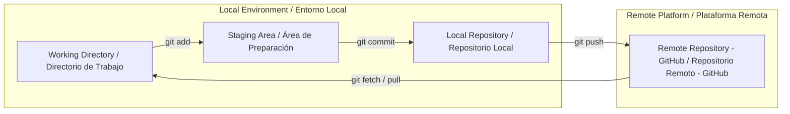

# 🚀 Git & GitHub: Version Control & Collaboration (MOC) · Control de Versiones y Colaboración (MOC)

**English:** [README.md](./README.md) · **Español:** [README-ES.md](./README-ES.md)

     

**Note:**
This module serves as the central **Map of Content (MOC)** for Git version control mechanisms, terminal workflows, branch management, and GitHub collaboration strategies. All examples use a game project (`quest-engine`) as the working repository.

**Nota:**
Este módulo funciona como el **Mapa de Contenidos (MOC)** central para los mecanismos de control de versiones con Git, los flujos de trabajo en terminal, la gestión de ramas y las estrategias de colaboración en GitHub. Todos los ejemplos usan un proyecto de videojuegos (`quest-engine`) como repositorio de trabajo.

---

## 📚 Core Modules · Módulos Principales

1. **[01 - Introduction & Setup](./01%20-%20Introduction%20&%20Setup.md)** — History of Git/GitHub, environment verification, `git init`, `git remote`, and default branch configuration.
   **[01 - Introducción y Configuración](./01%20-%20Introducci%C3%B3n%20y%20Configuraci%C3%B3n.md)** — Historia de Git/GitHub, verificación del entorno, `git init`, `git remote` y configuración de la rama por defecto.
2. **[02 - Core Workflow](./02%20-%20Core%20Workflow.md)** — Staging area (`git add`), commit snapshots (`git commit`), status checking (`git status`), and pushing to remote (`git push`).
   **[02 - Flujo de Trabajo Principal](./02%20-%20Flujo%20de%20Trabajo%20Principal.md)** — Área de preparación (`git add`), instantáneas con commit (`git commit`), verificación del estado (`git status`) y push al remoto (`git push`).
3. **[03 - Collaboration & Branching](./03%20-%20Collaboration%20&%20Branching.md)** — Repository cloning, access permissions, forking, branch management (`git branch`, `git switch`), and synchronizing changes (`git pull`).
   **[03 - Colaboración y Ramas](./03%20-%20Colaboraci%C3%B3n%20y%20Ramas.md)** — Clonado del repositorio, permisos de acceso, fork, gestión de ramas (`git branch`, `git switch`) y sincronización de cambios (`git pull`).
4. **[04 - Advanced Workflow & PRs](./04%20-%20Advanced%20Workflow%20&%20PRs.md)** — Merging branches (`git merge`), resolving merge conflicts, Pull Request (PR) lifecycle, code review checklists, and open-source contribution workflow.
   **[04 - Flujo Avanzado y PRs](./04%20-%20Flujo%20Avanzado%20y%20PRs.md)** — Merge de ramas (`git merge`), resolución de conflictos de merge, ciclo de vida de un Pull Request (PR), listas de verificación de revisión de código y flujo de contribución a código abierto.

## 🗺️ Architecture & Workflow Overview · Arquitectura y Visión General del Flujo

