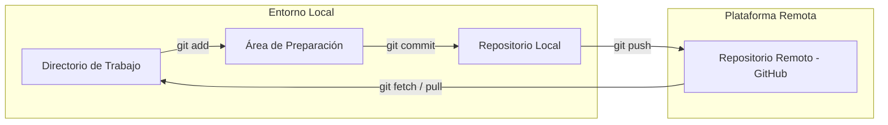

# 🚀 Git & GitHub: Control de Versiones y Colaboración (MOC)

**Versión original en inglés:** [README.md](./README.md)

     
 

**Nota:**
Este módulo funciona como el **Mapa de Contenidos (MOC)** central para los mecanismos de control de versiones con Git, los flujos de trabajo en terminal, la gestión de ramas y las estrategias de colaboración en GitHub. Todos los ejemplos usan un proyecto de videojuegos (`quest-engine`) como repositorio de trabajo. 

--- 

## 📚 Módulos Principales 

1. **[01 - Introducción y Configuración](./01%20-%20Introducci%C3%B3n%20y%20Configuraci%C3%B3n.md)** — Historia de Git/GitHub, verificación del entorno, `git init`, `git remote` y configuración de la rama por defecto. 
2. **[02 - Flujo de Trabajo Principal](./02%20-%20Flujo%20de%20Trabajo%20Principal.md)** — Área de preparación (`git add`), instantáneas con commit (`git commit`), verificación del estado (`git status`) y push al remoto (`git push`).
3. **[03 - Colaboración y Ramas](./03%20-%20Colaboraci%C3%B3n%20y%20Ramas.md)** — Clonado del repositorio, permisos de acceso, fork, gestión de ramas (`git branch`, `git switch`) y sincronización de cambios (`git pull`).
4. **[04 - Flujo Avanzado y PRs](./04%20-%20Flujo%20Avanzado%20y%20PRs.md)** — Merge de ramas (`git merge`), resolución de conflictos de merge, ciclo de vida de un Pull Request (PR), listas de verificación de revisión de código y flujo de contribución a código abierto.

## 🗺️ Arquitectura y Visión General del Flujo 
> 

