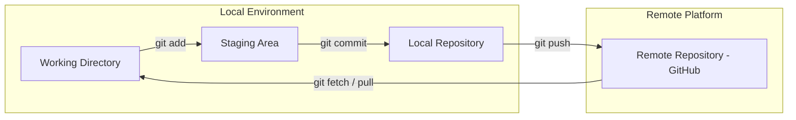

# 🚀 Git & GitHub: Version Control & Collaboration (MOC) 

     
 

> [!NOTE] 
> This module serves as the central **Map of Content (MOC)** for Git version control mechanisms, terminal workflows, branch management, and GitHub collaboration strategies. 
> 
> 
> --- 
> 

## 📚 Core Modules 

1. **[01 - Introduction & Setup](./01%20-%20Introduction%20%26%20Setup.md)** — History of Git/GitHub, environment verification, `git init`, `git remote`, and default branch configuration. 
2. **[02 - Core Workflow](./02%20-%20Core%20Workflow.md)** — Staging area (`git add`), commit snapshots (`git commit`), status checking (`git status`), and pushing to remote (`git push`).
3. **[03 - Collaboration & Branching](./03%20-%20Collaboration%20%26%20Branching.md)** — Repository cloning, access permissions, forking, branch management (`git branch`, `git switch`), and synchronizing changes (`git pull`).
4. **[04 - Advanced Workflow & PRs](./04%20-%20Advanced%20Workflow%20%26%20PRs.md)** — Merging branches (`git merge`), resolving merge conflicts, Pull Request (PR) lifecycle, code review checklists, and open-source contribution workflow.

## 🗺️ Architecture & Workflow Overview 
> 

