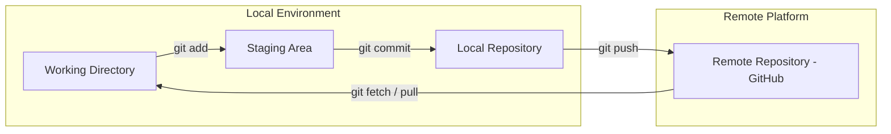

# 🚀 Git & GitHub: Version Control & Collaboration (MOC) 

     
 

> [!NOTE] 
> This module serves as the central **Map of Content (MOC)** for Git version control mechanisms, terminal workflows, branch management, and GitHub collaboration strategies. 
> 
> 
> --- 
> 

## 🗺️ Architecture & Workflow Overview 
> 

