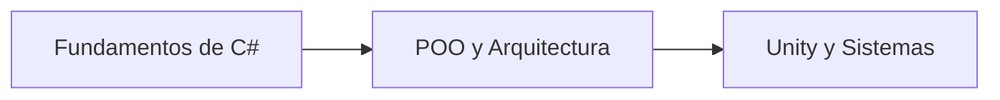

# 🟣 C#: Fundamentos Orientados a Objetos y Arquitectura de Sistemas de Juego (MOC)

**English:** [README.md](./README.md)

  
  
  
  
  

**Nota:**
Este módulo del repositorio sirve como mapa de contenidos (MOC) central para la sintaxis de C#, los patrones de diseño orientados a objetos, los fundamentos del ecosistema .NET y las notas sobre arquitectura de juegos con Unity dentro de este vault de Obsidian. Cada ejemplo y ejercicio está enmarcado en torno al desarrollo de videojuegos (combate, botín, misiones, juego en grupo y herramientas del motor).

**Consejo:**
**Ruta de Aprendizaje:** Domina primero el tipado fuerte y las estructuras de control básicas, y después progresa hacia los paradigmas de Programación Orientada a Objetos (POO), la gestión de memoria y la ingeniería de sistemas de juegos del mundo real.

---

## 🗺️ Mapa de Contenidos

### 📚 Referencia y Guías Rápidas

* **Chuletas y Reglas de Sintaxis:**
  * [00b - CSharp Cheatsheet](./00b%20-%20CSharp%20Cheatsheet.md) — Type system, memory stack vs. heap... *(archivo vacío — contenido pendiente; aún sin versión en español)*

---

### 🧠 1. Fundamentos del Lenguaje

* **[01 - Pulsa Start](./01%20-%20Pulsa%20Start.md)** — Linaje de C#, arquitectura del CLR de .NET, canalización de compilación y sentencias de nivel superior en Program.cs.
* **[02 - Conversión de Tipos](./02%20-%20Conversi%C3%B3n%20de%20Tipos.md)** — Tipos de valor vs. tipos de referencia, conversión explícita/implícita e inmutabilidad de las cadenas.
* **[03 - Control de Flujo](./03%20-%20Control%20de%20Flujo.md)** — Toma de decisiones con sentencias if/else, operadores lógicos (`&&`, `||`, `!`) y evaluación de la entrada del usuario.
* **[04 - Bucles](./04%20-%20Bucles.md)** — Ejecución de bloques repetitivos de control de flujo con bucles while/for y condiciones de salida controladas por el usuario.
* **[05 - Arreglos](./05%20-%20Arreglos.md)** — Arreglos unidimensionales, indexación, iteración de elementos y procesamiento paralelo de datos con varios arreglos.
* **[06 - Métodos](./06%20-%20M%C3%A9todos.md)** — Bloques de código reutilizables, paso de parámetros, valores de retorno y composición de métodos.
* **[Mad Dungeon Master - Proyecto de Hito](./Mad%20Dungeon%20Master%20-%20Proyecto%20de%20Hito.md)** — Generador interactivo de guiones de combates contra jefes en C# que aplica bucles, operadores lógicos y entrada del usuario.

---

### 🏗️ 2. Programación Orientada a Objetos y Arquitectura de Software

* **Encapsulamiento y Abstracción:** `04 - Classes & Structs` — *Campos, propiedades automáticas, constructores y asignación en pila vs. montón.* `[Planificado]`
* **Herencia y Polimorfismo:** `05 - Interfaces & Abstract Classes` — *Métodos virtuales, sobrescrituras, implementación de interfaces y diseño basado en contratos.* `[Planificado]`
* **Características Avanzadas:** `06 - Generics & LINQ` — *Colecciones de datos seguras en tipos, delegados, eventos, lambdas y Language Integrated Query.* `[Planificado]`

---

### 🎮 3. Desarrollo de Juegos e Integración con el Motor

* **Scripts del Ciclo de Vida de Unity:** `07 - MonoBehaviour Architecture` — *Ciclos de `Awake`, `Start`, `Update`, `FixedUpdate` y enlace de componentes.* `[Planificado]`
* **Diseño de Sistemas de Juego:** `08 - Scriptable Objects & State Machines` — *Diseño de sistemas dirigido por datos, eventos desacoplados y lógica de juego dirigida por estados.* `[Planificado]`

---

<b>🔍 Lista de Acceso Rápido</b>

- [x] Configuración inicial y ejecución de `Program.cs`
- [ ] Tipos primitivos y operaciones con cadenas
- [ ] Control de flujo y coincidencia de patrones
- [ ] Fundamentos de POO (Clases, Interfaces, Polimorfismo)
- [ ] Integración de Unity MonoBehaviour
- [ ] Sistemas de combate, botín y misiones en C#

