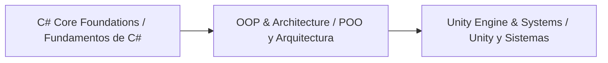

# 🟣 C#: Object-Oriented Foundations & Game Systems Architecture (MOC) · 🟣 C#: Fundamentos Orientados a Objetos y Arquitectura de Sistemas de Juego (MOC)

**English:** [README.md](./README.md) · **Español:** [README-ES.md](./README-ES.md)

  
  
  
  
  

**Note:**
This repository module serves as the central Map of Content (MOC) for C# syntax, object-oriented design patterns, .NET ecosystem fundamentals, and Unity game architecture notes inside this Obsidian vault. Every example and exercise is framed around video game development (combat, loot, quests, party play, and engine tooling).

**Nota:**
Este módulo del repositorio sirve como mapa de contenidos (MOC) central para la sintaxis de C#, los patrones de diseño orientados a objetos, los fundamentos del ecosistema .NET y las notas sobre arquitectura de juegos con Unity dentro de este vault de Obsidian. Cada ejemplo y ejercicio está enmarcado en torno al desarrollo de videojuegos (combate, botín, misiones, juego en grupo y herramientas del motor).

**Tip:**
**Learning Roadmap:** Master strong typing and core control structures first, then progress into Object-Oriented Programming (OOP) paradigms, memory management, and real-world game system engineering.

**Consejo:**
**Ruta de Aprendizaje:** Domina primero el tipado fuerte y las estructuras de control básicas, y después progresa hacia los paradigmas de Programación Orientada a Objetos (POO), la gestión de memoria y la ingeniería de sistemas de juegos del mundo real.

---

## 🗺️ Map of Content · Mapa de Contenidos

### 📚 Reference & Quick Guides · Referencia y Guías Rápidas

* **Cheatsheets & Syntax Rules / Chuletas y Reglas de Sintaxis:**
  * [00b - CSharp Cheatsheet](./00b%20-%20CSharp%20Cheatsheet.md) — Type system, memory stack vs. heap... *(empty file — content pending / archivo vacío — contenido pendiente; no Spanish version yet / aún sin versión en español)*

---

### 🧠 1. Core Language Foundations · 1. Fundamentos del Lenguaje

* **[01 - Press Start](./01%20-%20Press%20Start.md)** — C# lineage, .NET CLR architecture, compilation pipeline, and top-level statements in Program.cs.
   **[01 - Pulsa Start](./01%20-%20Pulsa%20Start.md)** — Linaje de C#, arquitectura del CLR de .NET, canalización de compilación y sentencias de nivel superior en Program.cs.
* **[02 - Typecast](./02%20-%20Typecast.md)** — Value types vs. reference types, explicit/implicit conversion, and string immutability.
   **[02 - Conversión de Tipos](./02%20-%20Conversi%C3%B3n%20de%20Tipos.md)** — Tipos de valor vs. tipos de referencia, conversión explícita/implícita e inmutabilidad de las cadenas.
* **[03 - Control Flow](./03%20-%20Control%20Flow.md)** — Decision making with if/else statements, logical operators (`&&`, `||`, `!`), and user input evaluation.
   **[03 - Control de Flujo](./03%20-%20Control%20de%20Flujo.md)** — Toma de decisiones con sentencias if/else, operadores lógicos (`&&`, `||`, `!`) y evaluación de la entrada del usuario.
* **[04 - Loops](./04%20-%20Loops.md)** — Executing repetitive control flow blocks with while/for loops and user-driven exit conditions.
   **[04 - Bucles](./04%20-%20Bucles.md)** — Ejecución de bloques repetitivos de control de flujo con bucles while/for y condiciones de salida controladas por el usuario.
* **[05 - Arrays](./05%20-%20Arrays.md)** — Single-dimensional arrays, indexing, element iteration, and multi-array parallel data processing.
   **[05 - Arreglos](./05%20-%20Arreglos.md)** — Arreglos unidimensionales, indexación, iteración de elementos y procesamiento paralelo de datos con varios arreglos.
* **[06 - Methods](./06%20-%20Methods.md)** — Reusable code blocks, parameter passing, return values, and method composition.
   **[06 - Métodos](./06%20-%20M%C3%A9todos.md)** — Bloques de código reutilizables, paso de parámetros, valores de retorno y composición de métodos.
* **[Mad Dungeon Master - Checkpoint Project](./Mad%20Dungeon%20Master%20-%20Checkpoint%20Project.md)** — Interactive C# boss-battle script generator applying loops, logic operators, and user input.
   **[Mad Dungeon Master - Proyecto de Hito](./Mad%20Dungeon%20Master%20-%20Proyecto%20de%20Hito.md)** — Generador interactivo de guiones de combates contra jefes en C# que aplica bucles, operadores lógicos y entrada del usuario.

---

### 🏗️ 2. Object-Oriented & Software Architecture · 2. Programación Orientada a Objetos y Arquitectura de Software

* **Encapsulation & Abstraction / Encapsulamiento y Abstracción:** `04 - Classes & Structs` — *Fields, auto-properties, constructors, and stack vs. heap allocation. / Campos, propiedades automáticas, constructores y asignación en pila vs. montón.* `[Planned / Planificado]`
* **Inheritance & Polymorphism / Herencia y Polimorfismo:** `05 - Interfaces & Abstract Classes` — *Virtual methods, overrides, interface implementation, and contract-driven design. / Métodos virtuales, sobrescrituras, implementación de interfaces y diseño basado en contratos.* `[Planned / Planificado]`
* **Advanced Features / Características Avanzadas:** `06 - Generics & LINQ` — *Type-safe data collections, delegates, events, Lambdas, and Language Integrated Query. / Colecciones de datos seguras en tipos, delegados, eventos, lambdas y Language Integrated Query.* `[Planned / Planificado]`

---

### 🎮 3. Game Development & Engine Integration · 3. Desarrollo de Juegos e Integración con el Motor

* **Unity Lifecycle Scripts / Scripts del Ciclo de Vida de Unity:** `07 - MonoBehaviour Architecture` — *`Awake`, `Start`, `Update`, `FixedUpdate` cycles and component linkage. / Ciclos de `Awake`, `Start`, `Update`, `FixedUpdate` y enlace de componentes.* `[Planned / Planificado]`
* **Game Systems Design / Diseño de Sistemas de Juego:** `08 - Scriptable Objects & State Machines` — *Data-driven system design, decoupled events, and state-driven game logic. / Diseño de sistemas dirigido por datos, eventos desacoplados y lógica de juego dirigida por estados.* `[Planned / Planificado]`

---

<b>🔍 Quick Access Checklist · Lista de Acceso Rápido</b>

- [x] Initial setup & `Program.cs` execution
   Configuración inicial y ejecución de `Program.cs`
- [ ] Primitive types & String operations
   Tipos primitivos y operaciones con cadenas
- [ ] Control flow & Pattern matching
   Control de flujo y coincidencia de patrones
- [ ] OOP Core (Classes, Interfaces, Polymorphism)
   Fundamentos de POO (Clases, Interfaces, Polimorfismo)
- [ ] Unity MonoBehaviour integration
   Integración de Unity MonoBehaviour
- [ ] Combat, loot & quest systems in C#
   Sistemas de combate, botín y misiones en C#

