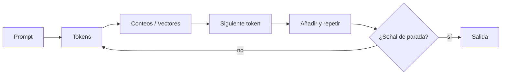
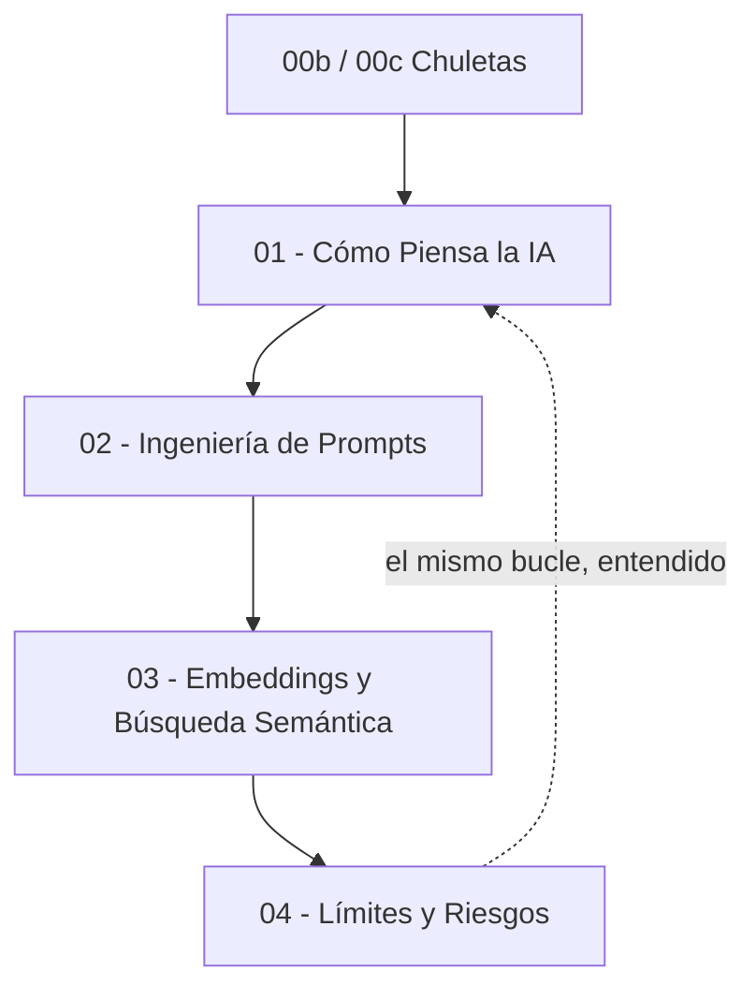

# 🤖 GenAI: Dentro de la Máquina de Predicción (MOC)

**English:** [README.md](./README.md)

<p align="left">
  
  
  
  
  
</p>

**Nota:**
Este módulo es el Mapa de Contenidos (MOC) de las notas de GenAI de este vault de Obsidian. La idea que sostiene todos los capítulos es lo bastante simple como para construirla solo con `re` y `math`: **un modelo de lenguaje es un predictor del siguiente token**, y todo lo demás —la fluidez, la confianza, los errores— se deduce de ahí. Los ejemplos están planteados alrededor del desarrollo de videojuegos, y los cuatro capítulos construyen un mismo proyecto pequeño: **Loreforge**, un compañero en Python para un roguelike 2D llamado *Emberfall*.

**Consejo:**
No empieces pidiéndole a una IA que se explique a sí misma. Empieza por **01** y construye el predictor a mano — en cuanto hayas escrito un modelo de juguete que se equivoca con total seguridad, [[04 - Límites y Riesgos]] deja de ser una lista de advertencias y pasa a ser un diagnóstico.

**Requisito previo:** Python básico — el [MOC de 🐍 Python](../%F0%9F%90%8D%20Python/README.md) cubre todo lo que se usa aquí (`re`, `math`, listas, diccionarios, bucles).

---

## 🗺️ Mapa de Contenidos

### 📑 Referencia y Chuletas

* **Chuletas:**
  * [00b - Chuleta de GenAI](./00b%20-%20Chuleta%20de%20GenAI.md) — Glosario de todos los términos, el bucle del LLM en una línea y los fragmentos de Python de los capítulos 01 y 03.
  * [00c - Chuleta de GenAI II](./00c%20-%20Chuleta%20de%20GenAI%20II.md) — Bloques de construcción de prompts, representaciones vectoriales, matemática de similitud y la lista de riesgos que hay que revisar antes de publicar salida de una IA.

### 🧠 1. Cómo Piensa la IA (Capítulo 1)

* **Cómo piensa la IA:** [01 - Cómo Piensa la IA](./01%20-%20C%C3%B3mo%20Piensa%20la%20IA.md) — Tokens, tokenizador, n-gramas, conteo y un predictor del siguiente token que funciona y escribe texto de ambiente de *Emberfall*.

### 🎭 2. Ingeniería de Prompts (Capítulo 2)

* **Ingeniería de prompts:** [02 - Ingeniería de Prompts](./02%20-%20Ingenier%C3%ADa%20de%20Prompts.md) — Especificidad, roles, ejemplos few-shot y chain-of-thought, construidos en forma de un prompt reutilizable, el **Compañero de Estudio de Game Dev**, en cuatro versiones.

### 🧭 3. Embeddings y Búsqueda Semántica (Capítulo 3)

* **Embeddings y búsqueda semántica:**
  * [03 - Embeddings y Búsqueda Semántica](./03%20-%20Embeddings%20y%20B%C3%BAsqueda%20Sem%C3%A1ntica.md) — Codificación one-hot, bolsa de palabras, similitud coseno y un motor de búsqueda de lore para el bestiario de *Emberfall*.

### ⚠️ 4. Límites y Riesgos (Capítulo 4)

* **Límites y riesgos:** [04 - Límites y Riesgos](./04%20-%20L%C3%ADmites%20y%20Riesgos.md) — Alucinaciones, la fecha de corte del entrenamiento, inyección de prompts, sesgo y cómo revisar el código de juego generado por una IA antes de publicarlo.

---

## 🎮 El Proyecto Usado en Todo el Módulo

Cada script de este módulo es una pieza de **Loreforge**, la herramienta interna de *Emberfall*, un roguelike 2D. Los mismos archivos crecen a lo largo de los cuatro capítulos, de modo que el vocabulario se mantiene fijo:

```text
Loreforge/
├── loreforge/
│   ├── flavor_engine.py     <-- cap. 01  predictor del siguiente token
│   ├── prompts.py           <-- cap. 02  el Compañero de Estudio
│   ├── lore_search.py       <-- cap. 03  embeddings + búsqueda semántica
│   └── review.py            <-- cap. 04  lista de casos límite
├── data/
│   ├── bestiary.txt         <-- enemigos
│   ├── items.txt            <-- botín
│   └── quests.txt           <-- entradas del diario de misiones
└── tests/
    └── test_edge_cases.py   <-- cap. 04  lo que el código de una IA olvida
```

**El corpus de lore.** Los capítulos 01 y 03 trabajan sobre texto real: entradas cortas escritas con la voz de *Emberfall* —una mazmorra iluminada por brasas, un bestiario breve y un diario de misiones. El capítulo 03 las busca.

```text
Emberfall — bestiary.txt
The Ember Warden patrols the forge corridor, unhurried and unafraid.
The Cinder Slime splits into two smaller slimes when it dies.
Ashen Wraiths drift through walls, and they ignore the light.
The player drinks a health flask before the boss room.
```

---

## 🧪 Lo que Sabrás Hacer

Al terminar el módulo:

- **Explicar** qué es un token, un n-grama, un embedding y un LLM — sin evasivas.
- **Construir** un tokenizador, un predictor de bigramas y un motor de búsqueda de bolsa de palabras en Python puro.
- **Escribir** prompts que especifiquen audiencia, rol, formato, ejemplos y pasos de razonamiento.
- **Detectar** alucinaciones, huecos por fecha de corte, inyección de prompts, sesgo y código con errores.
- **Decidir** cuándo un modelo de lenguaje pertenece a tu pipeline de juego y cuándo no.

---

## 🧰 Herramientas

| Herramienta | Para qué |
| :--- | :--- |
| Python 3.x | Solo biblioteca estándar: `re` para el tokenizador, `math` para la similitud coseno. |
| Un editor de texto | El punto es escribir el modelo tú mismo, no llamar a una API. |
| Cualquier chat con una IA | ChatGPT, Claude o Gemini — el objetivo de los ejercicios de prompts del capítulo 02. |

---

## 🗺️ La Idea, En Un Bucle

Todos los capítulos son el mismo bucle visto desde otro ángulo: convertir texto en números, comparar los números, elegir uno, repetir.



---



---

## 🎮 Por Qué Este Módulo Es de Game Dev

Un estudio de juegos está lleno de texto que nadie disfruta escribir y que todo el mundo publica: descripciones de objetos, diarios de misiones, textos de tutorial, comentarios de código, claves de localización. Los LLM son la nueva herramienta para ese trabajo, y la tentación es tratarlos como una caja mágica de prosa. No lo son. Son un predictor estadístico con muy buena memoria, y los cuatro capítulos existen para volver eso concreto antes de que construyas un pipeline que dependa de ello.

La hilo conductor del módulo es una sola frase: **tú estás en el bucle**. Genera, ejecuta, lee, corrige. Un estudio que adopta la IA sin el paso de leer publica un error seguro con una tipografía más bonita.

---
