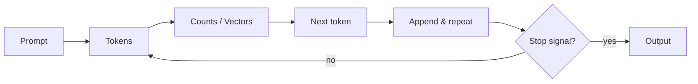
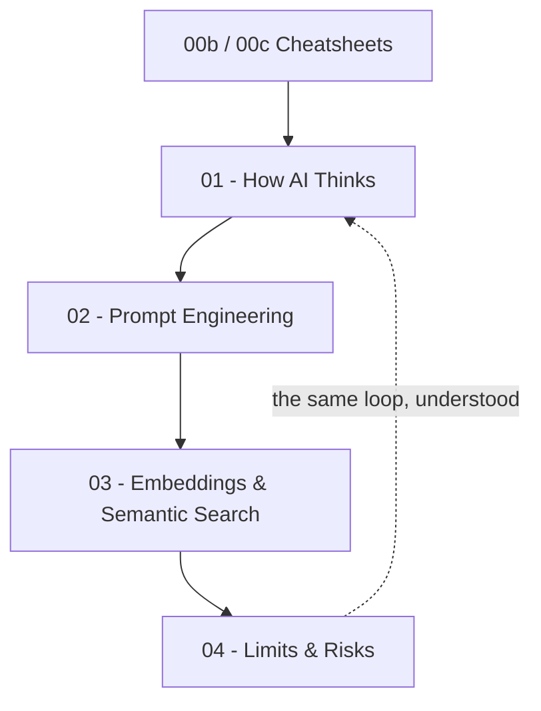

# 🤖 GenAI: Inside the Prediction Machine (MOC)

**Español:** [README-ES.md](./README-ES.md)

<p align="left">
  
  
  
  
  
</p>

**Note:**
This module is the Map of Content (MOC) for the GenAI notes in this Obsidian vault. The idea that drives every chapter is simple enough to build with nothing but `re` and `math`: **a language model is a next-token predictor**, and everything else — the fluency, the confidence, the mistakes — follows from that. The examples are framed around video game development, and the four chapters build one small project: **Loreforge**, a Python companion for a 2D roguelike called *Emberfall*.

**Tip:**
Do not start by asking an LLM to explain itself. Start at **01** and build the predictor by hand — once you have written a toy model that confidently gets things wrong, [[04 - Limits & Risks]] stops being a list of warnings and starts being a diagnosis.

**Prerequisite:** basic Python — the [🐍 Python MOC](../%F0%9F%90%8D%20Python/README.md) covers everything used here (`re`, `math`, lists, dictionaries, loops).

---

## 🗺️ Map of Content

### 📑 Reference & Cheatsheets

* **Cheatsheets:**
  * [00b - GenAI Cheatsheet](./00b%20-%20GenAI%20Cheatsheet.md) — Glossary of every term, the LLM loop in one line, and the Python snippets from chapters 01 and 03.
  * [00c - GenAI Cheatsheet II](./00c%20-%20GenAI%20Cheatsheet%20II.md) — Prompt building blocks, vector representations, similarity math, and the risk checklist to run before shipping AI output.

### 🧠 1. How AI Thinks (Chapter 1)

* **How AI Thinks:** [01 - How AI Thinks](./01%20-%20How%20AI%20Thinks.md) — Tokens, the tokenizer, n-grams, counting, and a working next-token predictor that writes *Emberfall* flavor text.

### 🎭 2. Prompt Engineering (Chapter 2)

* **Prompt Engineering:** [02 - Prompt Engineering](./02%20-%20Prompt%20Engineering.md) — Specificity, roles, few-shot examples and chain-of-thought, built into a reusable **Game Dev Study Buddy** prompt in four versions.

### 🧭 3. Embeddings & Semantic Search (Chapter 3)

* **Embeddings & Semantic Search:** [03 - Embeddings & Semantic Search](./03%20-%20Embeddings%20&%20Semantic%20Search.md) — One-hot encoding, bag of words, cosine similarity, and a lore search engine for the *Emberfall* bestiary.

### ⚠️ 4. Limits & Risks (Chapter 4)

* **Limits & Risks:** [04 - Limits & Risks](./04%20-%20Limits%20&%20Risks.md) — Hallucinations, the training cutoff, prompt injection, bias, and how to review AI-generated game code before it ships.

---

## 🎮 The Project Used Throughout

Every script in this module is a piece of **Loreforge**, the in-house tooling for *Emberfall*, a 2D roguelike. The same files grow across the four chapters, so the vocabulary stays fixed:

```text
Loreforge/
├── loreforge/
│   ├── flavor_engine.py     <-- ch. 01  next-token predictor
│   ├── prompts.py           <-- ch. 02  the Game Dev Study Buddy
│   ├── lore_search.py       <-- ch. 03  embeddings + semantic search
│   └── review.py            <-- ch. 04  edge-case checklist
├── data/
│   ├── bestiary.txt         <-- enemies
│   ├── items.txt            <-- loot
│   └── quests.txt           <-- quest log entries
└── tests/
    └── test_edge_cases.py   <-- ch. 04  what AI code usually forgets
```

**The lore corpus.** Chapters 01 and 03 run on real text: short entries written in the voice of *Emberfall* — an ember-lit dungeon, a short bestiary and a quest log. Chapter 03 searches them.

```text
Emberfall — bestiary.txt
The Ember Warden patrols the forge corridor, unhurried and unafraid.
The Cinder Slime splits into two smaller slimes when it dies.
Ashen Wraiths drift through walls, and they ignore the light.
The player drinks a health flask before the boss room.
```

---

## 🧪 What You Will Be Able To Do

By the end of the module:

- **Explain** what a token, an n-gram, an embedding and an LLM are — without hand-waving.
- **Build** a tokenizer, a bigram predictor and a bag-of-words search engine in pure Python.
- **Write** prompts that specify audience, role, format, examples and reasoning steps.
- **Spot** hallucinations, cutoff gaps, prompt injection, bias and buggy AI code.
- **Decide** when a language model belongs in your game pipeline and when it does not.

---

## 🧰 Tools

| Tool | Why |
| :--- | :--- |
| Python 3.x | Standard library only: `re` for the tokenizer, `math` for cosine similarity. |
| A text editor | The whole point is writing the model yourself, not calling an API. |
| Any LLM chat window | ChatGPT, Claude or Gemini — the target of the chapter 02 prompt exercises. |

---

## 🗺️ The Idea, In One Loop

Every chapter is the same loop seen from a different angle: turn text into numbers, compare the numbers, pick one, repeat.



---



---

## 🎮 Why This Is a Game Dev Module

A game studio is full of text that nobody enjoys writing and everybody ships: item descriptions, quest logs, tutorial copy, code comments, localization keys. LLMs are the new tool for that work, and the temptation is to treat them as a magic box of prose. They are not. They are a statistical predictor with a very good memory, and the four chapters exist to make that concrete before you build a pipeline that depends on it.

The through-line of the module is a single sentence: **you are in the loop**. Generate, run, read, fix. A studio that adopts AI without the read step ships a confident bug with a nicer font.

---
